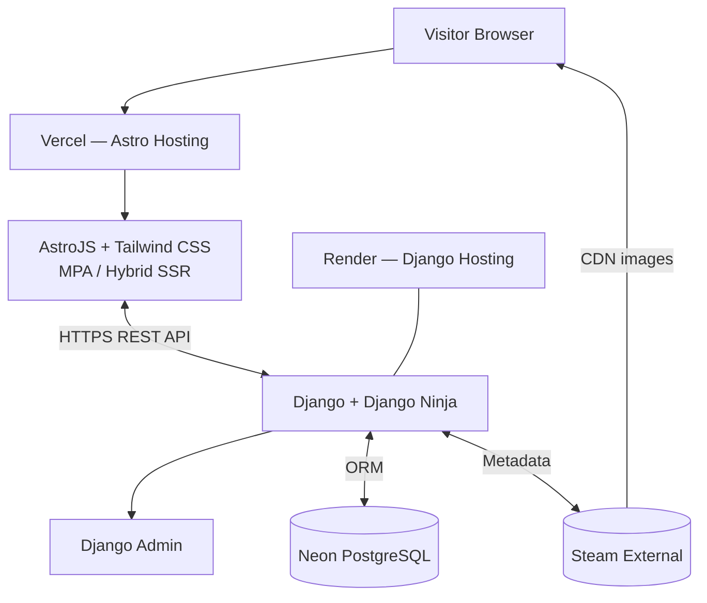
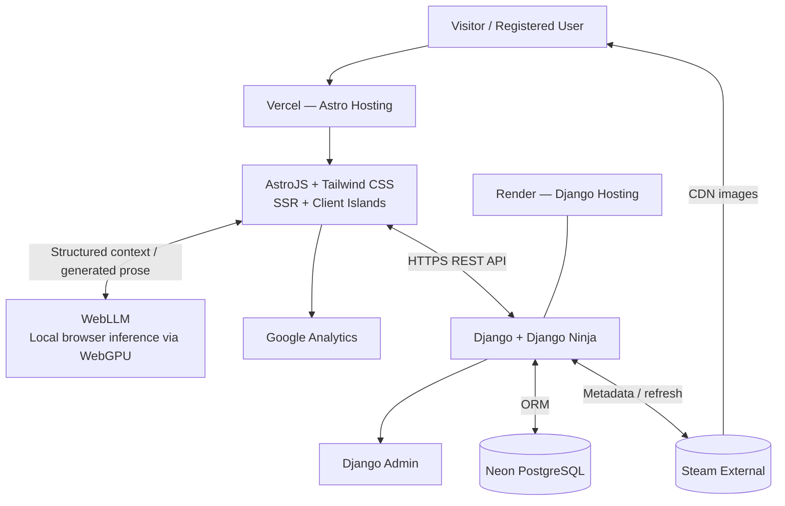

# Project Skill-Based Games Classification — Canonical Context

> **Document role:** Ultimate project source of truth for humans and LLMs  
> **Project key:** `SBGC`  
> **Jira project:** Project Skill-based Games Classification  
> **Public product name:** Not yet decided  
> **Owner / product lead:** Ammar “イズカ” Iskandar  
> **Canonical baseline date:** 2026-07-22  
> **Jira snapshot:** Generated 2026-07-22 08:34:02 UTC  
> **Current delivery target:** MVP, followed by a separately planned final-product phase  
> **Expected traffic:** Approximately 100 or fewer visits per month  
> **Cost objective:** RM0/month where practical, excluding an optional custom domain

---

## 0. Purpose, authority, and maintenance

This file is intended to let any human or LLM open the repository—today or years later—with no access to prior chats and immediately understand the product, terminology, architecture, scope, data, operations, decisions, Jira plan, and unresolved questions.

### 0.1 Normative language

- **MUST / MUST NOT:** decided requirement or explicit prohibition.
- **SHOULD / SHOULD NOT:** preferred implementation; deviations require a reason.
- **MAY:** optional.
- **TBD:** deliberately undecided; do not silently invent a choice.

### 0.2 Source-of-truth hierarchy

1. The latest `context.md` decision and changelog entry.
2. Accepted architecture decision records referenced here.
3. Jira for execution status and work breakdown.
4. Code and production configuration for implemented reality.
5. Diagrams as visual summaries.
6. Historical chats and drafts, which are superseded.

If code differs from this document, record the deviation. Do not let accidental implementation become architecture by default. Jira task `SBGC-130` explicitly requires technical documentation and documentation of deviations from `context.md`.

### 0.3 Update protocol

A material change to product scope, terminology, methodology, models, API, rendering, providers, security, recommendation logic, WebLLM, or moderation MUST update:

1. this file;
2. the decision log;
3. the changelog;
4. Jira;
5. diagrams when architecture changes.

Do not erase superseded decisions without preserving why they changed.

---

# 1. Executive summary

This is a lightweight full-stack games database conceptually similar to SteamDB or ProtonDB, but its core differentiator is a skill-composition classification rather than conventional genre tags.

Every game is assigned three percentages:

1. **Micro** — execution and mechanics.
2. **Mystiko** — hidden information, probability, mind games, reads, prediction, and short-horizon adaptation. This dimension was formerly called **Meso**.
3. **Macro** — systems understanding, resource management, planning, and long-horizon strategy.

Every valid classification MUST satisfy:

```text
Micro + Mystiko + Macro = 100
```

The values describe **composition, not difficulty**. A `70/20/10` game is not automatically harder than a `20/30/50` game; it rewards a different mix of skills.

The MVP is owner-curated. Ammar will manually review and classify approximately 200 popular games, primarily from Steam. Steam games use Steam App IDs. Very popular non-Steam games, such as Valorant, can be created manually through Django Admin. DLC, demos, soundtracks, software, tools, and other non-game products are excluded from public listings.

The final product preserves the MVP stack and can add user submissions, moderation, separate community scores, recommendation logic, and optional browser-local WebLLM prose generation. Django/Python selects the recommendation. WebLLM merely writes an explanation from trusted structured data on the client’s GPU.

Canonical stack:

- monorepo;
- AstroJS + Tailwind CSS frontend;
- Django + Django Ninja backend;
- Django Admin as the owner interface;
- Neon PostgreSQL;
- Vercel frontend hosting;
- Render backend hosting;
- Steam API/storefront data and Steam CDN images;
- Google Analytics for product analytics;
- WebLLM only in the final product.

Explicitly unnecessary at current scale: paid CDN, Kubernetes, Redis, Celery, Elasticsearch, object storage for Steam images, custom CMS, custom admin frontend, microservices, and SigNoz.

---

# 2. Product vision

## 2.1 Problem

Genre labels describe broad format but often fail to explain why games feel similar or different to play. Two games in the same genre may demand very different capabilities; games from different genres may reward nearly identical balances of mechanics, uncertainty management, opponent reading, and strategic planning.

The product provides a compact framework for questions such as:

- Which games are most Micro-heavy?
- Which games reward hidden-information reasoning and mind games?
- Which games are most Macro-heavy?
- Which games share a skill profile despite having different genres?
- Which games resemble a user’s favourites in skill requirements?
- Where does the owner’s editorial view differ from the community?

## 2.2 Value proposition

> Describe and compare games by the composition of skills required to succeed: Micro, Mystiko, and Macro.

## 2.3 Audience

Initial users are players interested in competitive or skill-oriented games, cross-genre comparisons, self-understanding, and discovery. The application should remain useful for ordinary players and avoid assuming esports expertise.

## 2.4 Project character

This is a personal learning and portfolio project, not a serious revenue-generating business. Architectural decisions prioritise learning, clarity, near-zero cost, and low operational burden over enterprise availability or theoretical scale.

---

# 3. Goals, non-goals, and constraints

## 3.1 MVP goals

The MVP MUST:

- provide a public catalogue of roughly 200 owner-classified games;
- support Steam records identified by App ID;
- support selected owner-created records for major non-Steam games;
- validate and display Micro/Mystiko/Macro percentages totalling 100;
- provide game pages, search, listings, rankings, and skill filters;
- exclude DLC and non-game records;
- provide Django Admin workflows for importing, creating, editing, classifying, hiding, and refreshing games;
- be minimal, fast, responsive, accessible, and usable on poor connections;
- deploy on free or near-free services;
- hotlink Steam images rather than storing copies;
- include sensible security, validation, logging, tests, documentation, and release procedures.

## 3.2 Final-product goals

The final product MAY add:

- accounts;
- one active user submission per game;
- moderation and audit history;
- editorial and community scores displayed separately;
- trusted contributors;
- consensus/disagreement indicators;
- Python-based game recommendations;
- client-side WebLLM explanations;
- Google Analytics if not already added during MVP release;
- a post-final-deployment A/B test of **Meso** versus **Mystiko**.

## 3.3 Non-goals

The project is not intended to be:

- a full Steam mirror;
- a storefront or download service;
- an image-hosting platform;
- a high-availability enterprise system;
- a microservice platform;
- a large social network;
- a server-hosted LLM product;
- an application where an LLM decides recommendations;
- a system requiring manual moderation of every community vote forever.

## 3.4 Constraints and accepted risks

- Assume approximately 100 or fewer monthly visits.
- Cold starts are acceptable.
- Occasional Steam or free-tier downtime is acceptable.
- Cost minimisation outranks high availability.
- Service plans may change; revalidate providers before deployment.
- The architecture must remain portable to equivalent providers.

---

# 4. Classification framework

## 4.1 Micro

Micro represents direct execution and mechanical performance, including aim, timing, reaction speed, movement precision, input accuracy, combos, animation cancels, dexterity, technical control, and moment-to-moment optimisation.

Micro is not synonymous with “action.” Strategy games may contain substantial Micro; action games may have forgiving execution.

## 4.2 Mystiko

Mystiko is the current preferred name for the former **Meso** dimension. The term derives from Greek for “hidden,” which better evokes information that must be inferred rather than directly known.

Mystiko includes:

- hidden information;
- probability management;
- mind games;
- bluffing;
- opponent reads;
- prediction;
- habit recognition and conditioning;
- short-horizon tactical choice;
- uncertainty management;
- matchup-specific adaptation.

Mystiko is not simply randomness. Randomness matters only where a player reasons and acts around uncertainty.

### 4.2.1 Meso-to-Mystiko decision

Current canonical UI, documentation, and API terminology is:

```text
Micro / Mystiko / Macro
```

Historical references may still say Meso. Schema and code should use `mystiko` unless an explicit compatibility migration requires otherwise.

A post-final-deployment A/B test SHOULD compare Meso and Mystiko for user comprehension. This work has not yet been written as a Jira ticket. It must be added later without inventing an issue key in advance.

The test should measure comprehension, not only clicks:

- correct association with hidden information, probability, reads, and mind games;
- time to understand the framework;
- methodology-page comprehension;
- preference after seeing definitions;
- whether either label causes systematic misclassification.

## 4.3 Macro

Macro represents systems and long-horizon strategy, including resource management, economy, map-wide planning, build orders, composition planning, progression, systemic knowledge, objective prioritisation, strategic positioning, and multi-step planning.

## 4.4 Composition, not difficulty

Percentages MUST NOT be presented as difficulty scores. Potential future dimensions such as skill intensity, knowledge burden, or learning curve are outside MVP unless separately approved.

## 4.5 Methodology baseline

The working rating prompt is:

> At competent or ranked play, what proportion of performance depends on execution and mechanics, hidden-information reasoning and short-horizon adaptation, and long-horizon systems knowledge and strategic planning?

Every classification MUST:

- include all three dimensions;
- keep each value within its valid range;
- total exactly 100;
- use a consistent methodology;
- include editorial notes where ambiguity materially affects interpretation.

## 4.6 Editorial and community scores

MVP uses editorial scores only.

Final product displays editorial and community results separately. They MUST NOT be silently blended.

Preferred rule:

- editorial is primary where available;
- community is primary only where editorial is absent;
- display both when both exist;
- show community submission count and optional consensus.

---

# 5. Scope by phase

## 5.1 MVP

Included:

- roughly 200 games;
- Steam and manual sources;
- editorial classification;
- public game pages;
- catalogue, search, rankings, filters;
- score visualisation;
- Django Admin;
- DLC/non-game exclusion;
- SEO metadata;
- validation, security, rate limiting;
- deployment, logging, monitoring, testing, documentation, data quality, and launch.

Excluded:

- accounts;
- community scoring;
- recommendation engine;
- WebLLM;
- custom CMS;
- background workers;
- paid CDN;
- SigNoz.

## 5.2 Final product

Adds capabilities without replacing the foundation:

- accounts and permissions;
- submissions and moderation;
- community aggregate;
- trusted-user pathway;
- recommendation logic;
- local WebLLM explanation;
- analytics and terminology experimentation.

The final-product backlog has not yet been created in Jira. Current Jira issues are an MVP delivery plan unless explicitly noted otherwise.

---

# 6. Users and journeys

## 6.1 Public visitor

A visitor can browse, search, filter, rank, open a game page, view metadata and artwork, understand the three percentages, see a dominant category, and read methodology/editorial notes.

## 6.2 Owner/admin

The owner can sign in to Django Admin, import Steam App IDs, create manual games, verify content type, enter or change scores, hide/publish records, refresh Steam metadata, and perform data-quality review.

## 6.3 Registered user — final only

A user may submit one active classification per game, revise it, provide reasoning, see moderation state, view community results, and identify favourite games.

## 6.4 Recommendation user — final only

The user selects favourite games. Django calculates skill-profile similarity and selects eligible recommendations. WebLLM optionally writes a human-readable explanation locally.

---

# 7. Architectural principles

1. Keep one frontend, one backend, and one relational database.
2. Use source-qualified external identity rather than assuming all numeric IDs are globally unique.
3. Persist only minimal metadata needed for search, listings, and administration; Steam remains authoritative.
4. Do not store Steam image binaries.
5. Keep business rules in Django/Python.
6. Use browser AI only for bounded prose generation.
7. Use Django Admin instead of building a custom CMS.
8. Prefer MPA, static rendering, and SSR over SPA complexity.
9. Optimise for low cost and low operations, not theoretical scale.
10. Add infrastructure only after measured need.
11. Degrade gracefully when external services fail.
12. Keep editorial and community viewpoints transparent.

---

# 8. Monorepo and application structure

The project MUST use a monorepo.

Recommended logical layout:

```text
/
├── apps/
│   ├── frontend/              # AstroJS + Tailwind CSS
│   └── backend/               # Django + Django Ninja
├── docs/
├── scripts/
├── .github/workflows/
├── .editorconfig
├── .gitignore
├── context.md
└── README.md
```

Frontend-specific dependencies stay with the frontend; backend dependencies stay with the backend. Root scripts may orchestrate install, lint, test, build, and run commands. Secrets MUST NOT be committed.

Suggested Django boundaries:

```text
config/                # settings, URLs, ASGI/WSGI
games/                 # identities, metadata, content types
classifications/       # editorial and future community scores
api/                   # Django Ninja routers and schemas
users/                 # final-product accounts, if separated
```

---

# 9. Rendering and navigation

The product is primarily an **MPA, not an SPA**.

Canonical rendering strategy:

- static/prerendered: About, Methodology, FAQ, fixed content;
- SSR/on-demand: game pages, catalogue, search, rankings, user-specific pages;
- CSR/islands: bounded interactions, analytics, final WebLLM.

Canonical description:

> Astro MPA with hybrid rendering: prerendered static pages, SSR dynamic pages, and limited client-side islands.

Preferred request path:

```text
Browser → Astro → Django API → PostgreSQL / Steam
```

Astro MUST NOT duplicate authoritative validation, classification, moderation, or recommendation logic.

---

# 10. MVP architecture



### Astro on Vercel

Owns public routing, SSR/prerendering, HTML, Tailwind presentation, pages, search UI, ranking UI, SEO metadata, accessibility, and small interactions.

### Django + Django Ninja on Render

Owns game identity, classifications, validation, Steam integration, manual records, exclusion policy, filtering/ranking queries, API schemas, security, rate limits, admin, and database access.

### Neon PostgreSQL

Stores identities, source type, minimal catalogue metadata, content/listing state, editorial scores, timestamps, and future final-product data.

### Steam

Provides Steam metadata and CDN images. Downtime is accepted. The system should fail gracefully but does not require paid resilience.

### Django Admin

Provides owner content management without a separate CMS.

### Public game-page flow

```text
Visitor requests Astro route
→ Astro SSR calls Django
→ Django reads PostgreSQL and Steam as required
→ Django returns normalised JSON
→ Astro renders HTML
→ browser loads image from Steam CDN
```

### Manual-game flow

```text
Visitor requests manual record
→ Astro calls Django
→ Django returns owner-managed metadata and classification
→ Astro uses the same public page components
→ browser loads configured external image or fallback
```


---

# 11. Final architecture



## 11.1 Execution boundaries

The diagram groups Astro and WebLLM as the frontend experience, but their execution locations differ:

- Astro SSR runs on Vercel.
- browser JavaScript runs on the user’s device;
- WebLLM runs on the user’s device, normally through WebGPU;
- Google Analytics executes from the public client experience;
- Django and Admin run on Render;
- PostgreSQL runs on Neon.

## 11.2 Recommendation responsibility

Recommendation selection MUST run in Django/Python:

```text
Favourite games
→ Django loads trusted skill vectors
→ Python calculates similarity
→ Python applies eligibility and threshold
→ Django selects recommended game(s)
→ Django returns structured data and reasons
→ Astro presents the result
→ WebLLM optionally rewrites it as natural-language prose
```

WebLLM MUST NOT choose the game, change the server result, classify games, or be required for the feature to work.

A deterministic template SHOULD be available if WebGPU is unsupported, model download is declined, memory is insufficient, or inference fails.

## 11.3 Model loading

Browser models may require downloads of hundreds of megabytes or more. WebLLM MUST be lazy-loaded only after the user explicitly opens/invokes the explanation feature. It MUST NOT load on every page.

## 11.4 Similarity logic

Accepted intent:

- compare Micro/Mystiko/Macro vectors;
- use favourite games as inputs;
- consider candidates with more than 90% similarity;
- select candidates in Python.

The exact similarity formula is **TBD** and MUST be formally defined, documented, and tested. It must respect the compositional nature of vectors summing to 100. The method for combining multiple favourites is also TBD.

---

# 12. Technology and hosting decisions

| Layer | Technology | Preferred provider (2026) | Responsibility |
|---|---|---|---|
| Repository | Monorepo | Git host TBD | One history and coordinated CI |
| Frontend | AstroJS | Vercel Hobby/free equivalent | MPA, SSR, static pages, UI |
| Styling | Tailwind CSS | Bundled | Responsive lightweight design |
| Backend | Django | Render free/equivalent | Logic, data access, admin |
| API | Django Ninja | With Django | Typed REST API / OpenAPI |
| Database | PostgreSQL | Neon free/equivalent | Durable relational data |
| Owner UI | Django Admin | With Django | Content/admin/moderation |
| Metadata | Steam APIs/storefront endpoints | Steam | Steam game information |
| Images | Steam CDN | Steam | Direct image delivery |
| Analytics | Google Analytics | Google | Product usage analytics |
| Local AI | WebLLM, final only | User browser/GPU | Recommendation prose |

## 12.1 PostgreSQL over deployed SQLite

SQLite remains fine for local development, but deployment uses PostgreSQL because managed durability, backups, migrations, future user writes, and platform portability matter more than a single-file database. This choice is operational, not driven by data size.

## 12.2 Provider longevity

Vercel, Render, and Neon are current choices, not eternal dependencies. By 2037 their plans may differ. The invariant is to use the cheapest practical equivalent for:

- SSR/static frontend hosting;
- Django hosting;
- durable managed PostgreSQL.

Provider substitutions that preserve responsibilities are acceptable but MUST be documented.

---

# 13. Data model

Precise Django field types are implementation decisions, but the following concepts and constraints are canonical.

## 13.1 `Game`

```text
id
source                  # steam or manual; future sources require a decision
external_id             # Steam App ID; nullable for manual
name
slug
content_type            # game, dlc, demo, soundtrack, software, tool, video, unknown
is_listed
release_date             # nullable
summary/description      # optional minimal metadata
developer                # nullable
publisher                # nullable
image_url
metadata_status          # optional
metadata_updated_at
created_at
updated_at
```

Rules:

- internal `id` is the relational primary key;
- Steam records MUST have an App ID;
- manual records MAY have no external ID;
- uniqueness SHOULD protect `(source, external_id)` when present;
- public URLs SHOULD use a stable slug and/or source-qualified identifier;
- manual slugs MUST be unique under the selected URL scheme;
- source identity must not assume that two providers cannot share the same numeric ID.

## 13.2 `EditorialClassification`

```text
game_id                  # one-to-one
micro
mystiko
macro
notes
methodology_version      # recommended
updated_by
created_at
updated_at
```

Rules:

- one per game;
- each value valid;
- total exactly 100;
- owner/admin editing only in MVP;
- changes attributable to an admin where practical;
- deleting a classification must not delete its game accidentally.

## 13.3 Derived values

May include dominant dimension, tied dominant dimensions, vector representation, formatted values, and ranking position. Derivation SHOULD live in one backend service/query layer, not be duplicated in templates.

## 13.4 `ClassificationSubmission` — final only

```text
id
game_id
user_id
micro
mystiko
macro
reasoning
status                   # pending, approved, rejected, superseded, withdrawn
created_at
updated_at
reviewed_at
reviewed_by
rejection_reason
```

Rules:

- one active submission per user/game;
- revised submissions follow a documented audit policy;
- scores total 100;
- only approved submissions affect the community result;
- moderation is auditable;
- anonymous scoring is not accepted in the current final design.

## 13.5 `CommunityAggregate` — final only

```text
game_id
micro
mystiko
macro
submission_count
consensus_score          # optional; formula TBD
scoring_method_version
updated_at
```

Arithmetic mean is acceptable for the first community implementation. Robust estimators may be introduced later for manipulation resistance.

## 13.6 Users — final only

Use Django authentication unless a custom-user requirement is identified before production migrations. Requirements include verified identity (normally email), permissions, status, suspension/ban capability, optional trusted-contributor status, and minimal personal-data collection.

## 13.7 Content types

Canonical values:

```text
game
dlc
demo
soundtrack
software
tool
video
unknown
```

Public listings normally require `content_type = game` and `is_listed = true`.

Ambiguous policy cases include standalone expansions, remasters, prologues, test clients, dedicated servers, bundles, modding tools, and episodic products.

## 13.8 Integrity and hardening

Database constraints SHOULD cover:

- source/external-ID uniqueness;
- score ranges;
- total of 100;
- required fields by source;
- safe foreign-key deletion;
- indexes for search, listing state, source, content type, and score ordering;
- migration reproducibility;
- least-privilege application credentials where supported;
- backup and restoration documentation.

---

# 14. Metadata and assets

## 14.1 Steam metadata

Steam is authoritative. Persist only the subset needed for search, listings, rankings, administration, and graceful display. Do not build a full Steam mirror.

## 14.2 Refresh

A manual Django Admin action or management command is sufficient. Refresh must update permitted metadata, preserve classifications, respect owner overrides, record success time, and fail without corrupting the record. Scheduled workers are not required.

## 14.3 Steam images

- Load from Steam CDN URLs.
- Do not store image binaries.
- Provide fallback imagery.
- Lazy-load where appropriate.
- Include meaningful alt text.
- Do not assume every image variant exists.

## 14.4 Manual-game images

Manual records may use an owner-supplied external URL. Validate its format, provide fallback behaviour, and comply with the source’s rights/terms.

No paid CDN is required.

---

# 15. Steam integration

The backend needs a dedicated client/service that:

- accepts App IDs;
- retrieves metadata;
- uses explicit timeouts;
- handles non-success, missing, malformed, restricted, or unavailable data;
- normalises responses;
- does not expose secrets;
- produces typed errors.

Import flow:

```text
Owner enters App ID
→ Steam lookup
→ normalise metadata
→ resolve content type
→ duplicate check
→ create/update Game
→ list only if policy allows
```

Reliability posture: occasional Steam failure is acceptable. Degrade gracefully; do not buy resilience infrastructure for this hobby workload.

---

# 16. Manual non-Steam records

Manual records are for selected very popular non-Steam games such as Valorant, not for exhaustive catalogue coverage.

Required owner-managed data should include name, unique slug, source=`manual`, content type, listing status, image URL/fallback, enough public metadata, and an editorial classification.

Steam refresh actions MUST NOT run on manual records. Both sources should share public components and ranking/search behaviour.

IGDB or another source is a future option, not an accepted MVP dependency.

---

# 17. API design

## 17.1 Style

- REST-like HTTPS JSON API;
- Django Ninja;
- recommended prefix `/api/v1/`;
- typed schemas;
- OpenAPI documentation;
- standard status codes;
- standard error envelope;
- no raw exceptions in production.

## 17.2 Indicative MVP endpoints

```text
GET /api/v1/games
GET /api/v1/games/{slug-or-id}
GET /api/v1/games/search?q=
GET /api/v1/rankings?dimension=micro
GET /api/v1/rankings?dimension=mystiko
GET /api/v1/rankings?dimension=macro
GET /api/v1/health
```

Owner writes may remain in Django Admin for MVP.

## 17.3 Indicative final endpoints

```text
POST /api/v1/games/{id}/submissions
PUT  /api/v1/submissions/{id}
GET  /api/v1/me/submissions
POST /api/v1/recommendations
```

Auth and CSRF strategy must be specified before final endpoints are introduced.

## 17.4 Example game response

```json
{
  "game": {
    "id": 123,
    "source": "steam",
    "external_id": "730",
    "name": "Example Game",
    "slug": "example-game",
    "content_type": "game",
    "release_date": "2023-09-27",
    "image_url": "https://...",
    "is_listed": true
  },
  "classification": {
    "editorial": {
      "micro": 65,
      "mystiko": 25,
      "macro": 10,
      "notes": "..."
    },
    "community": null
  }
}
```

## 17.5 Error envelope

```json
{
  "error": {
    "code": "GAME_NOT_FOUND",
    "message": "The requested game was not found.",
    "details": null,
    "request_id": "optional-correlation-id"
  }
}
```

---

# 18. Django Admin

Django Admin is the internal CMS/admin/moderation interface.

Game administration should support search by name, source, slug, and App ID; filters by source, content type, listing, and classification status; clear Steam/manual field groups; timestamps; refresh state; and classification links/inlines.

Classification administration should support all three values, total validation, notes, dominant-category display, updated-by fields, and one-classification-per-game enforcement.

Useful bulk actions:

- refresh Steam metadata;
- publish/hide;
- mark DLC/non-game;
- recalculate derived values;
- final phase: approve/reject submissions.

Safety:

- strong authentication;
- non-default path as defence in depth, not sole protection;
- minimal admin accounts;
- MFA/passkeys if available;
- read-only system fields;
- confirmation for destructive actions;
- timestamps and attribution.

---

# 19. Search, listings, and rankings

## 19.1 Catalogue

Show listed game records only, combine Steam/manual sources, exclude non-games, show compact scores, paginate, and provide mobile, empty, loading, and error states.

## 19.2 Search

Case-insensitive partial name search, URL-preserved query, SSR results, no-result state, input limits, and rate limiting. PostgreSQL/Django are sufficient; Elasticsearch is unnecessary.

## 19.3 Sort/filter

MVP options:

- alphabetical;
- recently added;
- highest Micro/Mystiko/Macro;
- dominant dimension;
- Steam/manual source;
- classification availability where useful.

## 19.4 Rankings

Must use stable deterministic ordering, explicit tie behaviour, pagination, backend logic, and exclusion of hidden, invalid, or unclassified records.

---

# 20. Visualisation and UX

Reusable components should include labelled percentage bars, numeric values, a dominant-dimension indicator, compact cards, full game-page display, and an optional triangular visual only if it remains understandable.

Accessibility requirements:

- do not rely on colour alone;
- include labels and values;
- maintain contrast and zoom/mobile legibility;
- expose screen-reader text;
- handle ties, 0/100 extremes, and missing data.

`SBGC-36` captures the product-level UX requirement:

> The GUI should be intuitive, minimal, fast, and lightweight, providing a good experience on any device and poor internet connections, including when opened in the background while the user is playing a game.

Tailwind CSS should implement a consistent responsive design system without turning the frontend into a heavy client application.

---

# 21. Recommendation and WebLLM — final only

## 21.1 Inputs and calculation

Potential inputs are one or more favourite games, their trusted published vectors, candidate vectors, and listing eligibility. Whether favourites require an account is TBD.

The algorithm MUST run in Python, use trusted values, apply a documented similarity formula and threshold, exclude invalid content, and return structured reasons. Exact multi-favourite aggregation is TBD.

## 21.2 WebLLM boundary

Example structured input:

```json
{
  "recommended_game": "Example",
  "similarity_score": 94.2,
  "user_favourites": ["Game A"],
  "recommended_vector": {
    "micro": 60,
    "mystiko": 25,
    "macro": 15
  },
  "comparison_points": [
    "Similar Micro requirement",
    "Slightly more Macro-heavy"
  ]
}
```

Prompt rules should require explanation of the server result, no invention of unsupported game facts, concise language, and honest uncertainty.

Privacy/performance:

- prompts need not be sent to a paid LLM API;
- model download size should be disclosed;
- loading must be opt-in/lazy;
- unsupported devices receive deterministic prose;
- avoid loading WebLLM on normal pages.

---

# 22. Community scoring and moderation — final only

Initial final workflow:

```text
User submits
→ backend validates total=100
→ pending moderation
→ owner approves/rejects in Django Admin
→ approved aggregate recalculates
```

Later, trusted users may bypass pre-approval based on account age, approval history, rejection rate, verification, and moderation history. This should be data-driven and reversible.

Abuse controls:

- one active submission per user/game;
- verified accounts;
- rate limits;
- edit/audit history;
- report and suspension capability;
- owner ability to disable community scoring for a brigaded game;
- separate editorial/community display.

Consensus is desirable because the mean may hide disagreement. Its formula is TBD.

---

# 23. Security, secrets, and abuse prevention

## 23.1 Secret management

No separate paid secret manager is required.

- Vercel environment variables for Astro server-only configuration;
- Render environment variables for Django secrets;
- Neon connection string stored in Render as `DATABASE_URL`;
- local `.env` files ignored by Git;
- committed `.env.example` files contain names, never values;
- no secret may use an Astro `PUBLIC_` prefix or enter browser bundles.

Likely backend secrets/configuration:

```text
DJANGO_SECRET_KEY
DATABASE_URL
DJANGO_DEBUG
DJANGO_ALLOWED_HOSTS
CSRF_TRUSTED_ORIGINS
CORS_ALLOWED_ORIGINS
STEAM_API_KEY             # only if required by chosen endpoint
ADMIN_URL_PATH            # optional configuration
```

## 23.2 Platform protection

Vercel and Render provide baseline network/DDoS protection. No paid CDN or standalone WAF is justified initially.

## 23.3 Django hardening

- `DEBUG = false` in production;
- correct allowed hosts;
- strict CORS origins;
- correct CSRF trusted origins;
- HTTPS and secure cookie settings;
- ORM rather than unsafe raw SQL;
- request-size limits;
- defensive parsing;
- no sensitive logs;
- dependency updates;
- least-privilege database credentials where practical.

## 23.4 Rate limiting baseline

Indicative starting limits, adjustable after observing usage:

```text
Anonymous reads:      60/minute/IP
Search:               20/minute/IP
Admin/login attempts:  5/15 minutes/IP
Registration:          3/hour/IP        # final only
Score submissions:    10/hour/user      # final only
Password reset:        3/hour/account    # final only
```

At MVP scale, implement rate limits without Redis if possible. Do not introduce Redis solely for an imagined load problem.

## 23.5 Bot controls

CAPTCHA is not required everywhere. Free Cloudflare Turnstile or an equivalent may be added only to high-abuse final-product actions such as registration or repeated suspicious submissions.

---

# 24. Logging, analytics, and monitoring

## 24.1 Logging

Django logs should cover request failures, validation failures, Steam errors, database errors, admin actions, and unexpected exceptions without secrets or unnecessary personal data.

Astro/Vercel logging should cover SSR failures, Django timeouts, invalid API responses, and deployment/build errors.

## 24.2 Google Analytics

Google Analytics is product-usage analytics, not application business logic. Useful events include page views, game views, searches, ranking/filter use, and final recommendation feature use.

The final architecture diagram includes Google Analytics. Jira also includes it in the MVP logging/analytics epic, so it may be introduced at late MVP release. It is non-core and can be delayed without changing the application architecture.

Privacy-conscious configuration and appropriate disclosure are required.

## 24.3 Basic monitoring

Use provider-native status, health checks, and logs:

- Django health endpoint;
- Render service/deployment status;
- Vercel deployment and function logs;
- Neon connection/usage status;
- optional free uptime check.

## 24.4 SigNoz decision

SigNoz is explicitly excluded at this scale. Cloud pricing conflicts with the budget; self-hosting adds collector/storage/maintenance overhead. It may be reconsidered only if distributed tracing or correlated telemetry becomes a measured need.

---

# 25. Performance, accessibility, and SEO

Performance priorities:

- small JavaScript payload;
- MPA navigation and SSR;
- prerender fixed pages;
- lazy images;
- no WebLLM download outside its feature;
- pagination;
- database indexes;
- explicit external-request timeouts;
- acceptable free-tier cold-start messaging/fallback.

Accessibility priorities:

- semantic HTML;
- keyboard operation;
- visible focus states;
- labelled forms;
- sufficient contrast;
- non-colour score cues;
- alt text;
- responsive layouts;
- screen-reader-readable classifications.

SEO/game-page metadata:

- meaningful title and description;
- canonical URL;
- social metadata;
- no indexing of hidden/invalid records;
- basic structured data where correct and useful;
- 404 and error pages.


---

# 26. Testing and quality strategy

## 26.1 Backend tests

Cover:

- model validation and constraints;
- editorial score total/ranges;
- source-specific fields;
- duplicate prevention;
- content-type exclusions;
- game detail/catalogue/ranking endpoints;
- Steam normalisation and failure handling;
- admin workflows/actions;
- security and rate limits where practical.

## 26.2 Frontend tests

Cover:

- layouts and reusable components;
- classification rendering;
- catalogue/search/rankings;
- error, empty, and missing-data states;
- responsive behaviour;
- critical accessibility semantics.

## 26.3 Integration and end-to-end tests

Critical journeys:

1. browse catalogue;
2. search for a game;
3. open a Steam game;
4. open a manual game;
5. view rankings and filters;
6. owner imports a Steam game;
7. owner creates a manual game;
8. owner enters a valid classification;
9. invalid totals are rejected;
10. DLC is absent from public listings.

## 26.4 Non-functional checks

- mobile responsiveness;
- weak-network experience;
- accessibility;
- performance and JavaScript weight;
- browser compatibility;
- security headers;
- no secret leakage;
- production smoke test.

## 26.5 MVP acceptance definition

MVP is releasable when:

- core public journeys work in production;
- core admin journeys work;
- roughly 200 records are populated and reviewed;
- exclusions are enforced;
- classification data is valid;
- frontend/backend/database/Steam integration is verified;
- release-blocking defects are resolved;
- recovery and incident checks are documented;
- owner documentation exists;
- known non-blocking issues are recorded.

---

# 27. Deployment and environments

## 27.1 Environments

At minimum:

- local development;
- preview/test where provider workflows permit;
- production.

Each environment has separate variables and URLs. Production secrets must never be reused casually in local/preview environments.

## 27.2 Backend deployment

Render deployment must define:

- supported Python version;
- dependency install command;
- migration process;
- production application server/start command;
- static-file handling for Django Admin;
- health-check route;
- environment variables;
- allowed hosts/CORS/CSRF settings.

## 27.3 Frontend deployment

Vercel deployment must define:

- Astro adapter;
- monorepo root/application directory;
- build command and output;
- server-side Django API URL;
- preview and production environment values;
- static and SSR route verification.

## 27.4 Database deployment

Neon setup must define:

- production database/branch strategy as appropriate;
- `DATABASE_URL`;
- SSL requirements;
- migration execution;
- backup/restore expectations;
- connection limits suitable for free-tier/serverless behaviour.

## 27.5 Deployment workflow

Git-based deployment should support:

- CI before merge;
- preview deployments where useful;
- controlled production migration;
- post-deployment smoke tests;
- rollback/redeploy procedure;
- documented handling of a migration that cannot be trivially reversed.

---

# 28. Operations, incidents, and data care

## 28.1 Health checks

The backend health endpoint should distinguish basic process health from deeper dependencies where useful, while avoiding expensive Steam calls on every health check.

## 28.2 Incident checklist

When the site fails, inspect in this order:

1. Vercel deployment/function logs;
2. Render service status and logs;
3. Django health endpoint;
4. Neon connectivity/limits;
5. environment-variable changes;
6. recent migrations/deployments;
7. Steam availability only if metadata/images are affected.

## 28.3 Backups and restoration

Before launch, document:

- what Neon provides automatically under the selected plan;
- how to create an export/dump if needed;
- where owner-maintained backups are kept;
- how to restore into a clean database;
- how to verify restored counts and constraints.

A backup process is not complete until restoration has been tested at least once.

## 28.4 Data quality

Review for:

- duplicate games/editions;
- missing metadata;
- broken image URLs;
- incorrect content types;
- invalid score totals;
- inconsistent methodology;
- hidden records accidentally exposed;
- non-Steam games lacking required manual fields.

---

# 29. Initial catalogue policy

The owner intends to classify at least approximately 200 popular games, primarily the most popular Steam games, supplemented by selected major non-Steam titles.

Catalogue preparation should:

- define a reproducible source/date for “popular” where possible;
- identify App IDs;
- distinguish separate games from DLC, demos, test servers, and duplicate editions;
- decide whether remasters/definitive editions deserve separate records;
- record classification status and review notes;
- include manual records only where popularity and product value justify maintenance.

The classification process should favour consistency over speed. Ambiguous games should receive notes and potentially a second review.

---

# 30. Current Jira state

The supplied Jira export contains **134 issues**:

- `SBGC-1` through `SBGC-21`: 21 epics;
- `SBGC-22` through `SBGC-134`: 113 child issues;
- of those child issues, `SBGC-36` is a Story and the other 112 are Tasks.

Snapshot-wide metadata:

- Project: Project Skill-based Games Classification.
- Status: all To Do.
- Priority: all Medium.
- Assignee: all Unassigned.
- Resolution: all Unresolved.
- Components: None.
- Affects versions: None.
- Fix versions: None.
- Labels: None.
- Votes: 0.
- Remaining estimate: Not Specified.
- Time spent: Not Specified.
- Original estimate: Not Specified.
- Epics were created 21 July 2026.
- `SBGC-22` was created 21 July 2026.
- `SBGC-23` onward were created 22 July 2026.
- Export generated by Ammar “イズカ” Iskandar on 22 July 2026.

Jira is currently a skeleton-level plan. Most tickets have titles and metadata rather than detailed descriptions. This file supplies the intended scope beneath those titles. `SBGC-36` is the only issue in the export with an explicit description.

---

# 31. Recommended implementation order and dependencies

The numbered epics are thematic, not a strict waterfall, but a practical sequence is:

1. `SBGC-1` foundation/monorepo.
2. Start `SBGC-2`, `SBGC-3`, and `SBGC-4` in parallel enough to establish contracts.
3. Implement `SBGC-5` and `SBGC-6` as data-source paths.
4. Implement `SBGC-7` and `SBGC-8` so the owner can populate data early.
5. Implement `SBGC-13` API contract/integration before completing public features.
6. Implement `SBGC-9`, `SBGC-10`, `SBGC-11`, and `SBGC-12` iteratively.
7. Apply `SBGC-14`, `SBGC-15`, and `SBGC-16` throughout, not only at the end.
8. Establish `SBGC-17` early enough to expose deployment assumptions.
9. Add `SBGC-18` and `SBGC-19` continuously.
10. Begin `SBGC-20` with a small seed set early; finish the full 200 after workflows stabilise.
11. Complete `SBGC-21` before launch.

Critical dependencies:

- public pages depend on game/classification models and API responses;
- search/rankings depend on persisted minimal metadata and classification queries;
- initial data population depends on Steam/manual/admin workflows;
- deployment depends on environment, database, static files, and security configuration;
- release depends on testing, documentation, data quality, and production verification.

---

# 32. Complete Jira epic and task registry

The following registry preserves every issue key/title and defines its intended scope. Sub-bullets are acceptance scope, not necessarily separate Jira subtasks.


## 32.1 `SBGC-1` — Project Foundation & Repository Setup

### `SBGC-22` — Create monorepo structure (Task)

**Intended scope:** Create `apps/frontend` and `apps/backend`, root documentation/configuration, shared scripts, and clear ownership boundaries.

### `SBGC-23` — Initialize frontend and backend applications (Task)

**Intended scope:** Scaffold Astro and Django, verify both run independently, establish local ports and startup commands.

### `SBGC-24` — Configure package and dependency management (Task)

**Intended scope:** Choose Node package manager/lockfile and Python environment/dependency format; add root install/run/test/build commands and update policy.

### `SBGC-25` — Configure environment variables (Task)

**Intended scope:** Create application-specific examples, distinguish public/server-only variables, configure secrets/database values, and prevent Git leakage.

### `SBGC-26` — Establish code-quality tooling (Task)

**Intended scope:** Configure frontend formatter/linter/type checks, Python formatter/linter/type checks as appropriate, editor settings, and repeatable commands.

### `SBGC-27` — Configure Git and CI foundation (Task)

**Intended scope:** Define branch/PR/commit conventions and CI for lint, tests, and builds, preferably path-aware in the monorepo.


## 32.2 `SBGC-2` — Astro Frontend Foundation

### `SBGC-28` — Configure Astro application architecture (Task)

**Intended scope:** Configure Vercel adapter, SSR default for dynamic routes, prerender fixed pages, and MPA route conventions.

### `SBGC-29` — Install and configure Tailwind CSS (Task)

**Intended scope:** Install Tailwind integration, global CSS, source scanning, and foundational spacing/typography/layout tokens.

### `SBGC-30` — Build the global application shell (Task)

**Intended scope:** Implement base layout, navigation, footer, responsive container, and default SEO metadata.

### `SBGC-31` — Create reusable Tailwind UI foundations (Task)

**Intended scope:** Implement buttons, forms, cards, badges, tables/lists, and loading/empty/error primitives.

### `SBGC-32` — Define Micro/Mystiko/Macro visual system (Task)

**Intended scope:** Define labels, score bars/charts, legends, responsive patterns, and accessible non-colour cues.

### `SBGC-33` — Create core route skeletons (Task)

**Intended scope:** Create Home, game detail, catalogue, search, rankings, Methodology, About, 404, and error routes.

### `SBGC-34` — Create frontend API layer (Task)

**Intended scope:** Create server-side Django client, response types, environment-based URL, timeouts, errors, and reusable fetch utilities.

### `SBGC-35` — Configure frontend analytics and security (Task)

**Intended scope:** Prepare analytics integration, security headers, public/private environment rules, and baseline accessibility/performance checks.

### `SBGC-36` — Fast, Sleek and Modern UI/UX (Story)

**Intended scope:** Story: make the GUI intuitive, minimal, fast, lightweight, responsive, and usable on poor internet while a game may be running in the background.


## 32.3 `SBGC-3` — Django Backend Foundation

### `SBGC-37` — Create Django application structure (Task)

**Intended scope:** Create project settings and logical games, classifications, API, and future user boundaries with environment-specific settings.

### `SBGC-38` — Configure Django Ninja (Task)

**Intended scope:** Create versioned API, routers, schemas, standard error shape, and OpenAPI documentation.

### `SBGC-39` — Configure database connectivity (Task)

**Intended scope:** Support local development and Neon PostgreSQL through `DATABASE_URL`; verify connections and migrations.

### `SBGC-40` — Configure Django Admin (Task)

**Intended scope:** Enable superuser access, model registration patterns, search/filter conventions, bulk-action foundation, and secure route.

### `SBGC-41` — Configure backend security (Task)

**Intended scope:** Set secret handling, hosts, CORS, CSRF, cookies, debug modes, request limits, and production defaults.

### `SBGC-42` — Configure external-service foundations (Task)

**Intended scope:** Create Steam service/client boundaries, timeouts, normalisation, CDN handling, and environment configuration.

### `SBGC-43` — Configure backend operations (Task)

**Intended scope:** Add logging, health endpoint, admin static files, Render settings, and production startup command.

### `SBGC-44` — Establish backend testing (Task)

**Intended scope:** Create test settings and conventions for models, API, validation, admin, and database isolation.


## 32.4 `SBGC-4` — Database Schema & Core Models

### `SBGC-45` — Implement the Game model (Task)

**Intended scope:** Implement Steam/manual source, external ID, name, slug, content type, listing state, minimal metadata, image URL, and timestamps.

### `SBGC-46` — Implement editorial classification (Task)

**Intended scope:** Implement one classification per game with Micro/Mystiko/Macro, notes, updater, and timestamps.

### `SBGC-47` — Implement database constraints (Task)

**Intended scope:** Enforce unique identities, score ranges/total, source-required fields, and safe deletion relationships.

### `SBGC-48` — Implement game-type and listing rules (Task)

**Intended scope:** Represent game/DLC/demo/software/soundtrack/tool/video/unknown and expose only valid listed games.

### `SBGC-49` — Add query and modal helpers (Task)

**Intended scope:** Jira title says “modal”; intended meaning is almost certainly model/query helpers. Implement listed/source/classified/dominant-category/ranking query helpers; correct Jira title if confirmed.

### `SBGC-50` — Create migrations and sample data (Task)

**Intended scope:** Create initial migrations, repeatable development fixtures/seed command, sample Steam/manual games, and classifications.

### `SBGC-51` — Validate models through admin and tests (Task)

**Intended scope:** Verify create/edit workflows, invalid totals, duplicates, DLC exclusion, and manual-source rules.

### `SBGC-52` — Database hardening (Task)

**Intended scope:** Add appropriate indexes, least privilege, connection settings, backup/restore documentation, migration safety, and integrity review.


## 32.5 `SBGC-5` — Steam API Integration

### `SBGC-53` — Build Steam API client (Task)

**Intended scope:** Retrieve by App ID with timeouts, error handling, response normalisation, and no browser secret exposure.

### `SBGC-54` — Implement Steam game import workflow (Task)

**Intended scope:** Import/create/update by App ID, populate fields, prevent duplicates, classify content type, and report invalid IDs clearly.

### `SBGC-55` — Handle Steam images (Task)

**Intended scope:** Generate/extract CDN URLs, provide fallbacks, and avoid image storage.

### `SBGC-56` — Implement metadata refresh (Task)

**Intended scope:** Add manual admin refresh, safe field updates, preservation of classifications/overrides, and last-refresh tracking.

### `SBGC-57` — Configure postman API and prepare test scripts (Task)

**Intended scope:** Create a Postman collection/environment and repeatable request scripts for Steam-related and core API endpoints without committing secrets.

### `SBGC-58` — Test Steam integration (Task)

**Intended scope:** Test valid, invalid, unavailable, malformed, timeout, duplicate, image-missing, and content-type cases.


## 32.6 `SBGC-6` — Manual Non-Steam Game Management

### `SBGC-59` — Implement manual game creation and editing (Task)

**Intended scope:** Create/edit major non-Steam titles in Admin with name, slug, release/developer metadata, image, listing state, and required-field validation.

### `SBGC-60` — Implement manual asset handling (Task)

**Intended scope:** Support validated external image URLs and fallbacks without unnecessary storage.

### `SBGC-61` — Implement source-specific behaviour (Task)

**Intended scope:** Disable Steam refresh for manual records, distinguish fields/admin presentation, and keep public/ranking compatibility.

### `SBGC-62` — Test manual game workflows (Task)

**Intended scope:** Test create, edit, hide, delete, duplicate slugs, missing fields, asset failures, and public display.


## 32.7 `SBGC-7` — Editorial Classification Management

### `SBGC-63` — Implement classification create and edit workflow (Task)

**Intended scope:** Assign all three percentages, notes, and updater attribution through owner workflows.

### `SBGC-64` — Implement classification validation (Task)

**Intended scope:** Enforce ranges, exact total of 100, and one editorial classification per game.

### `SBGC-65` — Implement classification-derived values (Task)

**Intended scope:** Calculate dominant/tied dimensions and consistent formatted/vector values for APIs and rankings.

### `SBGC-66` — Test classification rules (Task)

**Intended scope:** Test valid/invalid totals, ranges, updates, ties, extremes, and games without scores.


## 32.8 `SBGC-8` — Django Admin Configuration

### `SBGC-67` — Configure game administration (Task)

**Intended scope:** Search by name/App ID/source; filter by source/type/listed/classified; organise source-specific fields.

### `SBGC-68` — Configure classification administration (Task)

**Intended scope:** Enable intuitive score editing, total/dominant display, and clear validation.

### `SBGC-69` — Add admin actions (Task)

**Intended scope:** Refresh metadata, publish/hide, mark content type, and recalculate derived values.

### `SBGC-70` — Improve admin safety and usability (Task)

**Intended scope:** Use read-only system fields, destructive confirmations, secure access, and audit-visible timestamps/updaters.


## 32.9 `SBGC-9` — Public Game Pages

### `SBGC-71` — Build game-detail API endpoint (Task)

**Intended scope:** Return normalised identity, metadata, and editorial score for valid Steam/manual records with correct unavailable/not-found behaviour.

### `SBGC-72` — Build Astro game-detail route (Task)

**Intended scope:** Resolve stable game URL, fetch during SSR, and render title, artwork, metadata, source, and score.

### `SBGC-73` — Build classification display (Task)

**Intended scope:** Show three percentages, dominant dimension, notes, and methodology context responsively/accessibly.

### `SBGC-74` — Handle exceptional states (Task)

**Intended scope:** Handle missing image/score, stale or failed Steam metadata, hidden/invalid game, backend timeout, and unavailable service.

### `SBGC-75` — Add game-page metadata (Task)

**Intended scope:** Add title, description, canonical URL, social metadata, and accurate structured data where appropriate.


## 32.10 `SBGC-10` — Game Search & Listings

### `SBGC-76` — Build game catalogue API (Task)

**Intended scope:** Provide paginated listed games, name search, source/classification filters, and non-game exclusion.

### `SBGC-77` — Build public catalogue page (Task)

**Intended scope:** Create responsive grid/list, pagination, score summary, and loading/empty/error states.

### `SBGC-78` — Build search experience (Task)

**Intended scope:** Create input/results route, URL query state, SSR results, and no-result/invalid-query handling.

### `SBGC-79` — Implement basic sorting and filtering (Task)

**Intended scope:** Support alphabetical, recently added, Micro/Mystiko/Macro, dominant category, and source.

### `SBGC-80` — Test search and listing behaviour (Task)

**Intended scope:** Test case-insensitive partial search, pagination boundaries, combined filters, sorting, and exclusions.


## 32.11 `SBGC-11` — Rankings & Skill-Based Filtering

### `SBGC-81` — Build ranking API support (Task)

**Intended scope:** Rank by each dimension, filter by dominance, exclude invalid/unclassified data, paginate, and define ties.

### `SBGC-82` — Build rankings pages (Task)

**Intended scope:** Create Micro-, Mystiko-, and Macro-heavy views with URL-based filter/sort controls.

### `SBGC-83` — Handle ranking edge cases (Task)

**Intended scope:** Handle ties, tiny datasets, missing scores, and mixed Steam/manual records.

### `SBGC-84` — Test ranking accuracy (Task)

**Intended scope:** Verify order, ties, filters, pagination, and exclusion policy.


## 32.12 `SBGC-12` — Micro/Mystiko/Macro Visualization

### `SBGC-85` — Create reusable score components (Task)

**Intended scope:** Create bars, numbers, labels, optional triangle, and dominant indicator.

### `SBGC-86` — Define accessible visual rules (Task)

**Intended scope:** Ensure labels, legends, contrast, keyboard/screen-reader compatibility, and no colour-only meaning.

### `SBGC-87` — Apply visualisations across the product (Task)

**Intended scope:** Use consistent components on game pages, cards, search, listings, rankings, and useful admin previews.

### `SBGC-88` — Test score rendering (Task)

**Intended scope:** Test normal, tied, extreme, decimal/rounded, and missing-score states across breakpoints.


## 32.13 `SBGC-13` — API Integration Between Astro and Django

### `SBGC-89` — Create shared API contract (Task)

**Intended scope:** Document shapes, status codes, errors, versioning, pagination, filtering, and field semantics.

### `SBGC-90` — Implement Astro API client (Task)

**Intended scope:** Implement typed SSR requests, timeouts, response parsing, and error mapping.

### `SBGC-91` — Configure environments (Task)

**Intended scope:** Configure local, preview, and production URLs plus CORS/trusted origins.

### `SBGC-92` — Implement integration failure handling (Task)

**Intended scope:** Handle timeout, backend unavailable, malformed response, and partial external metadata failure.

### `SBGC-93` — Add integration tests (Task)

**Intended scope:** Cover game detail, catalogue/search, rankings, and failure scenarios across frontend/backend.


## 32.14 `SBGC-14` — DLC and Non-Game Exclusion

### `SBGC-94` — Define content-type policy (Task)

**Intended scope:** Define game, DLC, demo, soundtrack, software, tool, video, unknown, and ambiguous-product rules.

### `SBGC-95` — Implement automatic classification (Task)

**Intended scope:** Map Steam types to internal values and keep unknown/non-game records unlisted pending review.

### `SBGC-96` — Implement owner override (Task)

**Intended scope:** Permit authorised correction and publication of legitimate standalone titles.

### `SBGC-97` — Enforce exclusions everywhere (Task)

**Intended scope:** Apply policy to APIs, search, listings, rankings, public pages, and recommendations.

### `SBGC-98` — Test ambiguous cases (Task)

**Intended scope:** Test expansions, remasters, prologues, servers, bundles, test clients, tools, and other edge cases.


## 32.15 `SBGC-15` — Validation & Error Handling

### `SBGC-99` — Implement server-side validation (Task)

**Intended scope:** Validate scores, source-required fields, App IDs, URLs, slugs, content types, and duplicates.

### `SBGC-100` — Standardize backend errors (Task)

**Intended scope:** Define validation/not-found/external/permission/unexpected error codes and safe payloads.

### `SBGC-101` — Implement frontend error states (Task)

**Intended scope:** Provide inline, page-level, empty, retry, and friendly fallback experiences.

### `SBGC-102` — Add application safeguards (Task)

**Intended scope:** Limit body/query sizes, parse defensively, use safe defaults, and suppress raw exceptions.

### `SBGC-103` — Test failure paths (Task)

**Intended scope:** Test invalid input, missing data, Steam outage, database errors, and malformed responses.


## 32.16 `SBGC-16` — Security, Secrets & Rate Limiting

### `SBGC-104` — Configure secret management (Task)

**Intended scope:** Use Vercel/Render variables, Neon `DATABASE_URL`, ignored local `.env`, examples, and rotation guidance.

### `SBGC-105` — Harden Django (Task)

**Intended scope:** Configure hosts, CORS, CSRF, HTTPS, cookies, debug, headers, request limits, and safe logging.

### `SBGC-106` — Secure Django Admin (Task)

**Intended scope:** Use strong credentials, limited accounts, non-default route, MFA/passkeys where possible, and audit visibility.

### `SBGC-107` — Implement rate limiting (Task)

**Intended scope:** Protect search, Steam import/refresh, login, and future registration/submission/reset endpoints without premature Redis.

### `SBGC-108` — Add dependency and vulnerability controls (Task)

**Intended scope:** Enable dependency update/scanning workflows for Python and Node and define patch handling.

### `SBGC-109` — Verify security posture (Task)

**Intended scope:** Check client bundles/logs for secrets, headers, permissions, database privileges, and production configuration.


## 32.17 `SBGC-17` — Deployment to Vercel, Render and Neon

### `SBGC-110` — Provision cloud environments (Task)

**Intended scope:** Create Vercel project, Render service, Neon database, and environment values.

### `SBGC-111` — Deploy Django backend (Task)

**Intended scope:** Configure install/start, migrations, static admin assets, health check, hosts/CORS, and production verification.

### `SBGC-112` — Deploy Astro frontend (Task)

**Intended scope:** Configure adapter/build/root, production API URL, SSR, static pages, and preview behaviour.

### `SBGC-113` — Configure deployment workflow (Task)

**Intended scope:** Use Git deployments, CI, previews, migration procedure, smoke tests, and rollback plan.

### `SBGC-114` — Verify production integration (Task)

**Intended scope:** Test Astro→Django, Django→Neon, Django→Steam, CDN images, and Admin.


## 32.18 `SBGC-18` — Logging, Analytics & Basic Monitoring

### `SBGC-115` — Configure backend logging (Task)

**Intended scope:** Log request, Steam, database, admin, and exception events safely and structurally.

### `SBGC-116` — Configure frontend and SSR logging (Task)

**Intended scope:** Log Django request failures, SSR errors, invalid responses, and client failures without sensitive data.

### `SBGC-117` — Add Google Analytics (Task)

**Intended scope:** Track page/game/search/ranking interactions with privacy-conscious configuration and disclosure.

### `SBGC-118` — Configure basic monitoring (Task)

**Intended scope:** Use health checks, provider status/logs, Neon usage, and optional free uptime monitoring.

### `SBGC-119` — Document incident checks (Task)

**Intended scope:** Document diagnostic order, common failures, recovery, and escalation/rollback steps.


## 32.19 `SBGC-19` — Testing & Quality Assurance

### `SBGC-120` — Implement backend tests (Task)

**Intended scope:** Cover models, constraints, APIs, Steam services, admin, and security-relevant logic.

### `SBGC-121` — Implement frontend tests (Task)

**Intended scope:** Cover core components, pages, search, rankings, responsiveness, and errors.

### `SBGC-122` — Implement end-to-end tests (Task)

**Intended scope:** Cover catalogue, search, game pages, rankings, manual/Steam records, and owner workflows.

### `SBGC-123` — Perform non-functional checks (Task)

**Intended scope:** Assess mobile, accessibility, weak-network performance, browser support, headers, and bundle weight.

### `SBGC-124` — Define MVP acceptance test (Task)

**Intended scope:** Create critical public/admin journeys, production smoke test, data checks, and release sign-off.


## 32.20 `SBGC-20` — Initial 200-Game Data Population

### `SBGC-125` — Define the initial catalogue (Task)

**Intended scope:** Select roughly 200 popular games, identify Steam/manual sources, remove DLC/duplicates, and track status.

### `SBGC-126` — Import Steam games (Task)

**Intended scope:** Add App IDs, validate metadata/type, resolve failures, and verify listing.

### `SBGC-127` — Create manual non-Steam games (Task)

**Intended scope:** Add major non-Steam records with metadata, image URL, slug, and source rules.

### `SBGC-128` — Classify the initial catalogue (Task)

**Intended scope:** Assign Micro/Mystiko/Macro, add useful notes, review methodology consistency, and resolve borderline cases.

### `SBGC-129` — Run data-quality review (Task)

**Intended scope:** Find missing metadata, duplicates, incorrect types, invalid totals, broken images, and exposure errors.


## 32.21 `SBGC-21` — Documentation & MVP Release

### `SBGC-130` — Write technical documentation & document deviations from context.md (Task)

**Intended scope:** Document setup, monorepo, environment, migrations, API, deployment, operations, and every approved deviation from this file.

### `SBGC-131` — Write owner/admin documentation (Task)

**Intended scope:** Explain Steam import, manual creation, classification, refresh, hide/publish, and troubleshooting.

### `SBGC-132` — Write product documentation (Task)

**Intended scope:** Explain methodology, scope, limitations, editorial policy, terminology, and non-Steam inclusion.

### `SBGC-133` — Prepare release (Task)

**Intended scope:** Run smoke tests, verify analytics/logging/backups/SEO, resolve blockers, and record known issues.

### `SBGC-134` — Launch MVP (Task)

**Intended scope:** Publish production, monitor initial use/errors, record findings, and create evidence-based post-MVP backlog.


---

# 33. Definition of Done conventions

Unless a ticket explicitly states otherwise, a task is not complete merely because code exists. Completion should include, as applicable:

- implementation merged into the monorepo;
- linting/formatting/type checks passing;
- relevant automated tests added and passing;
- validation and failure behaviour implemented;
- security/privacy implications reviewed;
- accessibility considered for UI work;
- documentation/configuration examples updated;
- no secrets committed;
- production/preview behaviour verified where relevant;
- Jira acceptance notes updated;
- any deviation from this file recorded.

An epic is complete when its child work achieves the user/business outcome, not simply when every ticket is moved mechanically.

---

# 34. Architecture and product decision log

| Date | Decision | Status and rationale |
|---|---|---|
| 2026-07 | Build a skill-based games database | Accepted. Core differentiator is skill composition rather than genres. |
| 2026-07 | Three dimensions sum to 100 | Accepted invariant. Composition, not difficulty. |
| 2026-07 | Rename Meso to Mystiko | Current accepted terminology; post-final A/B test remains planned. |
| 2026-07 | Use AstroJS | Accepted due to owner experience/preference and fit for content-oriented MPA. |
| 2026-07 | Use MPA/hybrid rendering | Accepted: static fixed pages, SSR dynamic pages, limited islands. |
| 2026-07 | Use Tailwind CSS | Accepted frontend styling foundation. |
| 2026-07 | Use Django + Django Ninja | Accepted for Python learning, API clarity, business logic, and Admin. |
| 2026-07 | Use Django Admin instead of custom CMS | Accepted to minimise work and operations. |
| 2026-07 | Use a monorepo | Accepted for coordinated frontend/backend work and CI. |
| 2026-07 | Replace deployed SQLite with managed PostgreSQL | Accepted. Neon preferred for durability and free-tier operations. SQLite may remain local. |
| 2026-07 | Support manual non-Steam records | Accepted only for selected very popular games such as Valorant. |
| 2026-07 | Keep Steam as authoritative source | Accepted. Persist minimal searchable metadata, hotlink images, accept outages. |
| 2026-07 | Route application logic through Django | Accepted. Astro renders; Django owns data/business rules and Steam service integration. |
| 2026-07 | Exclude DLC/non-games | Accepted across listings, rankings, pages, and future recommendations. |
| 2026-07 | Start with owner editorial scores | Accepted MVP scope. Community scoring belongs to final product. |
| 2026-07 | Keep editorial/community scores separate | Accepted final principle; no opaque blending. |
| 2026-07 | Use Vercel + Render + Neon free tiers | Accepted current deployment preference, subject to revalidation. |
| 2026-07 | Use platform environment variables | Accepted; no standalone secret manager required. |
| 2026-07 | No paid CDN | Accepted. Use Vercel delivery and Steam CDN. |
| 2026-07 | Use provider DDoS protection plus app controls | Accepted. Django handles validation, spam, brute force, and rate limits. |
| 2026-07 | Add Google Analytics as non-core analytics | Accepted final architecture; Jira allows late-MVP implementation. |
| 2026-07 | Add WebLLM only in final product | Accepted. Local prose generation; server chooses recommendation. |
| 2026-07 | Do not include SigNoz | Accepted due to cost/operational mismatch. |

---

# 35. Explicit exclusions

The following MUST NOT be added merely because they are common in larger systems:

- Kubernetes;
- microservices;
- Redis solely for current rate limits/caching;
- Celery or another worker queue without a real asynchronous workload;
- Elasticsearch for a ~200-game catalogue;
- paid CDN;
- paid object storage for Steam images;
- separate custom admin frontend;
- heavyweight CMS;
- SigNoz or self-hosted observability stack;
- server-side paid LLM inference for recommendation prose;
- WebLLM in the MVP;
- anonymous community scoring;
- direct browser access to secrets;
- hardcoded classifications in frontend source code.

Adding an excluded technology requires a measured problem, alternatives analysis, cost/operations assessment, decision-log entry, and Jira scope.

---

# 36. Known unknowns and open decisions

These items are intentionally unresolved:

1. Public product name, logo, and domain.
2. Exact Node package manager and Python dependency tool.
3. Exact framework/library versions at implementation time.
4. Exact local database choice; SQLite is acceptable locally.
5. Exact minimal Steam metadata fields persisted versus fetched live.
6. Exact Steam endpoint(s), credentials, terms, and caching limitations.
7. Exact public URL scheme: slug, source/ID, or combined route.
8. Percentage storage type: integer versus fixed decimal.
9. Rounding rules for display and community aggregates.
10. Methodology versioning format.
11. Final colour palette and visual identity.
12. Whether a ternary/triangle visual is understandable enough to ship.
13. Exact source/date used to define the initial top 200 games.
14. Exact popularity threshold for adding manual non-Steam games.
15. Policy for remasters, definitive editions, standalone expansions, and prologues.
16. Authentication/session strategy for the final product.
17. Whether favourites require accounts.
18. Similarity formula and treatment of compositional vectors.
19. Multi-favourite aggregation method.
20. Recommendation tie-breaking and diversity rules.
21. Community consensus formula.
22. Trusted-contributor eligibility rules.
23. WebLLM model selection, download size, browser support, and prompt template.
24. Analytics consent/privacy presentation based on launch jurisdiction and configuration.
25. Exact test frameworks for Astro components and end-to-end journeys.
26. Whether Google Analytics ships at MVP launch or immediately after.
27. Exact backup frequency beyond provider capabilities.
28. Whether MFA/passkeys are implemented through a package or provider capability.
29. Exact implementation of rate limiting without premature infrastructure.
30. Meso-versus-Mystiko A/B test design and success threshold.

An LLM or developer MUST label assumptions when working on these items and must not present an unrecorded choice as already decided.

---

# 37. Final-product work not yet represented in the MVP Jira backlog

Before building the mature final architecture, create explicit Jira epics/tasks for at least:

- authentication and account lifecycle;
- user permissions and bans;
- classification submission model/API/UI;
- moderation queue and admin actions;
- community aggregate calculation;
- consensus/disagreement;
- trusted contributors and anti-brigading controls;
- favourite-game selection/storage;
- recommendation algorithm and mathematical specification;
- recommendation API and tests;
- WebLLM integration, model loading, fallback, and performance/privacy UX;
- Google Analytics expansion for recommendation/community journeys;
- post-final-deployment **Meso vs Mystiko terminology A/B test**;
- migration/compatibility plan if terminology changes after testing.

Do not overload MVP tickets with these final features unless scope is formally changed.

---

# 38. Suggested acceptance scenarios

## 38.1 Steam game

Given a valid Steam App ID for a base game, when the owner imports it, then one non-duplicate Steam record is created, metadata is normalised, it can be classified, and its public page uses Steam artwork.

## 38.2 Invalid Steam ID

Given an invalid/unavailable App ID, import fails clearly and does not create a broken listed record.

## 38.3 DLC

Given a Steam DLC record, it is stored only if administratively useful, marked as DLC, and excluded from catalogue/search/rankings/public discovery.

## 38.4 Manual game

Given Valorant or another approved major non-Steam title, the owner can create required metadata and classification, and it behaves like a normal game publicly without Steam refresh actions.

## 38.5 Classification

Given `Micro=50`, `Mystiko=30`, `Macro=20`, save succeeds. Given a total other than 100 or an out-of-range value, save and API validation fail with a clear error.

## 38.6 Search

Given a partial case-insensitive query, listed base games match, while hidden games and DLC do not appear.

## 38.7 Ranking

Given valid classifications, ranking order is correct and deterministic, ties follow documented behaviour, and unclassified/hidden/non-game records are absent.

## 38.8 External failure

Given a Steam timeout, existing trusted data remains intact, the page/admin receives a safe error or stale-data fallback, and no raw exception is exposed.

## 38.9 Final recommendation

Given favourite game vectors and eligible candidates, Python selects only games meeting the documented formula/threshold. WebLLM may explain but cannot change the selected result. Unsupported WebGPU receives deterministic fallback text.

---

# 39. Naming and code conventions

Canonical domain terms:

```text
micro
mystiko
macro
editorial classification
community classification
classification submission
community aggregate
content type
listed game
Steam game
manual game
```

Avoid using `meso` in new persistent schema or API fields unless required for an explicit migration/experiment. Historical import compatibility should be documented.

Prefer clear names over abbreviations. Do not call the three percentages “stats” where that could imply in-game character statistics; use “skill profile,” “skill composition,” or “classification.”

`SBGC-49` is titled “Add query and modal helpers.” The intended project concept is **model/query helpers**, not UI modal dialogs, unless the owner explicitly confirms otherwise. Jira should be corrected when convenient.

---

# 40. Glossary

**App ID:** Steam’s numeric application identifier.

**Astro island:** A bounded component hydrated with client JavaScript inside an otherwise server/static page.

**Community aggregate:** Final-product summary derived from approved user submissions.

**Composition:** Relative share of the three skill dimensions; not a difficulty score.

**Content type:** Internal classification such as game, DLC, demo, software, or unknown.

**Django Admin:** Django’s internal data-management interface used by the owner.

**Editorial classification:** Owner-reviewed Micro/Mystiko/Macro vector.

**Final architecture:** Mature product direction after MVP, including community and local-AI capabilities.

**Hotlinking:** Referencing an externally hosted image URL instead of copying the file.

**Macro:** Long-horizon strategy and systems skill.

**Manual game:** Owner-created non-Steam record.

**Meso:** Former name for Mystiko; retained only for historical context and future A/B testing.

**Micro:** Direct execution and mechanics skill.

**MPA:** Multi-page application; navigation is page/route based rather than a single persistent SPA shell.

**Mystiko:** Hidden-information, probability, mind-game, prediction, and adaptation skill.

**Published score:** The score treated as primary under display rules; normally editorial where present.

**SSR:** Server-side rendering on request.

**Steam game:** Record whose external source is Steam and whose external ID is an App ID.

**WebGPU:** Browser API used by WebLLM to access compatible client GPU computation.

**WebLLM:** Browser-local LLM runtime used only to write recommendation explanations in the final product.

---

# 41. Canonical source artifacts

This initial version was consolidated from:

- the project-planning conversation that defined the product, methodology, MVP, final architecture, hosting, rendering, security, WebLLM boundary, and Jira scopes;
- `Jira Tickets.pdf`, a 54-page export containing `SBGC-1` through `SBGC-134`;
- `MVP architecture(1).png`, showing Vercel/Astro, Django/Django Admin on Render, Neon PostgreSQL, and Steam API/CDN;
- `Final Architecture(1).png`, adding Google Analytics and WebLLM in the frontend experience.

The diagrams are retained as visual summaries. The Mermaid diagrams in this file preserve their meaning if the image files are unavailable.

---

# 42. Changelog

## 2026-07-22 — Initial canonical consolidation

- Established `context.md` as source of truth.
- Recorded the Micro/Mystiko/Macro framework and sum-to-100 rule.
- Recorded the rename from Meso to Mystiko.
- Recorded the missing post-final A/B-test work item.
- Recorded owner-curated 200-game MVP and selected manual non-Steam support.
- Recorded monorepo and Tailwind CSS decisions.
- Recorded Astro MPA hybrid rendering.
- Recorded Django + Django Ninja + Django Admin.
- Recorded Neon PostgreSQL replacing deployed SQLite.
- Recorded Vercel/Render/Neon cost-minimised deployment.
- Recorded Steam metadata/CDN approach and accepted reliability risk.
- Recorded security, secrets, rate limiting, analytics, testing, and operations.
- Recorded final recommendation/WebLLM responsibility boundary.
- Recorded exclusion of SigNoz and other unnecessary infrastructure.
- Preserved every Jira epic and child issue from `SBGC-1` through `SBGC-134`.

---

# 43. One-paragraph handoff summary

Build a low-cost monorepo games database using AstroJS and Tailwind CSS on Vercel, Django and Django Ninja with Django Admin on Render, Neon PostgreSQL, and Steam as the authoritative source for Steam metadata and CDN images. The MVP is a fast, accessible MPA with static fixed pages, SSR game/search/ranking pages, roughly 200 owner-classified Steam and selected major non-Steam games, strict Micro/Mystiko/Macro totals of 100, and universal DLC/non-game exclusion. The mature final product may add authenticated community submissions and separate aggregates, plus a Python recommendation engine using greater-than-90% skill-profile similarity and a lazy, optional client-side WebLLM that only writes the explanation. Keep the system simple: no paid CDN, Redis, Celery, Kubernetes, Elasticsearch, custom CMS, SigNoz, or server LLM. Record every deviation here.
