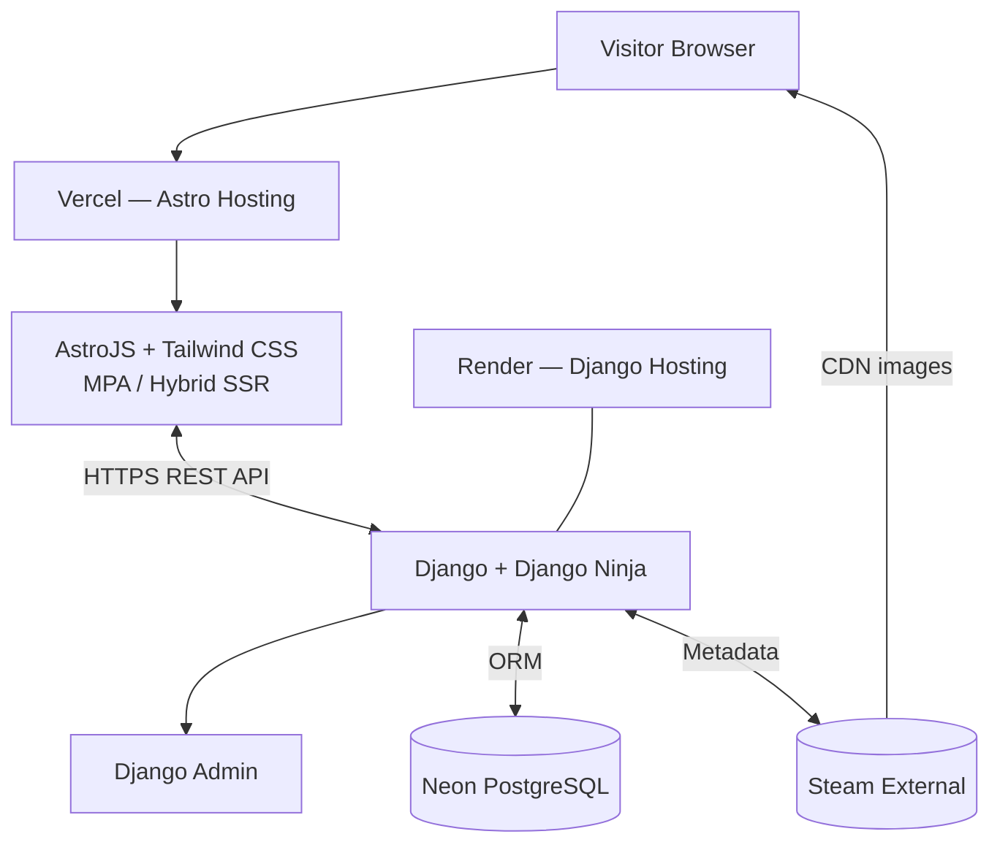
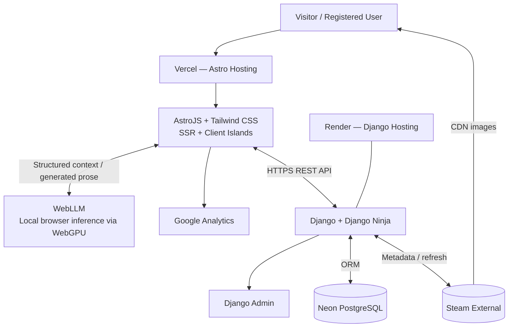

# Project Skill-Based Games Classification — Canonical Context

> **Document role:** Ultimate project source of truth for humans and LLMs  
> **Project key:** `SBGC`  
> **Jira project:** Project Skill-based Games Classification  
> **Public product name:** MyGameDNA
> **Owner / product lead:** Ammar “イズカ” Iskandar  
> **Canonical baseline date:** 2026-07-22  
> **Jira snapshot:** Generated 2026-07-22 08:34:02 UTC  
> **Current delivery target:** MVP, followed by a separately planned final-product phase  
> **Expected traffic:** Approximately 100 or fewer visits per month  
> **Cost objective:** RM0/month where practical, excluding an optional custom domain

---

## 0. Purpose, authority, and maintenance

This file is intended to let any human or LLM open the repository—today or years later—with no access to prior chats and immediately understand the product, terminology, architecture, scope, data, operations, decisions, Jira plan, and unresolved questions.

### 0.1 Normative language

- **MUST / MUST NOT:** decided requirement or explicit prohibition.
- **SHOULD / SHOULD NOT:** preferred implementation; deviations require a reason.
- **MAY:** optional.
- **TBD:** deliberately undecided; do not silently invent a choice.

### 0.2 Source-of-truth hierarchy

1. The latest `context.md` decision and changelog entry.
2. Accepted architecture decision records referenced here.
3. Jira for execution status and work breakdown.
4. Code and production configuration for implemented reality.
5. Diagrams as visual summaries.
6. Historical chats and drafts, which are superseded.

If code differs from this document, record the deviation. Do not let accidental implementation become architecture by default. Jira task `SBGC-130` explicitly requires technical documentation and documentation of deviations from `context.md`.

### 0.3 Update protocol

A material change to product scope, terminology, methodology, models, API, rendering, providers, security, recommendation logic, WebLLM, or moderation MUST update:

1. this file;
2. the decision log;
3. the changelog;
4. Jira;
5. diagrams when architecture changes.

Do not erase superseded decisions without preserving why they changed.

---

# 1. Executive summary

This is a lightweight full-stack games database conceptually similar to SteamDB or ProtonDB, but its core differentiator is a dual-profile classification rather than conventional genre tags.

Every game is described through two independent profiles:

1. **Challenge profile** — what the game asks the player to do well.
2. **Reward profile** — what makes the player feel satisfied, validated, proud, fulfilled, or meaningfully recognised.

Each profile uses the same three dimensions:

1. **Micro** — immediate, local, moment-to-moment execution or validation.
2. **Mystiko** — hidden, private, inferred, personally understood, or internally meaningful play.
3. **Macro** — accumulated, large-scale, long-horizon systems mastery or prestige.

Every valid profile MUST satisfy:

```text
Challenge Micro + Challenge Mystiko + Challenge Macro = 100
Reward Micro + Reward Mystiko + Reward Macro = 100
```

The two profiles are related but MUST remain conceptually and numerically separate. A game may demand one mix of skills while rewarding a different mix of outcomes. The values describe **composition, not difficulty, quality, fun, or overall engagement**.

The MVP is owner-curated. Ammar will manually review and classify approximately 200 popular games, primarily from Steam. Steam games use Steam App IDs. Very popular non-Steam games, such as Valorant, can be created manually through Django Admin. DLC, demos, soundtracks, software, tools, and other non-game products are excluded from public listings.

The final product preserves the MVP stack and can add user submissions, moderation, separate community scores, recommendation logic, and optional browser-local WebLLM prose generation. Django/Python selects the recommendation. WebLLM merely writes an explanation from trusted structured data on the client’s GPU.

Canonical stack:

- monorepo;
- AstroJS + Tailwind CSS frontend;
- Django + Django Ninja backend;
- Django Admin as the owner interface;
- Neon PostgreSQL;
- Vercel frontend hosting;
- Render backend hosting;
- Steam API/storefront data and Steam CDN images;
- Google Analytics for product analytics;
- WebLLM only in the final product.

Explicitly unnecessary at current scale: paid CDN, Kubernetes, Redis, Celery, Elasticsearch, object storage for Steam images, custom CMS, custom admin frontend, microservices, and SigNoz.

---

# 2. Product vision

## 2.1 Problem

Genre labels describe broad format but often fail to explain either why games feel similar to play or why they remain satisfying. Two games in the same genre may demand very different capabilities; games from different genres may impose similar challenges but reward players in completely different ways.

The product provides a compact framework for questions such as:

- Which games are most Micro-, Mystiko-, or Macro-heavy in the challenges they present?
- Which games provide mostly immediate local rewards, private/internal rewards, or long-horizon prestige?
- Which games share a challenge profile despite having different genres?
- Which games share a reward profile despite playing differently?
- Which games resemble a user’s favourites in skill requirements, reward structure, or both?
- Why can a low-challenge or cheated experience still feel rewarding?
- Where does the owner’s editorial view differ from the community?

## 2.2 Value proposition

> Describe and compare games through two separate Micro/Mystiko/Macro profiles: the challenges they present and the rewards they provide.

## 2.3 Audience

Initial users are players interested in competitive or skill-oriented games, cross-genre comparisons, self-understanding, and discovery. The application should remain useful for ordinary players and avoid assuming esports expertise.

## 2.4 Project character

This is a personal learning and portfolio project, not a serious revenue-generating business. Architectural decisions prioritise learning, clarity, near-zero cost, and low operational burden over enterprise availability or theoretical scale.

---

# 3. Goals, non-goals, and constraints

## 3.1 MVP goals

The MVP MUST:

- provide a public catalogue of roughly 200 owner-classified games;
- support Steam records identified by App ID;
- support selected owner-created records for major non-Steam games;
- validate and display separate Challenge and Reward Micro/Mystiko/Macro profiles, with each profile totalling 100;
- provide game pages, search, listings, rankings, and skill filters;
- exclude DLC and non-game records;
- provide Django Admin workflows for importing, creating, editing, classifying, hiding, and refreshing games;
- be minimal, fast, responsive, accessible, and usable on poor connections;
- deploy on free or near-free services;
- hotlink Steam images rather than storing copies;
- include sensible security, validation, logging, tests, documentation, and release procedures.

## 3.2 Final-product goals

The final product MAY add:

- accounts;
- one active user submission per game;
- moderation and audit history;
- editorial and community Challenge/Reward profiles displayed separately;
- trusted contributors;
- consensus/disagreement indicators;
- Python-based game recommendations;
- client-side WebLLM explanations;
- Google Analytics if not already added during MVP release;
- a post-final-deployment A/B test of **Meso** versus **Mystiko**.

## 3.3 Non-goals

The project is not intended to be:

- a full Steam mirror;
- a storefront or download service;
- an image-hosting platform;
- a high-availability enterprise system;
- a microservice platform;
- a large social network;
- a server-hosted LLM product;
- an application where an LLM decides recommendations;
- a system requiring manual moderation of every community vote forever.

## 3.4 Constraints and accepted risks

- Assume approximately 100 or fewer monthly visits.
- Cold starts are acceptable.
- Occasional Steam or free-tier downtime is acceptable.
- Cost minimisation outranks high availability.
- Service plans may change; revalidate providers before deployment.
- The architecture must remain portable to equivalent providers.

---

# 4. Dual-profile classification framework

## 4.1 Core model

Every game has two conceptually independent classifications:

1. **Challenge composition** — the relative composition of what the game asks the player to overcome or perform.
2. **Reward composition** — the relative composition of what makes the player feel rewarded.

Both profiles use Micro, Mystiko, and Macro, but the meanings are contextual. The same label MUST NOT be assumed to mean exactly the same thing across Challenge and Reward.

The two triplets MUST be stored, validated, displayed, discussed, and versioned separately.

## 4.2 Challenge profile

The Challenge profile answers:

> At competent or ranked play, what proportion of successful performance depends on Micro execution, Mystiko inference/adaptation, and Macro systems/strategy?

### 4.2.1 Challenge Micro

Challenge Micro represents direct execution and mechanical performance, including aim, timing, reaction speed, movement precision, input accuracy, combos, animation cancels, dexterity, technical control, and moment-to-moment optimisation.

Challenge Micro is not synonymous with “action.” Strategy games may contain substantial Micro; action games may have forgiving execution.

### 4.2.2 Challenge Mystiko

Challenge Mystiko is the current preferred name for the former **Meso** dimension. The term derives from Greek for “hidden,” which better evokes information that must be inferred rather than directly known.

Challenge Mystiko includes:

- hidden information;
- probability management;
- mind games;
- bluffing;
- opponent reads;
- prediction;
- habit recognition and conditioning;
- short-horizon tactical choice;
- uncertainty management;
- matchup-specific adaptation.

Challenge Mystiko is not simply randomness. Randomness matters only where a player reasons and acts around uncertainty.

### 4.2.3 Challenge Macro

Challenge Macro represents systems and long-horizon strategy, including resource management, economy, map-wide planning, build orders, composition planning, progression, systemic knowledge, objective prioritisation, strategic positioning, and multi-step planning.

## 4.3 Reward profile

The Reward profile answers:

> What proportion of the game’s felt satisfaction comes from immediate/local validation, private/internal fulfilment, and accumulated/broad prestige?

Reward does not mean only formal prizes. It includes any quantitative or qualitative feedback, recognition, fulfilment, catharsis, expression, pride, validation, or meaningful satisfaction that encourages continued play.

### 4.3.1 Reward Micro

Reward Micro is immediate, short-horizon, and local to the current moment, encounter, match, lobby, race, server, or play session.

Typical sources include:

- winning one match;
- getting kills, assists, damage, healing, score, or another lobby statistic;
- being MVP;
- setting the fastest lap in one race;
- receiving immediate audiovisual feedback;
- collecting visible resources such as diamonds;
- completing a short encounter or objective;
- receiving praise or recognition from the small circle currently present.

The defining idea is:

> “I did well in this particular moment or local session, and the result or nearby audience validates it.”

Reward Micro may be quantitative or qualitative. Winning one match is Reward Micro even if it contributes to a longer ranked progression.

### 4.3.2 Reward Macro

Reward Macro is accumulated, prestigious, persistent, rare, long-horizon, or visible to a much larger reference group.

Typical sources include:

- reaching a high rank such as Platinum;
- maintaining a high Elo rating;
- winning many matches over time;
- earning a rare skin or item;
- completing a difficult long-term achievement;
- holding a speedrun world record;
- building a renowned collection, base, or public accomplishment;
- receiving recognition that extends beyond one lobby or session.

The defining idea is:

> “This achievement persists beyond the current match and can be recognised by a wider community.”

Reward Macro may also be quantitative or qualitative. Its distinguishing feature is not merely a larger number; it is accumulated scale, persistence, prestige, rarity, or broader social visibility.

### 4.3.3 Reward Mystiko

Reward Mystiko is private, internally understood, personally meaningful, clever, expressive, elegant, or hidden from the wider audience.

The reward may not produce a kill, score, win, rank, achievement, or visible recognition. Other players may not know that anything important happened. The player nevertheless understands why the action mattered and feels rewarded.

Typical sources include:

- a Rainbow Six Siege Lesion trap quietly redirecting an enemy into a teammate’s kill;
- choosing a specific Elden Ring weapon and successfully executing the imagined counter;
- performing a stylish Devil May Cry 5 combo that offers little numerical advantage but feels expressive and technically satisfying;
- preparing a chess opening response for a particular opponent and seeing the preparation work;
- manipulating an opponent into the exact mistake the player predicted;
- discovering an elegant, self-imposed, role-playing, creative, or systemic solution that the game does not formally score.

The defining idea is:

> “Other people may not see or understand why this mattered, but I know what I achieved.”

Reward Mystiko is not restricted to hidden information. It includes private meaning, authorship, ingenuity, expression, style, fulfilment, and unseen causal impact.

## 4.4 Why challenge and reward must be separated

Challenge and reward interact but are not equivalent.

A player may experience:

- high challenge and high reward;
- high challenge and weak reward;
- low challenge and high reward;
- almost no challenge but enough reward to remain entertained.

This distinction explains why cheating can still feel fun. Cheating may remove or reduce the Challenge profile while preserving or amplifying Reward Micro through dominant local outcomes, Reward Macro through accelerated progression or rare possessions, and Reward Mystiko through experimentation, fantasy fulfilment, unusual systemic behaviour, or personally meaningful play.

The product MUST NOT assume that challenge is the sole reason people play games.

## 4.5 Canonical terminology and Meso-to-Mystiko decision

Current canonical UI, documentation, schema, and API terminology is:

```text
Challenge: Micro / Mystiko / Macro
Reward:    Micro / Mystiko / Macro
```

Historical references may still say Meso. New schema and code should use `mystiko` unless an explicit compatibility migration requires otherwise.

A post-final-deployment A/B test SHOULD compare Meso and Mystiko for user comprehension. This work has not yet been written as a Jira ticket. It must be added later without inventing an issue key in advance.

The test should measure comprehension, not only clicks:

- correct association with hidden information, probability, reads, and mind games for Challenge Mystiko;
- correct association with private meaning, unseen impact, ingenuity, and internal fulfilment for Reward Mystiko;
- time to understand the framework;
- methodology-page comprehension;
- preference after seeing definitions;
- whether either label causes systematic misclassification.

## 4.6 Composition, not difficulty or quality

Neither profile is a difficulty score, quality score, fun score, addiction score, or measure of how rewarding a game is in absolute terms.

A profile describes the **relative composition** of challenge or reward within that game. Potential future dimensions such as challenge intensity, reward intensity, knowledge burden, learning curve, or reward frequency are outside MVP unless separately approved.

## 4.7 Methodology baseline

Every reviewed game requires two separate rating prompts.

Challenge prompt:

> At competent or ranked play, what proportion of successful performance depends on execution and mechanics, hidden-information reasoning and short-horizon adaptation, and long-horizon systems knowledge and strategic planning?

Reward prompt:

> Across ordinary and sustained play, what proportion of felt satisfaction comes from immediate/local validation, private or internally understood fulfilment, and accumulated or broadly visible prestige?

Every Challenge and Reward profile MUST:

- include all three dimensions;
- keep each value within its valid range;
- total exactly 100 independently;
- use a consistent methodology and review horizon;
- include editorial notes where ambiguity materially affects interpretation;
- avoid using one profile as a proxy for the other.

## 4.8 Worked examples

### Chess

Challenge is expected to lean heavily Macro and Mystiko, with lower Micro.

Reward may also lean Macro and Mystiko:

- Reward Micro: winning one individual game, delivering a tactical combination, or capturing a major piece;
- Reward Macro: Elo progression, tournament results, titles, and sustained performance;
- Reward Mystiko: preparing a specific opening counter, recognising a deep positional idea, inducing a predicted mistake, or seeing a private plan unfold.

### Competitive shooter

A shooter may have high Challenge Micro, substantial Challenge Mystiko, and some Challenge Macro.

Its Reward profile may differ:

- Reward Micro: kills, MVP, damage, one match win;
- Reward Macro: rank, public prestige, rare cosmetics, long-term mastery;
- Reward Mystiko: a trap, rotation, bait, or prediction whose impact only the player fully understands.

### Character-action game

A game may reward an elaborate combo through Reward Mystiko even when the combo barely improves damage or completion time. Its satisfaction comes from expression, style, authorship, and successful execution of a personally meaningful idea.

## 4.9 Editorial and community profiles

MVP uses editorial Challenge and Reward profiles only.

Final product displays editorial and community Challenge/Reward results separately. They MUST NOT be silently blended.

Preferred rule:

- editorial is primary where available;
- community is primary only where editorial is absent;
- display both when both exist;
- show community submission count and optional consensus.

---

# 5. Scope by phase

## 5.1 MVP

Included:

- roughly 200 games;
- Steam and manual sources;
- editorial Challenge and Reward classification;
- public game pages;
- catalogue, search, rankings, filters;
- score visualisation;
- Django Admin;
- DLC/non-game exclusion;
- SEO metadata;
- validation, security, rate limiting;
- deployment, logging, monitoring, testing, documentation, data quality, and launch.

Excluded:

- accounts;
- community scoring;
- recommendation engine;
- WebLLM;
- custom CMS;
- background workers;
- paid CDN;
- SigNoz.

## 5.2 Final product

Adds capabilities without replacing the foundation:

- accounts and permissions;
- submissions and moderation;
- community Challenge and Reward aggregates;
- trusted-user pathway;
- recommendation logic;
- local WebLLM explanation;
- analytics and terminology experimentation.

The final-product backlog has not yet been created in Jira. Current Jira issues are an MVP delivery plan unless explicitly noted otherwise.

---

# 6. Users and journeys

## 6.1 Public visitor

A visitor can browse, search, filter, rank, open a game page, view metadata and artwork, understand both three-part profiles, see dominant Challenge and Reward dimensions, and read methodology/editorial notes.

## 6.2 Owner/admin

The owner can sign in to Django Admin, import Steam App IDs, create manual games, verify content type, enter or change Challenge and Reward profiles, hide/publish records, refresh Steam metadata, and perform data-quality review.

## 6.3 Registered user — final only

A user may submit one active dual-profile classification per game, revise it, provide reasoning, see moderation state, view community results, and identify favourite games.

## 6.4 Recommendation user — final only

The user selects favourite games. Django calculates skill-profile similarity and selects eligible recommendations. WebLLM optionally writes a human-readable explanation locally.

---

# 7. Architectural principles

1. Keep one frontend, one backend, and one relational database.
2. Use source-qualified external identity rather than assuming all numeric IDs are globally unique.
3. Persist only minimal metadata needed for search, listings, and administration; Steam remains authoritative.
4. Do not store Steam image binaries.
5. Keep business rules in Django/Python.
6. Use browser AI only for bounded prose generation.
7. Use Django Admin instead of building a custom CMS.
8. Prefer MPA, static rendering, and SSR over SPA complexity.
9. Optimise for low cost and low operations, not theoretical scale.
10. Add infrastructure only after measured need.
11. Degrade gracefully when external services fail.
12. Keep editorial and community viewpoints transparent.
13. Keep Challenge and Reward profiles separate in data, APIs, visuals, rankings, and methodology.
14. Browser interactions dependent on scrolling, animation, gestures, runtime
    geometry, or timing must be validated against a real browser using the actual
    runtime mechanism; pure/synthetic tests supplement but cannot substitute for
    that evidence. F3 motion/timing features require a strategy comparison and
    real-browser regression coverage. If the same interaction defect survives two
    correction attempts, code changes stop for architecture and validation-harness
    reassessment before further patches.

---

# 8. Monorepo and application structure

The project MUST use a monorepo.

Recommended logical layout:

```text
/
├── apps/
│   ├── frontend/              # AstroJS + Tailwind CSS
│   └── backend/               # Django + Django Ninja
├── docs/
├── scripts/
├── .github/workflows/
├── .editorconfig
├── .gitignore
├── context.md
└── README.md
```

Frontend-specific dependencies stay with the frontend; backend dependencies stay with the backend. Root scripts may orchestrate install, lint, test, build, and run commands. Secrets MUST NOT be committed.

Suggested Django boundaries:

```text
config/                # settings, URLs, ASGI/WSGI
games/                 # identities, metadata, content types
classifications/       # editorial and future community scores
api/                   # Django Ninja routers and schemas
users/                 # final-product accounts, if separated
```

## Design reference assets

**SBGC-136** created the approved high-fidelity dark-mode mock design. Human references include the Jira-attached PNG and the Figma Make link.

For LLM and developer reference, a read-only archived export lives at:

```text
design-reference/figma-make-dark-ui/
```

This export is **generated React/Vite code**. It MUST NOT:

- be edited directly;
- be imported into Astro production code;
- be built or deployed by Vercel;
- have its dependencies installed as project dependencies.

It is useful as implementation reference for layout, spacing, typography intent, component appearance, interaction intent, visual hierarchy, copy, and asset reference.

**Production implementation remains Astro + Tailwind CSS.** Any conflict between the generated prototype and canonical architecture is resolved in favour of this document. Design fidelity is expected, but implementation technology must remain canonical.

SBGC-136 created the design; SBGC-137 archived and protected it.

---

# 9. Rendering and navigation

The product is primarily an **MPA, not an SPA**.

Canonical rendering strategy:

- static/prerendered: About, Methodology, FAQ, fixed content;
- SSR/on-demand: game pages, catalogue, search, rankings, user-specific pages;
- CSR/islands: bounded interactions, analytics, final WebLLM.

Canonical description:

> Astro MPA with hybrid rendering: prerendered static pages, SSR dynamic pages, and limited client-side islands.

Preferred request path:

```text
Browser → Astro → Django API → PostgreSQL / Steam
```

The `/rankings` page (SBGC-82) follows this model as an SSR/on-demand,
viewport-contained ranking application over the SBGC-81 ranking read: three
profile tabs, one sort control, selection-driven detail pane, client-side page
transitions via a same-origin proxy, and a viewport-driven page size.  See
`docs/frontend-architecture.md` → "Rankings (SBGC-82)".

Astro MUST NOT duplicate authoritative validation, classification, moderation, or recommendation logic.

---

# 10. MVP architecture


```mermaid
flowchart TB
    User[Visitor Browser]
    Vercel[Vercel — Astro Hosting]
    Astro[AstroJS + Tailwind CSS\nMPA / Hybrid SSR]
    Django[Django + Django Ninja]
    Admin[Django Admin]
    Render[Render — Django Hosting]
    Neon[(Neon PostgreSQL)]
    Steam[(Steam External)]

    User --> Vercel
    Vercel --> Astro
    Astro <-->|HTTPS REST API| Django
    Django --> Admin
    Render --- Django
    Django <-->|ORM| Neon
    Django <-->|Metadata| Steam
    Steam -->|CDN images| User
```

### Astro on Vercel

Owns public routing, SSR/prerendering, HTML, Tailwind presentation, pages, search UI, ranking UI, SEO metadata, accessibility, and small interactions.

### Django + Django Ninja on Render

Owns game identity, classifications, validation, Steam integration, manual records, exclusion policy, filtering/ranking queries, API schemas, security, rate limits, admin, and database access.

### Neon PostgreSQL

Stores identities, source type, minimal catalogue metadata, content/listing state, editorial scores, timestamps, and future final-product data.

### Steam

Provides Steam metadata and CDN images. Downtime is accepted. The system should fail gracefully but does not require paid resilience.

### Django Admin

Provides owner content management without a separate CMS.

### Public game-page flow

```text
Visitor requests Astro route
→ Astro SSR calls Django
→ Django reads PostgreSQL and Steam as required
→ Django returns normalised JSON
→ Astro renders HTML
→ browser loads image from Steam CDN
```

### Manual-game flow

```text
Visitor requests manual record
→ Astro calls Django
→ Django returns owner-managed metadata and classification
→ Astro uses the same public page components
→ browser loads configured external image or fallback
```


---

# 11. Final architecture


```mermaid
flowchart TB
    User[Visitor / Registered User]
    Vercel[Vercel — Astro Hosting]
    Astro[AstroJS + Tailwind CSS\nSSR + Client Islands]
    WebLLM[WebLLM\nLocal browser inference via WebGPU]
    GA[Google Analytics]
    Django[Django + Django Ninja]
    Admin[Django Admin]
    Render[Render — Django Hosting]
    Neon[(Neon PostgreSQL)]
    Steam[(Steam External)]

    User --> Vercel
    Vercel --> Astro
    Astro <-->|Structured context / generated prose| WebLLM
    Astro --> GA
    Astro <-->|HTTPS REST API| Django
    Django --> Admin
    Render --- Django
    Django <-->|ORM| Neon
    Django <-->|Metadata / refresh| Steam
    Steam -->|CDN images| User
```

## 11.1 Execution boundaries

The diagram groups Astro and WebLLM as the frontend experience, but their execution locations differ:

- Astro SSR runs on Vercel.
- browser JavaScript runs on the user’s device;
- WebLLM runs on the user’s device, normally through WebGPU;
- Google Analytics executes from the public client experience;
- Django and Admin run on Render;
- PostgreSQL runs on Neon.

## 11.2 Recommendation responsibility

Recommendation selection MUST run in Django/Python:

```text
Favourite games
→ Django loads trusted skill vectors
→ Python calculates similarity
→ Python applies eligibility and threshold
→ Django selects recommended game(s)
→ Django returns structured data and reasons
→ Astro presents the result
→ WebLLM optionally rewrites it as natural-language prose
```

WebLLM MUST NOT choose the game, change the server result, classify games, or be required for the feature to work.

A deterministic template SHOULD be available if WebGPU is unsupported, model download is declined, memory is insufficient, or inference fails.

## 11.3 Model loading

Browser models may require downloads of hundreds of megabytes or more. WebLLM MUST be lazy-loaded only after the user explicitly opens/invokes the explanation feature. It MUST NOT load on every page.

## 11.4 Similarity logic

Accepted intent:

- compare trusted Challenge vectors, Reward vectors, or an explicitly documented combination;
- use favourite games as inputs;
- consider candidates with more than 90% similarity;
- select candidates in Python.

Whether recommendation similarity uses Challenge only, Reward only, separate filters, or a documented combined measure is **TBD**. The exact similarity formula is also **TBD** and MUST be formally defined, documented, and tested. It must respect the compositional nature of vectors summing to 100. The method for combining multiple favourites is also TBD.

---

# 12. Technology and hosting decisions

| Layer | Technology | Preferred provider (2026) | Responsibility |
|---|---|---|---|
| Repository | Monorepo | Git host TBD | One history and coordinated CI |
| Frontend | AstroJS | Vercel Hobby/free equivalent | MPA, SSR, static pages, UI |
| Styling | Tailwind CSS | Bundled | Responsive lightweight design |
| Backend | Django | Render free/equivalent | Logic, data access, admin |
| API | Django Ninja | With Django | Typed REST API / OpenAPI |
| Database | PostgreSQL | Neon free/equivalent | Durable relational data |
| Owner UI | Django Admin | With Django | Content/admin/moderation |
| Metadata | Steam APIs/storefront endpoints | Steam | Steam game information |
| Images | Steam CDN | Steam | Direct image delivery |
| Analytics | Google Analytics | Google | Product usage analytics |
| Local AI | WebLLM, final only | User browser/GPU | Recommendation prose |

## 12.1 PostgreSQL over deployed SQLite

SQLite remains fine for local development, but deployment uses PostgreSQL because managed durability, backups, migrations, future user writes, and platform portability matter more than a single-file database. This choice is operational, not driven by data size.

## 12.2 Provider longevity

Vercel, Render, and Neon are current choices, not eternal dependencies. By 2037 their plans may differ. The invariant is to use the cheapest practical equivalent for:

- SSR/static frontend hosting;
- Django hosting;
- durable managed PostgreSQL.

Provider substitutions that preserve responsibilities are acceptable but MUST be documented.

---

# 13. Data model

Precise Django field types are implementation decisions, but the following concepts and constraints are canonical.

## 13.1 `Game`

```text
id
source                  # steam or manual; future sources require a decision
external_id             # Steam App ID; nullable for manual
name
slug
content_type            # game, dlc, demo, soundtrack, software, tool, video, unknown
is_listed
release_date             # nullable
summary/description      # optional minimal metadata
developer                # nullable
publisher                # nullable
image_url
metadata_status          # optional
metadata_updated_at
created_at
updated_at
```

Rules:

- internal `id` is the relational primary key;
- Steam records MUST have an App ID;
- manual records MAY have no external ID;
- uniqueness SHOULD protect `(source, external_id)` when present;
- public URLs SHOULD use a stable slug and/or source-qualified identifier;
- manual slugs MUST be unique under the selected URL scheme;
- source identity must not assume that two providers cannot share the same numeric ID.

## 13.2 `EditorialClassification`

```text
game_id                       # one-to-one

challenge_micro
challenge_mystiko
challenge_macro

reward_micro
reward_mystiko
reward_macro

challenge_notes
reward_notes
methodology_version
updated_by
created_at
updated_at
```

Rules:

- one editorial classification record per game is acceptable, provided Challenge and Reward remain explicitly separated;
- each value must be valid;
- Challenge values total exactly 100;
- Reward values total exactly 100;
- neither triplet may be derived from the other;
- owner/admin editing only in MVP;
- changes attributable to an admin where practical;
- deleting a classification must not delete its game accidentally.

A future implementation MAY split this into separate `ChallengeProfile` and `RewardProfile` entities if that produces clearer constraints, history, or community aggregation. That structural choice must preserve the canonical separation.

## 13.3 Derived values

May include dominant Challenge dimension, dominant Reward dimension, tied dimensions, separate vector representations, formatted values, and ranking positions. Derivation SHOULD live in one backend service/query layer, not be duplicated in templates.

SBGC-81 delivers the public ranking read (`GET /api/v1/rankings/`) over these published values. Challenge/Reward read the current READY snapshot's `unified_integer_*` arrays (canonical `[micro, macro, mystiko]`); Unified is a presentation-only `(Challenge + Reward) / 2` (`.5` preserved) and is never persisted. See `docs/backend-api.md` for profile/direction/eligibility/tie/dominance/pagination semantics.

## 13.4 `ClassificationSubmission` — final only

```text
id
game_id
user_id
challenge_micro
challenge_mystiko
challenge_macro
reward_micro
reward_mystiko
reward_macro
challenge_reasoning
reward_reasoning
status                   # pending, approved, rejected, superseded, withdrawn
created_at
updated_at
reviewed_at
reviewed_by
rejection_reason
```

Rules:

- one active submission per user/game;
- revised submissions follow a documented audit policy;
- Challenge and Reward triplets each total 100;
- only approved submissions affect the community result;
- moderation is auditable;
- anonymous scoring is not accepted in the current final design.

## 13.5 `CommunityAggregate` — final only

```text
game_id
challenge_micro
challenge_mystiko
challenge_macro
reward_micro
reward_mystiko
reward_macro
submission_count
consensus_score          # optional; formula TBD
scoring_method_version
updated_at
```

Arithmetic mean is acceptable for the first community implementation. Robust estimators may be introduced later for manipulation resistance.

## 13.6 Users — final only

Use Django authentication unless a custom-user requirement is identified before production migrations. Requirements include verified identity (normally email), permissions, status, suspension/ban capability, optional trusted-contributor status, and minimal personal-data collection.

## 13.7 Content types

Canonical values:

```text
game
dlc
demo
soundtrack
software
tool
video
unknown
```

Public listings normally require `content_type = game` and `is_listed = true`.

Ambiguous policy cases include standalone expansions, remasters, prologues, test clients, dedicated servers, bundles, modding tools, and episodic products.

## 13.8 Integrity and hardening

Database constraints SHOULD cover:

- source/external-ID uniqueness;
- score ranges;
- Challenge total of 100;
- Reward total of 100;
- required fields by source;
- safe foreign-key deletion;
- indexes for search, listing state, source, content type, and score ordering;
- migration reproducibility;
- least-privilege application credentials where supported;
- backup and restoration documentation.

---

# 14. Metadata and assets

## 14.1 Steam metadata

Steam is authoritative. Persist only the subset needed for search, listings, rankings, administration, and graceful display. Do not build a full Steam mirror.

## 14.2 Refresh

Refresh must update permitted metadata, preserve classifications, respect owner overrides, record success time, and fail without corrupting the record. A manual Django Admin action and `SteamGameRefreshService` remain the canonical refresh path. A daily scheduled refresh (Steam-only, per-Game retry budget, failure-only retries, one final-failure alert) is delivered by SBGC-183 — see `docs/scheduled-steam-refresh.md`.

## 14.3 Steam images

- Load from Steam CDN URLs.
- Do not store image binaries.
- Provide fallback imagery.
- Lazy-load where appropriate.
- Include meaningful alt text.
- Do not assume every image variant exists.

## 14.4 Manual-game images

Manual records may use an owner-supplied external URL. Validate its format, provide fallback behaviour, and comply with the source’s rights/terms.

No paid CDN is required.

---

**SBGC-42 (completed)** delivered a synchronous Steam HTTP client under
`games/services/steam/` (see
[`docs/steam-integration.md`](docs/steam-integration.md)). Key design:

- **Immutable configuration** (`SteamClientConfig`) — timeouts, retry policy,
  response-size limit, CDN allowlist, and optional API key.
- **Synchronous Requests session** — urllib3 `Retry` adapter for bounded
  idempotent retries.
- **Immutable trusted origins** — `STEAM_WEB_API_ORIGIN` and
  `STEAM_STORE_API_ORIGIN` are module-level constants in
  `games.services.steam.constants`, not dataclass fields, Django settings,
  or environment variables (SBGC-168).
- **Header-only API key** — sent in `x-webapi-key`; never in query strings,
  logs, errors, or `repr`.
- **Connect/read timeouts** — every request uses `timeout=(connect, read)`.
- **GET/HEAD-only retry** — retryable statuses: 429, 500, 502, 503, 504.
  401 and 403 never retried.
- **Redirects disabled** — unexpected 3xx raises `SteamRedirectError`.
- **Bounded sleep** — `backoff_max` and `retry_after_max` both capped at
  `retry_sleep_max_seconds` (default 5.0 s, max 10.0 s).  Retry-After values
  above the cap are reduced; exponential backoff cannot exceed the cap
  (SBGC-168).
- **Configured operation budget** — `maximum_attempts × (connect + read)
  + max_retries × retry_sleep_max_seconds` (default 49.15 s, ceiling 120 s).
  Configurations exceeding the ceiling are rejected (SBGC-168).
- **Direct urllib3 dependency** — pinned at 2.7.0 alongside requests 2.32.5
  (SBGC-168).
- **Status-first error processing** — error status classified before body
  read; oversized/malformed error bodies never mask status classification;
  raw upstream body never in exceptions (SBGC-168).
- **Single-join body assembly** — chunks accumulated in list, joined once
  with `b"".join()` (SBGC-168).
- **Structured JSON media matching** — regex accepts `application/json` and
  `application/<subtype>+json` with optional parameters; rejects `text/json`,
  `application/jsonx`, `application/+json` (SBGC-168).
- **CDN numeric-host rejection** — decimal, hex, and octal IP
  representations (e.g. `2130706433`, `0x7f000001`, `017700000001`) are
  rejected alongside IP literals and localhost (SBGC-168).
- **Bounded response size** — configurable limit (default 2 MiB);
  `SteamResponseTooLargeError` on exceed.
- **JSON-object response contract** — arrays, scalars, null, and non-JSON
  media types rejected.
- **CDN URL validation** — `validate_steam_cdn_url()` enforces HTTPS,
  exact-host allowlist, no credentials/ports/fragments/IP literals/numeric
  hosts.
- **No real network calls in tests** — isolated tests use injected fake
  sessions and patched urllib3 sleep.
- **Endpoint integration deferred** — concrete API adapters (e.g.,
  `GetAppList`) belong to SBGC-53.
- **No image downloading or proxying** — CDN validation is pure; image
  retrieval is a later concern.
- **Environment configuration** — `config/steam.py`
  (`steam_client_config_from_settings()`) reads raw Django settings,
  normalises values (blank key → absent, CDN hosts deduplicated), and
  delegates validation to `SteamClientConfig.__post_init__`.  No second
  `.env` reader; no `os.environ` access inside the transport model.

# 15. Steam integration

The backend needs a dedicated client/service that:

- accepts App IDs;
- retrieves metadata;
- uses explicit timeouts;
- handles non-success, missing, malformed, restricted, or unavailable data;
- normalises responses;
- does not expose secrets;
- produces typed errors.

Import flow:

```text
Owner enters App ID
→ Steam lookup
→ normalise metadata
→ resolve content type
→ duplicate check
→ create/update Game
→ list only if policy allows
```

Reliability posture: occasional Steam failure is acceptable. Degrade gracefully; do not buy resilience infrastructure for this hobby workload.

---

# 16. Manual non-Steam records

Manual records are for selected very popular non-Steam games such as Valorant, not for exhaustive catalogue coverage.

Required owner-managed data should include name, unique slug, source=`manual`, content type, listing status, image URL/fallback, enough public metadata, and an editorial classification.

Steam refresh actions MUST NOT run on manual records. Both sources should share public components and ranking/search behaviour.

IGDB or another source is a future option, not an accepted MVP dependency.

---

# 17. API design

## 17.1 Style

- REST-like HTTPS JSON API;
- Django Ninja;
- recommended prefix `/api/v1/`;
- typed schemas;
- OpenAPI documentation;
- standard status codes;
- standard error envelope;
- no raw exceptions in production.

## 17.2 Indicative MVP endpoints

```text
GET /api/v1/games
GET /api/v1/games/{slug-or-id}
GET /api/v1/games/search?q=
GET /api/v1/rankings?profile=challenge&dimension=micro
GET /api/v1/rankings?profile=challenge&dimension=mystiko
GET /api/v1/rankings?profile=challenge&dimension=macro
GET /api/v1/rankings?profile=reward&dimension=micro
GET /api/v1/rankings?profile=reward&dimension=mystiko
GET /api/v1/rankings?profile=reward&dimension=macro
GET /api/v1/health
```

Owner writes may remain in Django Admin for MVP.

## 17.3 Indicative final endpoints

```text
POST /api/v1/games/{id}/submissions
PUT  /api/v1/submissions/{id}
GET  /api/v1/me/submissions
POST /api/v1/recommendations
```

Auth and CSRF strategy must be specified before final endpoints are introduced.

## 17.4 Example game response

```json
{
  "game": {
    "id": 123,
    "source": "steam",
    "external_id": "730",
    "name": "Example Game",
    "slug": "example-game",
    "content_type": "game",
    "release_date": "2023-09-27",
    "image_url": "https://...",
    "is_listed": true
  },
  "classification": {
    "editorial": {
      "challenge": {
        "micro": 65,
        "mystiko": 25,
        "macro": 10,
        "notes": "..."
      },
      "reward": {
        "micro": 35,
        "mystiko": 40,
        "macro": 25,
        "notes": "..."
      }
    },
    "community": null
  }
}
```

## 17.5 Error envelope

```json
{
  "error": {
    "code": "GAME_NOT_FOUND",
    "message": "The requested game was not found.",
    "details": null,
    "request_id": "optional-correlation-id"
  }
}
```

---

# 18. Django Admin

Django Admin is the internal CMS/admin/moderation interface.

Game administration should support search by name, source, slug, and App ID; filters by source, content type, listing, and classification status; clear Steam/manual field groups; timestamps; refresh state; and classification links/inlines.

Classification administration should support both three-value profiles, independent total validation, separate notes, dominant Challenge/Reward display, updated-by fields, and one-classification-per-game enforcement.

Useful bulk actions:

- refresh Steam metadata;
- publish/hide;
- mark DLC/non-game;
- recalculate derived values;
- final phase: approve/reject submissions.

Safety:

- strong authentication;
- non-default path as defence in depth, not sole protection;
- minimal admin accounts;
- MFA/passkeys if available;
- read-only system fields;
- confirmation for destructive actions;
- timestamps and attribution.

---

# 19. Search, listings, and rankings

## 19.1 Catalogue

Show listed game records only, combine Steam/manual sources, exclude non-games, show compact scores, paginate, and provide mobile, empty, loading, and error states.

## 19.2 Search

Case-insensitive partial name search, URL-preserved query, SSR results, no-result state, input limits, and rate limiting. PostgreSQL/Django are sufficient; Elasticsearch is unnecessary.

## 19.3 Sort/filter

MVP options:

- alphabetical;
- recently added;
- highest Micro/Mystiko/Macro within either Challenge or Reward;
- dominant dimension within a selected profile;
- Steam/manual source;
- classification availability where useful.

## 19.4 Rankings

Must use stable deterministic ordering, explicit tie behaviour, pagination, backend logic, and exclusion of hidden, invalid, or unclassified records.

---

# 20. Visualisation and UX

Reusable components should include clearly labelled Challenge and Reward sections, percentage bars, numeric values, separate dominant-dimension indicators, compact cards, full game-page display, and an optional triangular visual only if it remains understandable.

The interface MUST make it impossible to mistake Challenge percentages for Reward percentages. Side-by-side, stacked, tabbed, or toggle-based presentation is acceptable only after mobile readability and comprehension testing. A single unlabeled six-value visual is not acceptable.

Accessibility requirements:

- do not rely on colour alone;
- include labels and values;
- maintain contrast and zoom/mobile legibility;
- expose screen-reader text;
- handle ties, 0/100 extremes, and missing data.

`SBGC-36` captures the product-level UX requirement:

> The GUI should be intuitive, minimal, fast, and lightweight, providing a good experience on any device and poor internet connections, including when opened in the background while the user is playing a game.

Tailwind CSS should implement a consistent responsive design system without turning the frontend into a heavy client application.

---

# 21. Recommendation and WebLLM — final only

## 21.1 Inputs and calculation

Potential inputs are one or more favourite games, their trusted published Challenge and Reward vectors, candidate vectors, and listing eligibility. Whether favourites require an account is TBD.

The algorithm MUST run in Python, use trusted values, apply a documented similarity formula and threshold, exclude invalid content, and return structured reasons. Exact multi-favourite aggregation is TBD.

## 21.2 WebLLM boundary

Example structured input:

```json
{
  "recommended_game": "Example",
  "similarity_score": 94.2,
  "user_favourites": ["Game A"],
  "recommended_profiles": {
    "challenge": {
      "micro": 60,
      "mystiko": 25,
      "macro": 15
    },
    "reward": {
      "micro": 30,
      "mystiko": 45,
      "macro": 25
    }
  },
  "comparison_points": [
    "Similar Challenge Micro requirement",
    "More Reward Mystiko and less Reward Macro"
  ]
}
```

Prompt rules should require explanation of the server result, no invention of unsupported game facts, concise language, and honest uncertainty.

Privacy/performance:

- prompts need not be sent to a paid LLM API;
- model download size should be disclosed;
- loading must be opt-in/lazy;
- unsupported devices receive deterministic prose;
- avoid loading WebLLM on normal pages.

---

# 22. Community scoring and moderation — final only

Initial final workflow:

```text
User submits
→ backend validates total=100
→ pending moderation
→ owner approves/rejects in Django Admin
→ approved aggregate recalculates
```

Later, trusted users may bypass pre-approval based on account age, approval history, rejection rate, verification, and moderation history. This should be data-driven and reversible.

Abuse controls:

- one active submission per user/game;
- verified accounts;
- rate limits;
- edit/audit history;
- report and suspension capability;
- owner ability to disable community scoring for a brigaded game;
- separate editorial/community display.

Consensus is desirable because the mean may hide disagreement. Its formula is TBD.

---

# 23. Security, secrets, and abuse prevention

## 23.1 Secret management

No separate paid secret manager is required.

- Vercel environment variables for Astro server-only configuration;
- Render environment variables for Django secrets;
- Neon connection string stored in Render as `DATABASE_URL`;
- local `.env` files ignored by Git;
- committed `.env.example` files contain names, never values;
- no secret may use an Astro `PUBLIC_` prefix or enter browser bundles.

Likely backend secrets/configuration:

```text
DJANGO_SECRET_KEY
DATABASE_URL
DJANGO_ALLOWED_HOSTS
CSRF_TRUSTED_ORIGINS
DJANGO_SECURE_HSTS_SECONDS
STEAM_API_KEY             # only if required by chosen endpoint
ADMIN_URL_PATH            # optional configuration, validated at startup
```

## 23.2 Platform protection

Vercel and Render provide baseline network/DDoS protection. No paid CDN or standalone WAF is justified initially.

## 23.3 Django hardening — implemented SBGC-41

Production security is enforced at settings-import time with environment-specific ownership.  Missing or malformed values raise `ImproperlyConfigured` — production never falls back to development defaults.

- **Environment-specific settings:** `base.py` owns shared infrastructure only (password hashers, request-size limits, installed apps, middleware).  `development.py`, `production.py`, and `test.py` each declare their own security contract.
- **Secret key:** Production must supply a valid `DJANGO_SECRET_KEY`.  Rejects missing, blank, known placeholder, and short values.  Error messages never echo the supplied value.
- **Allowed hosts:** Validated comma-separated hostnames — no wildcards, schemes, ports, paths, queries, fragments, credentials, or blank entries.  Deduplicated.
- **CSRF trusted origins:** Validated comma-separated origins.  Production requires `https://` origins; rejects HTTP, malformed URLs, paths, queries, and fragments.
- **CORS — deny-by-default:** No `django-cors-headers` middleware is installed.  The architecture requires no browser-to-Django cross-origin access.  Django responses never contain `Access-Control-Allow-Origin`.  A future approved browser-to-Django feature must introduce a validated explicit origin allowlist.
- **Password hashing — PBKDF2-SHA256 only:** `PASSWORD_HASHERS = ["django.contrib.auth.hashers.PBKDF2PasswordHasher"]`.  No MD5, SHA-1, PBKDF2-SHA1, Argon2, bcrypt, or scrypt.  Default iteration count preserved.
- **HTTPS and proxy:** `SECURE_PROXY_SSL_HEADER = ("HTTP_X_FORWARDED_PROTO", "https")` per Render deployment guide.  `SECURE_SSL_REDIRECT = True`.
- **Secure cookies:** `SESSION_COOKIE_SECURE`, `CSRF_COOKIE_SECURE`, `SESSION_COOKIE_HTTPONLY` all `True`.  SameSite `Lax` for both session and CSRF cookies.
- **Response headers:** `SECURE_CONTENT_TYPE_NOSNIFF`, `X_FRAME_OPTIONS = "DENY"`, `SECURE_REFERRER_POLICY = "strict-origin-when-cross-origin"`, `SECURE_CROSS_ORIGIN_OPENER_POLICY = "same-origin"`.
- **HSTS — staged:** `SECURE_HSTS_SECONDS` starts at `0`, stage to `3600` after HTTPS deployment verified, increase to `31536000` after sustained operation.  Subdomains and preload remain `False`.
- **Request-size limits:** `DATA_UPLOAD_MAX_MEMORY_SIZE` and `FILE_UPLOAD_MAX_MEMORY_SIZE` at 2.5 MiB, `DATA_UPLOAD_MAX_NUMBER_FIELDS` at 1,000, `DATA_UPLOAD_MAX_NUMBER_FILES` at 20.
- **Rate limiting:** Not yet implemented at the application level.  Login brute-force protection belongs at the deployment/reverse-proxy edge.  Django Ninja cache-based throttling is an application fairness control, not a security boundary — it may be added for expensive or sensitive endpoints in a later ticket.
- **Remaining deployment blockers:** Real `DJANGO_SECRET_KEY`, `DATABASE_URL`, `DJANGO_ALLOWED_HOSTS`, `CSRF_TRUSTED_ORIGINS`, login rate-limiting at the edge, and HSTS staging must all be configured before public deployment.

See [`docs/backend-security.md`](docs/backend-security.md) for the full implemented policy.

- ORM rather than unsafe raw SQL;
- defensive parsing;
- no sensitive logs;
- dependency updates;
- least-privilege database credentials where practical.

## 23.4 Rate limiting baseline

Indicative starting limits, adjustable after observing usage:

```text
Anonymous reads:      60/minute/IP
Search:               20/minute/IP
Admin/login attempts:  5/15 minutes/IP
Registration:          3/hour/IP        # final only
Score submissions:    10/hour/user      # final only
Password reset:        3/hour/account    # final only
```

At MVP scale, implement rate limits without Redis if possible. Do not introduce Redis solely for an imagined load problem.

## 23.5 Bot controls

CAPTCHA is not required everywhere. Free Cloudflare Turnstile or an equivalent may be added only to high-abuse final-product actions such as registration or repeated suspicious submissions.

---

# 24. Logging, analytics, and monitoring

## 24.1 Logging

Django logs should cover request failures, validation failures, Steam errors, database errors, admin actions, and unexpected exceptions without secrets or unnecessary personal data.

Astro/Vercel logging should cover SSR failures, Django timeouts, invalid API responses, and deployment/build errors.

## 24.2 Google Analytics

Google Analytics is product-usage analytics, not application business logic. Useful events include page views, game views, searches, ranking/filter use, and final recommendation feature use.

The final architecture diagram includes Google Analytics. Jira also includes it in the MVP logging/analytics epic, so it may be introduced at late MVP release. It is non-core and can be delayed without changing the application architecture.

Privacy-conscious configuration and appropriate disclosure are required.

## 24.3 Basic monitoring

Use provider-native status, health checks, and logs:

- Django health endpoint;
- Render service/deployment status;
- Vercel deployment and function logs;
- Neon connection/usage status;
- optional free uptime check;
- the scheduled Steam refresh final-failure email (SBGC-183) surfaces a daily
  run's residual failures to the operator (see
  `docs/scheduled-steam-refresh.md`).

## 24.4 SigNoz decision

SigNoz is explicitly excluded at this scale. Cloud pricing conflicts with the budget; self-hosting adds collector/storage/maintenance overhead. It may be reconsidered only if distributed tracing or correlated telemetry becomes a measured need.

---

# 25. Performance, accessibility, and SEO

Performance priorities:

- small JavaScript payload;
- MPA navigation and SSR;
- prerender fixed pages;
- lazy images;
- no WebLLM download outside its feature;
- pagination;
- database indexes;
- explicit external-request timeouts;
- acceptable free-tier cold-start messaging/fallback.

Accessibility priorities:

- semantic HTML;
- keyboard operation;
- visible focus states;
- labelled forms;
- sufficient contrast;
- non-colour score cues;
- alt text;
- responsive layouts;
- screen-reader-readable classifications.

SEO/game-page metadata:

- meaningful title and description;
- canonical URL;
- social metadata;
- no indexing of hidden/invalid records;
- basic structured data where correct and useful;
- 404 and error pages.


---

# 26. Testing and quality strategy

## 26.1 Backend tests

Cover:

- model validation and constraints;
- independent Challenge and Reward totals/ranges;
- source-specific fields;
- duplicate prevention;
- content-type exclusions;
- game detail/catalogue/ranking endpoints;
- Steam normalisation and failure handling;
- admin workflows/actions;
- security and rate limits where practical.

## 26.2 Frontend tests

Cover:

- layouts and reusable components;
- Challenge and Reward profile rendering;
- catalogue/search/rankings;
- error, empty, and missing-data states;
- responsive behaviour;
- critical accessibility semantics.

## 26.3 Integration and end-to-end tests

Critical journeys:

1. browse catalogue;
2. search for a game;
3. open a Steam game;
4. open a manual game;
5. view rankings and filters;
6. owner imports a Steam game;
7. owner creates a manual game;
8. owner enters valid Challenge and Reward profiles;
9. an invalid total in either profile is rejected;
10. DLC is absent from public listings.

## 26.4 Non-functional checks

- mobile responsiveness;
- weak-network experience;
- accessibility;
- performance and JavaScript weight;
- browser compatibility;
- security headers;
- no secret leakage;
- production smoke test.

## 26.5 MVP acceptance definition

MVP is releasable when:

- core public journeys work in production;
- core admin journeys work;
- roughly 200 records are populated and reviewed;
- exclusions are enforced;
- Challenge and Reward classification data is valid;
- frontend/backend/database/Steam integration is verified;
- release-blocking defects are resolved;
- recovery and incident checks are documented;
- owner documentation exists;
- known non-blocking issues are recorded.

---

# 27. Deployment and environments

## 27.1 Environments

At minimum:

- local development;
- preview/test where provider workflows permit;
- production.

Each environment has separate variables and URLs. Production secrets must never be reused casually in local/preview environments.

## 27.2 Backend deployment

Render deployment must define:

- supported Python version;
- dependency install command;
- migration process;
- production application server/start command;
- static-file handling for Django Admin;
- health-check route;
- environment variables;
- allowed hosts/CORS/CSRF settings;
- a Render Cron job for the daily scheduled Steam refresh (SBGC-183) if
  enabled — application-implemented but not provisioned by the ticket.

## 27.3 Frontend deployment

Vercel deployment must define:

- Astro adapter;
- monorepo root/application directory;
- build command and output;
- server-side Django API URL;
- preview and production environment values;
- static and SSR route verification.

## 27.4 Database deployment

Neon setup must define:

- production database/branch strategy as appropriate;
- `DATABASE_URL`;
- SSL requirements;
- migration execution;
- backup/restore expectations;
- connection limits suitable for free-tier/serverless behaviour.

## 27.5 Deployment workflow

Git-based deployment should support:

- CI before merge;
- preview deployments where useful;
- controlled production migration;
- post-deployment smoke tests;
- rollback/redeploy procedure;
- documented handling of a migration that cannot be trivially reversed.

---

# 28. Operations, incidents, and data care

## 28.1 Health checks

The backend health endpoint should distinguish basic process health from deeper dependencies where useful, while avoiding expensive Steam calls on every health check.

## 28.2 Incident checklist

When the site fails, inspect in this order:

1. Vercel deployment/function logs;
2. Render service status and logs;
3. Django health endpoint;
4. Neon connectivity/limits;
5. environment-variable changes;
6. recent migrations/deployments;
7. Steam availability only if metadata/images are affected.

## 28.3 Backups and restoration

Before launch, document:

- what Neon provides automatically under the selected plan;
- how to create an export/dump if needed;
- where owner-maintained backups are kept;
- how to restore into a clean database;
- how to verify restored counts and constraints.

A backup process is not complete until restoration has been tested at least once.

## 28.4 Data quality

Review for:

- duplicate games/editions;
- missing metadata;
- broken image URLs;
- incorrect content types;
- invalid Challenge or Reward totals;
- inconsistent Challenge/Reward methodology;
- hidden records accidentally exposed;
- non-Steam games lacking required manual fields.

---

# 29. Initial catalogue policy

The owner intends to classify at least approximately 200 popular games, primarily the most popular Steam games, supplemented by selected major non-Steam titles.

Catalogue preparation should:

- define a reproducible source/date for “popular” where possible;
- identify App IDs;
- distinguish separate games from DLC, demos, test servers, and duplicate editions;
- decide whether remasters/definitive editions deserve separate records;
- record Challenge and Reward classification status and review notes;
- include manual records only where popularity and product value justify maintenance.

The classification process should favour consistency over speed. Ambiguous games should receive notes and potentially a second review.

---

# 30. Current Jira state

The supplied Jira export contains **134 issues**:

- `SBGC-1` through `SBGC-21`: 21 epics;
- `SBGC-22` through `SBGC-134`: 113 child issues;
- of those child issues, `SBGC-36` is a Story and the other 112 are Tasks.

Snapshot-wide metadata:

- Project: Project Skill-based Games Classification.
- Status: all To Do.
- Priority: all Medium.
- Assignee: all Unassigned.
- Resolution: all Unresolved.
- Components: None.
- Affects versions: None.
- Fix versions: None.
- Labels: None.
- Votes: 0.
- Remaining estimate: Not Specified.
- Time spent: Not Specified.
- Original estimate: Not Specified.
- Epics were created 21 July 2026.
- `SBGC-22` was created 21 July 2026.
- `SBGC-23` onward were created 22 July 2026.
- Export generated by Ammar “イズカ” Iskandar on 22 July 2026.

Jira is currently a skeleton-level plan. Most tickets have titles and metadata rather than detailed descriptions. This file supplies the intended scope beneath those titles. `SBGC-36` is the only issue in the export with an explicit description.

---

# 31. Recommended implementation order and dependencies

The numbered epics are thematic, not a strict waterfall, but a practical sequence is:

1. `SBGC-1` foundation/monorepo.
2. Start `SBGC-2`, `SBGC-3`, and `SBGC-4` in parallel enough to establish contracts.
3. Implement `SBGC-5` and `SBGC-6` as data-source paths.
4. Implement `SBGC-7` and `SBGC-8` so the owner can populate data early.
5. Implement `SBGC-13` API contract/integration before completing public features.
6. Implement `SBGC-9`, `SBGC-10`, `SBGC-11`, and `SBGC-12` iteratively.
7. Apply `SBGC-14`, `SBGC-15`, and `SBGC-16` throughout, not only at the end.
8. Establish `SBGC-17` early enough to expose deployment assumptions.
9. Add `SBGC-18` and `SBGC-19` continuously.
10. Begin `SBGC-20` with a small seed set early; finish the full 200 after workflows stabilise.
11. Complete `SBGC-21` before launch.

Critical dependencies:

- public pages depend on game/classification models and API responses;
- search/rankings depend on persisted minimal metadata and classification queries;
- initial data population depends on Steam/manual/admin workflows;
- deployment depends on environment, database, static files, and security configuration;
- release depends on testing, documentation, data quality, and production verification.

---

# 32. Complete Jira epic and task registry

The following registry preserves every issue key/title and defines its intended scope. Sub-bullets are acceptance scope, not necessarily separate Jira subtasks.


## 32.1 `SBGC-1` — Project Foundation & Repository Setup

### `SBGC-22` — Create monorepo structure (Task)

**Intended scope:** Create `apps/frontend` and `apps/backend`, root documentation/configuration, shared scripts, and clear ownership boundaries.

### `SBGC-23` — Initialize frontend and backend applications (Task)

**Intended scope:** Scaffold Astro and Django, verify both run independently, establish local ports and startup commands.

### `SBGC-24` — Configure package and dependency management (Task)

**Intended scope:** Choose Node package manager/lockfile and Python environment/dependency format; add root install/run/test/build commands and update policy.

### `SBGC-25` — Configure environment variables (Task)

**Intended scope:** Create application-specific examples, distinguish public/server-only variables, configure secrets/database values, and prevent Git leakage.

### `SBGC-26` — Establish code-quality tooling (Task)

**Intended scope:** Configure frontend formatter/linter/type checks, Python formatter/linter/type checks as appropriate, editor settings, and repeatable commands.

### `SBGC-27` — Configure Git and CI foundation (Task)

**Intended scope:** Define branch/PR/commit conventions and CI for lint, tests, and builds, preferably path-aware in the monorepo.


## 32.2 `SBGC-2` — Astro Frontend Foundation

### `SBGC-28` — Configure Astro application architecture (Task)

**Intended scope:** Configure Vercel adapter, SSR default for dynamic routes, prerender fixed pages, and MPA route conventions.

### `SBGC-29` — Install and configure Tailwind CSS (Task)

**Intended scope:** Install Tailwind integration, global CSS, source scanning, and foundational spacing/typography/layout tokens.

### `SBGC-30` — Build the global application shell (Task)

**Intended scope:** Implement base layout, navigation, footer, responsive container, and default SEO metadata.

### `SBGC-31` — Create reusable Tailwind UI foundations (Task)

**Intended scope:** Implement buttons, forms, cards, badges, tables/lists, and loading/empty/error primitives.

### `SBGC-32` — Define Micro/Mystiko/Macro visual system (Task)

**Intended scope:** Define labels, separate Challenge and Reward score bars/charts, legends, responsive patterns, profile distinction, and accessible non-colour cues.

### `SBGC-33` — Create core route skeletons (Task)

**Intended scope:** Create Home, game detail, catalogue, search, rankings, Methodology, About, 404, and error routes.

### `SBGC-34` — Create frontend API layer (Task)

**Intended scope:** Create server-side Django client, response types, environment-based URL, timeouts, errors, and reusable fetch utilities.

### `SBGC-35` — Configure frontend analytics and security (Task)

**Intended scope:** Prepare analytics integration, security headers, public/private environment rules, and baseline accessibility/performance checks.

### `SBGC-36` — Fast, Sleek and Modern UI/UX (Story)

**Intended scope:** Story: make the GUI intuitive, minimal, fast, lightweight, responsive, and usable on poor internet while a game may be running in the background.


## 32.3 `SBGC-3` — Django Backend Foundation

### `SBGC-37` — Create Django application structure (Task)

**Intended scope:** Create project settings and logical games, classifications, API, and future user boundaries with environment-specific settings.

### `SBGC-38` — Configure Django Ninja (Task)

**Intended scope:** Create versioned API, routers, schemas, standard error shape, and OpenAPI documentation.

### `SBGC-39` — Configure database connectivity (Task)

**Intended scope:** Support local development and Neon PostgreSQL through `DATABASE_URL`; verify connections and migrations.

### `SBGC-40` — Configure Django Admin (Task)

**Intended scope:** Enable superuser access, model registration patterns, search/filter conventions, bulk-action foundation, and secure route.

### `SBGC-41` — Configure backend security (Task)

**Intended scope:** Set secret handling, hosts, CORS, CSRF, cookies, debug modes, request limits, and production defaults.

### `SBGC-42` — Configure external-service foundations (Task)

**Intended scope:** Create Steam service/client boundaries, timeouts, normalisation, CDN handling, and environment configuration.

### `SBGC-43` — Configure backend operations (Task)

**Intended scope:** Add logging, health endpoint, admin static files, Render settings, and production startup command.

### `SBGC-44` — Establish backend testing (Task)

**Intended scope:** Create test settings and conventions for models, API, validation, admin, and database isolation.


## 32.4 `SBGC-4` — Database Schema & Core Models

### `SBGC-45` — Implement the Game model (Task)

**Intended scope:** Implement Steam/manual source, external ID, name, slug, content type, listing state, minimal metadata, image URL, and timestamps.

### `SBGC-46` — Implement editorial classification (Task)

**Intended scope:** Implement one editorial classification per game containing separate Challenge and Reward Micro/Mystiko/Macro profiles, notes, updater, and timestamps.

### `SBGC-47` — Implement database constraints (Task)

**Intended scope:** Enforce unique identities, score ranges/total, source-required fields, and safe deletion relationships.

### `SBGC-48` — Implement game-type and listing rules (Task)

**Intended scope:** Represent game/DLC/demo/software/soundtrack/tool/video/unknown and expose only valid listed games.

### `SBGC-49` — Add query and modal helpers (Task)

**Intended scope:** Jira title says “modal”; intended meaning is almost certainly model/query helpers. Implement listed/source/classified/dominant-category/ranking query helpers; correct Jira title if confirmed.

### `SBGC-50` — Create migrations and sample data (Task)

**Intended scope:** Create initial migrations, repeatable development fixtures/seed command, sample Steam/manual games, and classifications.

### `SBGC-51` — Validate models through admin and tests (Task)

**Intended scope:** Verify create/edit workflows, invalid totals, duplicates, DLC exclusion, and manual-source rules.

### `SBGC-52` — Database hardening (Task)

**Intended scope:** Add appropriate indexes, least privilege, connection settings, backup/restore documentation, migration safety, and integrity review.


## 32.5 `SBGC-5` — Steam API Integration

### `SBGC-53` — Build Steam API client (Task)

**Intended scope:** Retrieve by App ID with timeouts, error handling, response normalisation, and no browser secret exposure.

### `SBGC-54` — Implement Steam game import workflow (Task)

**Intended scope:** Import/create/update by App ID, populate fields, prevent duplicates, classify content type, and report invalid IDs clearly.

### `SBGC-55` — Handle Steam images (Task)

**Intended scope:** Generate/extract CDN URLs, provide fallbacks, and avoid image storage.

### `SBGC-56` — Implement metadata refresh (Task)

**Intended scope:** Add manual admin refresh, safe field updates, preservation of classifications/overrides, and last-refresh tracking.

### `SBGC-57` — Configure postman API and prepare test scripts (Task)

**Intended scope:** Create a Postman collection/environment and repeatable request scripts for Steam-related and core API endpoints without committing secrets.

### `SBGC-58` — Test Steam integration (Task)

**Intended scope:** Test valid, invalid, unavailable, malformed, timeout, duplicate, image-missing, and content-type cases.


## 32.6 `SBGC-6` — Manual Non-Steam Game Management

### `SBGC-59` — Implement manual game creation and editing (Task)

**Intended scope:** Create/edit major non-Steam titles in Admin with name, slug, release/developer metadata, image, listing state, and required-field validation.

### `SBGC-60` — Implement manual asset handling (Task)

**Intended scope:** Support validated external image URLs and fallbacks without unnecessary storage.

### `SBGC-61` — Implement source-specific behaviour (Task)

**Intended scope:** Disable Steam refresh for manual records, distinguish fields/admin presentation, and keep public/ranking compatibility.

### `SBGC-62` — Test manual game workflows (Task)

**Intended scope:** Test create, edit, hide, delete, duplicate slugs, missing fields, asset failures, and public display.


## 32.7 `SBGC-7` — Editorial Classification Management

### `SBGC-63` — Implement classification create and edit workflow (Task)

**Intended scope:** Assign all three percentages, notes, and updater attribution through owner workflows.

### `SBGC-64` — Implement classification validation (Task)

**Intended scope:** Enforce ranges, an exact total of 100 for each profile independently, and one editorial classification per game.

### `SBGC-65` — Implement classification-derived values (Task)

**Intended scope:** Implement the complete derived-classification engine governed by `docs/statistical_model.md` (STATISTICAL_MODEL_V1.0.0): Method 1 (role-aware anchored), Method 2 (Isolation Forest), Method 3 (LoOP), BHPCM_V1 unified Final Classification, provisional/full/resilience/boundary confidence, daily-epoch asynchronous calculation, versioned provenance-bearing persistence, retry coordination, notifier scaffold, read contract, and the required simulation harness. No Method 1/2/3 averaging; no manual editing of derived values.

### `SBGC-66` — Test classification rules (Task)

**Intended scope:** Test valid/invalid totals for both profiles, ranges, updates, ties, extremes, and games without profiles.


## 32.8 `SBGC-8` — Django Admin Configuration

### `SBGC-67` — Configure game administration (Task)

**Intended scope:** Search by name/App ID/source; filter by source/type/listed/classified; organise source-specific fields.

### `SBGC-68` — Configure classification administration (Task)

**Intended scope:** Enable intuitive score editing, total/dominant display, and clear validation.

### `SBGC-69` — Add admin actions (Task)

**Intended scope:** Refresh metadata, publish/hide, mark content type, and recalculate derived values.

### `SBGC-70` — Improve admin safety and usability (Task)

**Intended scope:** Use read-only system fields, destructive confirmations, secure access, and audit-visible timestamps/updaters.


## 32.9 `SBGC-9` — Public Game Pages

### `SBGC-71` — Build game-detail API endpoint (Task)

**Intended scope:** Return normalised identity, metadata, and editorial score for valid Steam/manual records with correct unavailable/not-found behaviour.

### `SBGC-72` — Build Astro game-detail route (Task)

**Intended scope:** Resolve stable game URL, fetch during SSR, and render title, artwork, metadata, source, and score.

### `SBGC-73` — Build classification display (Task)

**Intended scope:** Show three percentages, dominant dimension, notes, and methodology context responsively/accessibly.

### `SBGC-74` — Handle exceptional states (Task)

**Intended scope:** Handle missing image/score, stale or failed Steam metadata, hidden/invalid game, backend timeout, and unavailable service.

### `SBGC-75` — Add game-page metadata (Task)

**Intended scope:** Add title, description, canonical URL, social metadata, and accurate structured data where appropriate.


## 32.10 `SBGC-10` — Game Search & Listings

### `SBGC-76` — Build game catalogue API (Task)

**Intended scope:** Provide paginated listed games, name search, source/classification filters, and non-game exclusion.

### `SBGC-77` — Build public catalogue page (Task)

**Intended scope:** Create responsive grid/list, pagination, score summary, and loading/empty/error states.

### `SBGC-78` — Build search experience (Task)

**Intended scope:** Create input/results route, URL query state, SSR results, and no-result/invalid-query handling.

### `SBGC-79` — Implement basic sorting and filtering (Task)

**Intended scope:** Support alphabetical, recently added, Micro/Mystiko/Macro, dominant category, and source.

### `SBGC-80` — Test search and listing behaviour (Task)

**Intended scope:** Test case-insensitive partial search, pagination boundaries, combined filters, sorting, and exclusions.


## 32.11 `SBGC-11` — Rankings & Skill-Based Filtering

### `SBGC-81` — Build ranking API support (Task)

**Intended scope:** Rank by each dimension, filter by dominance, exclude invalid/unclassified data, paginate, and define ties.

### `SBGC-82` — Build rankings pages (Task)

**Intended scope:** Create Micro-, Mystiko-, and Macro-heavy views with URL-based filter/sort controls.

### `SBGC-83` — Handle ranking edge cases (Task)

**Intended scope:** Handle ties, tiny datasets, missing scores, and mixed Steam/manual records.

### `SBGC-84` — Test ranking accuracy (Task)

**Intended scope:** Verify order, ties, filters, pagination, and exclusion policy.


## 32.12 `SBGC-12` — Micro/Mystiko/Macro Visualization

### `SBGC-85` — Create reusable score components (Task)

**Intended scope:** Create reusable, unmistakably separated Challenge and Reward bars, numbers, labels, optional profile-specific triangles, and dominant indicators.

### `SBGC-86` — Define accessible visual rules (Task)

**Intended scope:** Ensure profile labels, legends, contrast, keyboard/screen-reader compatibility, no colour-only meaning, and no ambiguity between Challenge and Reward.

### `SBGC-87` — Apply visualisations across the product (Task)

**Intended scope:** Use consistent dual-profile components on game pages, cards, search, listings, rankings, and useful admin previews.

### `SBGC-88` — Test score rendering (Task)

**Intended scope:** Test both profiles in normal, tied, extreme, decimal/rounded, partial/missing, and mobile states, including comprehension of profile separation.


### Additional Jira work to create under `SBGC-12` — keys not yet assigned

The dual-profile decision was made after the original Jira export. Create new child tasks without reusing or inventing historical keys for:

- define the Challenge-versus-Reward information architecture, labels, explanatory copy, and methodology affordances;
- design and implement the Reward Micro/Mystiko/Macro visual treatment;
- design the combined dual-profile game-page component, including mobile stacking/toggling and explicit profile distinction;
- create worked-example and tooltip content that teaches Reward Micro, Reward Mystiko, and Reward Macro;
- test whether users can correctly distinguish Challenge from Reward and correctly interpret both uses of Mystiko;
- update ranking/filter controls so the selected profile is always explicit;
- update visual regression, accessibility, responsive, and comprehension tests for six displayed values.


## 32.13 `SBGC-13` — API Integration Between Astro and Django

### `SBGC-89` — Create shared API contract (Task)

**Intended scope:** Document shapes, status codes, errors, versioning, pagination, filtering, and field semantics.

### `SBGC-90` — Implement Astro API client (Task)

**Intended scope:** Implement typed SSR requests, timeouts, response parsing, and error mapping.

### `SBGC-91` — Configure environments (Task)

**Intended scope:** Configure local, preview, and production URLs plus CORS/trusted origins.

### `SBGC-92` — Implement integration failure handling (Task)

**Intended scope:** Handle timeout, backend unavailable, malformed response, and partial external metadata failure.

### `SBGC-93` — Add integration tests (Task)

**Intended scope:** Cover game detail, catalogue/search, rankings, and failure scenarios across frontend/backend.


## 32.14 `SBGC-14` — DLC and Non-Game Exclusion

### `SBGC-94` — Define content-type policy (Task)

**Intended scope:** Define game, DLC, demo, soundtrack, software, tool, video, unknown, and ambiguous-product rules.

### `SBGC-95` — Implement automatic classification (Task)

**Intended scope:** Map Steam types to internal values and keep unknown/non-game records unlisted pending review.

### `SBGC-96` — Implement owner override (Task)

**Intended scope:** Permit authorised correction and publication of legitimate standalone titles.

### `SBGC-97` — Enforce exclusions everywhere (Task)

**Intended scope:** Apply policy to APIs, search, listings, rankings, public pages, and recommendations.

### `SBGC-98` — Test ambiguous cases (Task)

**Intended scope:** Test expansions, remasters, prologues, servers, bundles, test clients, tools, and other edge cases.


## 32.15 `SBGC-15` — Validation & Error Handling

### `SBGC-99` — Implement server-side validation (Task)

**Intended scope:** Validate scores, source-required fields, App IDs, URLs, slugs, content types, and duplicates.

### `SBGC-100` — Standardize backend errors (Task)

**Intended scope:** Define validation/not-found/external/permission/unexpected error codes and safe payloads.

### `SBGC-101` — Implement frontend error states (Task)

**Intended scope:** Provide inline, page-level, empty, retry, and friendly fallback experiences.

### `SBGC-102` — Add application safeguards (Task)

**Intended scope:** Limit body/query sizes, parse defensively, use safe defaults, and suppress raw exceptions.

### `SBGC-103` — Test failure paths (Task)

**Intended scope:** Test invalid input, missing data, Steam outage, database errors, and malformed responses.


## 32.16 `SBGC-16` — Security, Secrets & Rate Limiting

### `SBGC-104` — Configure secret management (Task)

**Intended scope:** Use Vercel/Render variables, Neon `DATABASE_URL`, ignored local `.env`, examples, and rotation guidance.

### `SBGC-105` — Harden Django (Task)

**Intended scope:** Configure hosts, CORS, CSRF, HTTPS, cookies, debug, headers, request limits, and safe logging.

### `SBGC-106` — Secure Django Admin (Task)

**Intended scope:** Use strong credentials, limited accounts, non-default route, MFA/passkeys where possible, and audit visibility.

### `SBGC-107` — Implement rate limiting (Task)

**Intended scope:** Protect search, Steam import/refresh, login, and future registration/submission/reset endpoints without premature Redis.

### `SBGC-108` — Add dependency and vulnerability controls (Task)

**Intended scope:** Enable dependency update/scanning workflows for Python and Node and define patch handling.

### `SBGC-109` — Verify security posture (Task)

**Intended scope:** Check client bundles/logs for secrets, headers, permissions, database privileges, and production configuration.


## 32.17 `SBGC-17` — Deployment to Vercel, Render and Neon

### `SBGC-110` — Provision cloud environments (Task)

**Intended scope:** Create Vercel project, Render service, Neon database, and environment values.

### `SBGC-111` — Deploy Django backend (Task)

**Intended scope:** Configure install/start, migrations, static admin assets, health check, hosts/CORS, and production verification.

### `SBGC-112` — Deploy Astro frontend (Task)

**Intended scope:** Configure adapter/build/root, production API URL, SSR, static pages, and preview behaviour.

### `SBGC-113` — Configure deployment workflow (Task)

**Intended scope:** Use Git deployments, CI, previews, migration procedure, smoke tests, and rollback plan.

### `SBGC-114` — Verify production integration (Task)

**Intended scope:** Test Astro→Django, Django→Neon, Django→Steam, CDN images, and Admin.


## 32.18 `SBGC-18` — Logging, Analytics & Basic Monitoring

### `SBGC-115` — Configure backend logging (Task)

**Intended scope:** Log request, Steam, database, admin, and exception events safely and structurally.

### `SBGC-116` — Configure frontend and SSR logging (Task)

**Intended scope:** Log Django request failures, SSR errors, invalid responses, and client failures without sensitive data.

### `SBGC-117` — Add Google Analytics (Task)

**Intended scope:** Track page/game/search/ranking interactions with privacy-conscious configuration and disclosure.

### `SBGC-118` — Configure basic monitoring (Task)

**Intended scope:** Use health checks, provider status/logs, Neon usage, and optional free uptime monitoring.

### `SBGC-119` — Document incident checks (Task)

**Intended scope:** Document diagnostic order, common failures, recovery, and escalation/rollback steps.


## 32.19 `SBGC-19` — Testing & Quality Assurance

### `SBGC-120` — Implement backend tests (Task)

**Intended scope:** Cover models, constraints, APIs, Steam services, admin, and security-relevant logic.

### `SBGC-121` — Implement frontend tests (Task)

**Intended scope:** Cover core components, pages, search, rankings, responsiveness, and errors.

### `SBGC-122` — Implement end-to-end tests (Task)

**Intended scope:** Cover catalogue, search, game pages, rankings, manual/Steam records, and owner workflows.

### `SBGC-123` — Perform non-functional checks (Task)

**Intended scope:** Assess mobile, accessibility, weak-network performance, browser support, headers, and bundle weight.

### `SBGC-124` — Define MVP acceptance test (Task)

**Intended scope:** Create critical public/admin journeys, production smoke test, data checks, and release sign-off.


## 32.20 `SBGC-20` — Initial 200-Game Data Population

### `SBGC-125` — Define the initial catalogue (Task)

**Intended scope:** Select roughly 200 popular games, identify Steam/manual sources, remove DLC/duplicates, and track status.

### `SBGC-126` — Import Steam games (Task)

**Intended scope:** Add App IDs, validate metadata/type, resolve failures, and verify listing.

### `SBGC-127` — Create manual non-Steam games (Task)

**Intended scope:** Add major non-Steam records with metadata, image URL, slug, and source rules.

### `SBGC-128` — Classify the initial catalogue (Task)

**Intended scope:** Assign Micro/Mystiko/Macro, add useful notes, review methodology consistency, and resolve borderline cases.

### `SBGC-129` — Run data-quality review (Task)

**Intended scope:** Find missing metadata, duplicates, incorrect types, invalid totals, broken images, and exposure errors.


## 32.21 `SBGC-21` — Documentation & MVP Release

### `SBGC-130` — Write technical documentation & document deviations from context.md (Task)

**Intended scope:** Document setup, monorepo, environment, migrations, API, deployment, operations, and every approved deviation from this file.

### `SBGC-131` — Write owner/admin documentation (Task)

**Intended scope:** Explain Steam import, manual creation, classification, refresh, hide/publish, and troubleshooting.

### `SBGC-132` — Write product documentation (Task)

**Intended scope:** Explain methodology, scope, limitations, editorial policy, terminology, and non-Steam inclusion.

### `SBGC-133` — Prepare release (Task)

**Intended scope:** Run smoke tests, verify analytics/logging/backups/SEO, resolve blockers, and record known issues.

### `SBGC-134` — Launch MVP (Task)

**Intended scope:** Publish production, monitor initial use/errors, record findings, and create evidence-based post-MVP backlog.


---

# 33. Definition of Done conventions

Unless a ticket explicitly states otherwise, a task is not complete merely because code exists. Completion should include, as applicable:

- implementation merged into the monorepo;
- linting/formatting/type checks passing;
- relevant automated tests added and passing;
- validation and failure behaviour implemented;
- security/privacy implications reviewed;
- accessibility considered for UI work;
- documentation/configuration examples updated;
- no secrets committed;
- production/preview behaviour verified where relevant;
- Jira acceptance notes updated;
- any deviation from this file recorded.

An epic is complete when its child work achieves the user/business outcome, not simply when every ticket is moved mechanically.

---

# 34. Architecture and product decision log

| Date | Decision | Status and rationale |
|---|---|---|
| 2026-07 | Build a skill-based games database | Accepted. Core differentiator is skill composition rather than genres. |
| 2026-07 | Three dimensions sum to 100 | Accepted invariant. Composition, not difficulty. |
| 2026-07 | Use two independent profiles: Challenge and Reward | Accepted. Challenge describes what the game asks the player to overcome; Reward describes what produces satisfaction, validation, fulfilment, or prestige. |
| 2026-07 | Apply Micro/Mystiko/Macro separately to each profile | Accepted invariant. Each triplet independently totals 100 and must not be silently blended or inferred from the other. |
| 2026-07 | Recognise reward independently of challenge | Accepted. Low-challenge and cheated play can remain enjoyable through Micro, Mystiko, or Macro rewards. |
| 2026-07 | Rename Meso to Mystiko | Current accepted terminology; post-final A/B test remains planned. |
| 2026-07 | Use AstroJS | Accepted due to owner experience/preference and fit for content-oriented MPA. |
| 2026-07 | Use MPA/hybrid rendering | Accepted: static fixed pages, SSR dynamic pages, limited islands. |
| 2026-07 | Use Tailwind CSS | Accepted frontend styling foundation. |
| 2026-07 | Use Django + Django Ninja | Accepted for Python learning, API clarity, business logic, and Admin. |
| 2026-07 | Use Django Admin instead of custom CMS | Accepted to minimise work and operations. |
| 2026-07 | Use a monorepo | Accepted for coordinated frontend/backend work and CI. |
| 2026-07 | Replace deployed SQLite with managed PostgreSQL | Accepted. Neon preferred for durability and free-tier operations. SQLite may remain local. |
| 2026-07 | Support manual non-Steam records | Accepted only for selected very popular games such as Valorant. |
| 2026-07 | Keep Steam as authoritative source | Accepted. Persist minimal searchable metadata, hotlink images, accept outages. |
| 2026-07 | Route application logic through Django | Accepted. Astro renders; Django owns data/business rules and Steam service integration. |
| 2026-07 | Exclude DLC/non-games | Accepted across listings, rankings, pages, and future recommendations. |
| 2026-07 | Start with owner editorial scores | Accepted MVP scope. Community scoring belongs to final product. |
| 2026-07 | Keep editorial/community scores separate | Accepted final principle; no opaque blending. |
| 2026-07 | Use Vercel + Render + Neon free tiers | Accepted current deployment preference, subject to revalidation. |
| 2026-07 | Use platform environment variables | Accepted; no standalone secret manager required. |
| 2026-07 | No paid CDN | Accepted. Use Vercel delivery and Steam CDN. |
| 2026-07 | Use provider DDoS protection plus app controls | Accepted. Django handles validation, spam, brute force, and rate limits. |
| 2026-07 | Adopt MyGameDNA as the public product name | Accepted. Distinguishes from an unrelated gambling-site domain and establishes a distinct SEO identity. |
| 2026-07 | Use Observable Plot for bar charts and D3 for radar/spider charts | Accepted. No React, Recharts, Chart.js, or Vega. Bar-versus-radar product selection belongs to Ammar Iskandar. |
| 2026-07 | Add Google Analytics as non-core analytics | Accepted final architecture; Jira allows late-MVP implementation. |
| 2026-07 | Add WebLLM only in final product | Accepted. Local prose generation; server chooses recommendation. |
| 2026-07 | Do not include SigNoz | Accepted due to cost/operational mismatch. |
| 2026-07-30 | Environment-specific security ownership with fail-closed production | Accepted (SBGC-41).  `base.py` owns shared infrastructure only; `development.py`, `production.py`, and `test.py` each declare their own security contract.  Production raises `ImproperlyConfigured` for missing or malformed security values. |
| 2026-07-30 | PBKDF2-SHA256-only password hashing | Accepted (SBGC-41).  No legacy hashers, no Argon2/bcrypt/scrypt dependencies.  Default iteration count preserved. |
| 2026-07-30 | Explicit deny-by-default CORS policy | Accepted (SBGC-41).  No `django-cors-headers` middleware installed; architecture requires no browser-to-Django access. |
| 2026-07-30 | Staged HSTS rollout | Accepted (SBGC-41).  Start at 0, stage to 3600 after HTTPS verified, increase to 31536000 after sustained operation. |
| 2026-07-30 | Rate limiting deferred to deployment edge | Accepted (SBGC-41).  Login brute-force belongs at the reverse-proxy edge; Ninja throttling is an application fairness control, not a security boundary. |
| 2026-07-30 | Synchronous Requests client for Steam Web API | Accepted (SBGC-42).  No asyncio, httpx, or aiohttp — Requests + urllib3 Retry is sufficient for the MVP synchronous import workflow. |
| 2026-07-30 | Fixed trusted Steam API origins | Accepted (SBGC-42 / SBGC-168).  `STEAM_WEB_API_ORIGIN` and `STEAM_STORE_API_ORIGIN` are module-level constants in `games.services.steam.constants` — not dataclass fields, Django settings, or environment variables. |
| 2026-07-30 | Header-only Steam API key transmission | Accepted (SBGC-42).  The key is sent only in the `x-webapi-key` header; never in query strings, logs, errors, or `repr`. |
| 2026-07-30 | GET/HEAD-only retry with explicit status list | Accepted (SBGC-42).  Only 429, 500, 502, 503, 504 are retried; 401 and 403 are never retried; redirects disabled; `other=0`. |
| 2026-07-30 | Bounded Steam response size | Accepted (SBGC-42).  Default 2 MiB limit enforced before JSON decoding; `SteamResponseTooLargeError` raised on exceed. |
| 2026-07-30 | JSON-object response contract | Accepted (SBGC-42).  Arrays, scalars, null roots, and non-JSON media types are rejected with `SteamInvalidResponseError`. |
| 2026-07-30 | Exact-host CDN allowlist | Accepted (SBGC-42).  `validate_steam_cdn_url()` uses exact hostname matching — no wildcard or suffix matching; empty allowlist rejects all. |
| 2026-07-30 | No network calls in Steam tests | Accepted (SBGC-42 / SBGC-168).  All Steam service tests use injected fake sessions, adapter inspection, or patched urllib3 sleep; no real external requests. |
| 2026-08-05 | Bounded sleep and Retry-After caps | Accepted (SBGC-168).  `backoff_max` and `retry_after_max` both capped at `retry_sleep_max_seconds` (default 5.0 s); Retry-After values above cap reduced; exponential backoff cannot exceed cap. |
| 2026-08-05 | Configured operation budget | Accepted (SBGC-168).  `maximum_attempts × (connect + read) + max_retries × retry_sleep_max_seconds` (default 49.15 s, ceiling 120 s); configs exceeding ceiling rejected. |
| 2026-08-05 | Status-first error processing | Accepted (SBGC-168).  Error status classified before body read; oversized/malformed error bodies never mask status classification; raw upstream body never in exceptions. |
| 2026-08-05 | Single-join body assembly | Accepted (SBGC-168).  Chunks accumulated in list, joined once with `b"".join()`. |
| 2026-08-05 | Structured JSON media-type matching | Accepted (SBGC-168).  Regex accepts `application/json` and `application/<subtype>+json` with optional parameters; rejects `text/json`, `application/jsonx`, `application/+json`. |
| 2026-08-05 | CDN numeric-host rejection | Accepted (SBGC-168).  Decimal, hex, and octal IP representations (e.g. `2130706433`, `0x7f000001`, `017700000001`) rejected alongside IP literals and localhost. |
| 2026-08-05 | Direct urllib3 dependency | Accepted (SBGC-168).  Pinned at urllib3 2.7.0 alongside requests 2.32.5; explicit ownership of retry and sleep behavior. |
| 2026-07-30 | Endpoint adapters deferred to SBGC-5 | Accepted (SBGC-42).  The service foundation is complete; concrete API endpoint adapters (e.g., ``GetAppList``, ``GetSchemaForGame``) belong to SBGC-5. |
| 2026-07-31 | Gunicorn WSGI runtime | Accepted (SBGC-43).  Synchronous Gunicorn workers; no Uvicorn, ASGI, or async. |
| 2026-07-31 | WhiteNoise Admin static files | Accepted (SBGC-43).  Compressed manifest storage; collectstatic in build phase only. |
| 2026-07-31 | /health/ liveness endpoint | Accepted (SBGC-43).  Public, no-auth, no-DB, no-Steam, no-secret-disclosure.  Liveness/startup only. |
| 2026-07-31 | stdout/stderr logging | Accepted (SBGC-43).  Console handlers only; DJANGO_LOG_LEVEL validated; no file/remote handlers. |
| 2026-07-31 | Repository-owned Render Blueprint | Accepted (SBGC-43).  render.yaml defines one web service; Neon provisioned separately. |
| 2026-07-31 | Separate build, migrate, start phases | Accepted (SBGC-43).  Build collects static; pre-deploy migrates; start runs Gunicorn only. |
| 2026-07-31 | PostgreSQL-only production enforcement | Accepted (SBGC-43).  require_postgresql=True rejects SQLite, MySQL, Oracle; missing/blank URL raises ImproperlyConfigured. |
| 2026-07-31 | Strengthened secret-key policy | Accepted (SBGC-43).  50+ chars, 5+ unique chars, no insecure prefix. |
| 2026-07-31 | Non-default Admin path in production | Accepted (SBGC-43).  'admin' rejected; validated path-segment format reused. |
| 2026-07-31 | Structured CSRF origin parsing | Accepted (SBGC-43).  urlparse-based; hostname DNS label validation; port 1-65535. |
| 2026-07-31 | Staged HSTS without preload/subdomains | Accepted (SBGC-43).  SECURE_HSTS_INCLUDE_SUBDOMAINS=False, SECURE_HSTS_PRELOAD=False until subdomain readiness verified.  Deployment gate accepts W005/W021 as documented staging warnings. |
| 2026-07-31 | Django unittest test framework | Accepted (SBGC-44).  No pytest, factory-boy, or coverage; SimpleTestCase is default for non-DB tests; TestCase for DB-backed tests. |
| 2026-07-31 | Test discovery audit in CI | Accepted (SBGC-44).  Discovery audit validates structure (duplicate IDs, empty modules) without hard-coded counts. |
| 2026-07-31 | Subprocess test environment isolation | Accepted (SBGC-44).  Shared minimal_subprocess_env() never inherits credentials, settings module, or .env flag. |
| 2026-07-31 | Network isolation in tests | Accepted (SBGC-44).  No live HTTP requests; assert_no_live_requests() guard; mocks/fakes/adapter inspection only. |
| 2026-07-31 | Reverse and shuffle test verification | Accepted (SBGC-44).  Order-independence verified; not in normal CI. |
| 2026-07-31 | No live deployment verification | Accepted (SBGC-43).  No Render service created; no Neon migration ran; SBGC-44 remains before SBGC-3 epic closes. |
| 2026-08-05 | SBGC-168 Steam hardening complete | SBGC-53 (Steam endpoint adapters) unblocked but not started.  No live deployment. |
| 2026-08-05 | SBGC-45 Game model | ``Game`` model with automatic PK, source-qualified optional external ID, name/slug, content type, listing status, manual metadata, timestamps, display identity, constraints, indexes, Admin registration, and 59 focused tests.  SBGC-46 (Classifications) unblocked. |
| 2026-08-05 | SBGC-46 Editorial classification | ``EditorialClassification`` with separate ``ChallengeProfile`` and ``RewardProfile``, independent Micro/Mystiko/Macro scores totaling 100 each, atomic service layer, DB range constraints, Admin with two inlines, and 50 tests.  SBGC-47 unblocked. |
| 2026-08-05 | SBGC-47 Database constraints | Verified all existing DB constraints (8 Game + 16 Classification invariants). No schema changes required.  Added 48 bulk/delete/relationship/migration-reversibility tests.  Constraint inventory, invalid-state matrix, PostgreSQL verification matrix (11 items for SBGC-52), and questionnaire-readiness separation all documented in ``docs/database-constraints.md``.  SBGC-52 unblocked. |
| 2026-08-28 | WebSR upscaling enabled by flag OR high-DPI desktop | Accepted (SBGC-209).  Supersedes SBGC-202's flag-only disabled-by-default gate: automatic WebSR 2x now also activates by default on a fine-pointer desktop display above 1920×1080 (physical or logical pixels).  The explicit `PUBLIC_ENABLE_IMAGE_UPSCALE` flag still force-enables it for any client. |

---

# 35. Explicit exclusions

The following MUST NOT be added merely because they are common in larger systems:

- Kubernetes;
- microservices;
- Redis solely for current rate limits/caching;
- Celery or another worker queue without a real asynchronous workload;
- Elasticsearch for a ~200-game catalogue;
- paid CDN;
- paid object storage for Steam images;
- separate custom admin frontend;
- heavyweight CMS;
- SigNoz or self-hosted observability stack;
- server-side paid LLM inference for recommendation prose;
- WebLLM in the MVP;
- anonymous community scoring;
- direct browser access to secrets;
- hardcoded classifications in frontend source code.

Adding an excluded technology requires a measured problem, alternatives analysis, cost/operations assessment, decision-log entry, and Jira scope.

---

# 36. Known unknowns and open decisions

These items are intentionally unresolved:

1. Public product domain.
2. Exact Node package manager and Python dependency tool replacement.
3. Exact framework/library versions at implementation time.
4. Exact local database choice; SQLite is acceptable locally.
5. Exact minimal Steam metadata fields persisted versus fetched live.
6. Exact Steam endpoint(s), credentials, terms, and caching limitations.
7. Exact public URL scheme: slug, source/ID, or combined route.
8. Percentage storage type: integer versus fixed decimal.
9. Rounding rules for display and community aggregates.
10. Methodology versioning format.
11. Final colour palette and visual identity.
12. Whether a ternary/triangle visual is understandable enough to ship.
13. Exact source/date used to define the initial top 200 games.
14. Exact popularity threshold for adding manual non-Steam games.
15. Policy for remasters, definitive editions, standalone expansions, and prologues.
16. Authentication/session strategy for the final product.
17. Whether favourites require accounts.
18. Similarity formula and treatment of compositional vectors.
19. Multi-favourite aggregation method.
20. Recommendation tie-breaking and diversity rules.
21. Community consensus formula.
22. Trusted-contributor eligibility rules.
23. WebLLM model selection, download size, browser support, and prompt template.
24. Analytics consent/privacy presentation based on launch jurisdiction and configuration.
25. Exact test frameworks for Astro components and end-to-end journeys.
26. Whether Google Analytics ships at MVP launch or immediately after.
27. Exact backup frequency beyond provider capabilities.
28. Whether MFA/passkeys are implemented through a package or provider capability.
29. Exact implementation of rate limiting without premature infrastructure.
30. Meso-versus-Mystiko A/B test design and success threshold.
31. Exact editorial review horizon for Reward profiles: one session, representative ordinary play, sustained play, or a documented combination.
32. Whether reward frequency/intensity should ever become a separate axis rather than remaining out of scope.
33. Whether recommendation similarity should use Challenge, Reward, separate user-selected modes, or a combined weighted measure.
34. Best UI pattern for presenting two triplets without confusion on mobile.
35. Whether community users submit both profiles together or may submit Challenge and Reward independently.
36. Whether Challenge and Reward require separate methodology-version identifiers.

An LLM or developer MUST label assumptions when working on these items and must not present an unrecorded choice as already decided.

---

# 37. Final-product work not yet represented in the MVP Jira backlog

Before building the mature final architecture, create explicit Jira epics/tasks for at least:

- authentication and account lifecycle;
- user permissions and bans;
- classification submission model/API/UI;
- moderation queue and admin actions;
- community aggregate calculation;
- consensus/disagreement;
- trusted contributors and anti-brigading controls;
- favourite-game selection/storage;
- recommendation algorithm and mathematical specification;
- recommendation API and tests;
- WebLLM integration, model loading, fallback, and performance/privacy UX;
- Google Analytics expansion for recommendation/community journeys;
- post-final-deployment **Meso vs Mystiko terminology A/B test**;
- migration/compatibility plan if terminology changes after testing.

Do not overload MVP tickets with these final features unless scope is formally changed.

---

# 38. Suggested acceptance scenarios

## 38.1 Steam game

Given a valid Steam App ID for a base game, when the owner imports it, then one non-duplicate Steam record is created, metadata is normalised, it can be classified, and its public page uses Steam artwork.

## 38.2 Invalid Steam ID

Given an invalid/unavailable App ID, import fails clearly and does not create a broken listed record.

## 38.3 DLC

Given a Steam DLC record, it is stored only if administratively useful, marked as DLC, and excluded from catalogue/search/rankings/public discovery.

## 38.4 Manual game

Given Valorant or another approved major non-Steam title, the owner can create required metadata and classification, and it behaves like a normal game publicly without Steam refresh actions.

## 38.5 Classification

Given `Micro=50`, `Mystiko=30`, `Macro=20`, save succeeds. Given a total other than 100 or an out-of-range value, save and API validation fail with a clear error.

## 38.6 Search

Given a partial case-insensitive query, listed base games match, while hidden games and DLC do not appear.

## 38.7 Ranking

Given valid classifications, ranking order is correct and deterministic, ties follow documented behaviour, and unclassified/hidden/non-game records are absent.

## 38.8 External failure

Given a Steam timeout, existing trusted data remains intact, the page/admin receives a safe error or stale-data fallback, and no raw exception is exposed.

## 38.9 Final recommendation

Given favourite game vectors and eligible candidates, Python selects only games meeting the documented formula/threshold. WebLLM may explain but cannot change the selected result. Unsupported WebGPU receives deterministic fallback text.

---

# 39. Naming and code conventions

Canonical domain terms:

```text
challenge profile
reward profile
challenge micro
challenge mystiko
challenge macro
reward micro
reward mystiko
reward macro
editorial classification
community classification
classification submission
community aggregate
content type
listed game
Steam game
manual game
```

Avoid using `meso` in new persistent schema or API fields unless required for an explicit migration/experiment. Historical import compatibility should be documented.

Prefer clear names over abbreviations. Do not call the percentages “stats” where that could imply in-game character statistics. Use “Challenge profile,” “Reward profile,” “challenge composition,” “reward composition,” or “classification.” The term “skill profile” should normally refer only to Challenge, not Reward.

`SBGC-49` is titled “Add query and modal helpers.” The intended project concept is **model/query helpers**, not UI modal dialogs, unless the owner explicitly confirms otherwise. Jira should be corrected when convenient.

---

# 40. Glossary

**App ID:** Steam’s numeric application identifier.

**Astro island:** A bounded component hydrated with client JavaScript inside an otherwise server/static page.

**Community aggregate:** Final-product summary derived from approved user submissions.

**Challenge profile:** Relative Micro/Mystiko/Macro composition of what the game asks the player to perform, infer, overcome, or strategically manage.

**Composition:** Relative share of the three skill dimensions; not a difficulty score.

**Content type:** Internal classification such as game, DLC, demo, software, or unknown.

**Django Admin:** Django’s internal data-management interface used by the owner.

**Editorial classification:** Owner-reviewed Micro/Mystiko/Macro vector.

**Final architecture:** Mature product direction after MVP, including community and local-AI capabilities.

**Hotlinking:** Referencing an externally hosted image URL instead of copying the file.

**Macro:** Context-sensitive label. In Challenge, long-horizon strategy and systems skill. In Reward, accumulated, persistent, prestigious, rare, or broadly visible satisfaction.

**Manual game:** Owner-created non-Steam record.

**Meso:** Former name for Mystiko; retained only for historical context and future A/B testing.

**Micro:** Context-sensitive label. In Challenge, direct execution and mechanics. In Reward, immediate, local, short-horizon validation or satisfaction.

**MPA:** Multi-page application; navigation is page/route based rather than a single persistent SPA shell.

**Mystiko:** Context-sensitive label. In Challenge, hidden-information reasoning, probability, mind games, prediction, and adaptation. In Reward, private meaning, unseen impact, ingenuity, expression, elegance, or internally understood fulfilment.

**Published profile:** The Challenge or Reward profile treated as primary under display rules; normally editorial where present.

**Reward profile:** Relative Micro/Mystiko/Macro composition of what creates satisfaction, validation, fulfilment, expression, prestige, or recognition.

**SSR:** Server-side rendering on request.

**Steam game:** Record whose external source is Steam and whose external ID is an App ID.

**WebGPU:** Browser API used by WebLLM to access compatible client GPU computation.

**WebLLM:** Browser-local LLM runtime used only to write recommendation explanations in the final product.

---

# 41. Canonical source artifacts

This initial version was consolidated from:

- the project-planning conversation that defined the product, methodology, MVP, final architecture, hosting, rendering, security, WebLLM boundary, and Jira scopes;
- `Jira Tickets.pdf`, a 54-page export containing `SBGC-1` through `SBGC-134`;
- `MVP architecture(1).png`, showing Vercel/Astro, Django/Django Admin on Render, Neon PostgreSQL, and Steam API/CDN;
- `Final Architecture(1).png`, adding Google Analytics and WebLLM in the frontend experience.

The diagrams are retained as visual summaries. The Mermaid diagrams in this file preserve their meaning if the image files are unavailable.

---

# 42. Software development reviews

The project includes periodic independent software development reviews. SBGC-138 is the audit/review epic containing SBGC-139 through SBGC-144 (six review tasks) plus SBGC-145 (reviewer setup).

The reviewer is Codex running inside VS Code, with instructions defined in `codex.md`. The reviewer specification is agent-agnostic — another capable model could replace Codex without rewriting the review framework.

### Reviewer boundary

The reviewer is **strictly read-only**. It must never edit files, modify code, generate patches, install dependencies, run destructive commands, stage, commit, merge, push, modify Jira, or automatically fix any finding.

### Review scope

Reviews cover product alignment, architecture, code structure, framework correctness, data modelling, security, testing, CI, Git/PR/delivery process, dependencies, operations, documentation inheritability, design implementation, technical debt, and resolution of previous findings. The scope is broad and goes beyond code quality alone.

### Review artefacts

Review outputs are plain-text files saved as `reviews/review1.txt` through `reviews/review6.txt`, mapped to SBGC-139 through SBGC-144. They are immutable historical governance records.

Findings are advisory until accepted by the owner. Remediation requires separate Jira work. Corrections are handled by addendum or later review, not by silently rewriting past files.

---

# 43. Changelog

## 2026-08-30 — SBGC-214 about page build

- Rebuilt `/about` as a static content page (prerendered, no client scripts):
  `h1` "About" with no subheader, followed by three sections — "Why was the
  project created?" (with a compact inline `youtube-nocookie` embed of
  Surnex's Challenge vs Reward video, `?autoplay=0`, `loading="lazy"`, 16:9,
  `max-w-md`), "Built on Astro, Powered by Django" (Astro + Django logos
  from `public/images/about/`, Djazztro repo link), and "How YOU can
  contribute" (placeholder coffee link). Owner copy preserved verbatim;
  `&nbsp;`-protected spacing around the inline links.
- New assets: `public/images/about/astro-logo.png`,
  `public/images/about/django-logo.png` (owner-provided).
- No other routes touched. `astro check` 0 errors; lint/format clean;
  595 tests OK; production build verified (logos copied, iframe src clean,
  zero text↔link whitespace joins).

## 2026-08-30 — SBGC-213 methodology page redesign

- Rebuilt `/methodology` into a static, self-contained educational guide:
  standardized header with the new subheader copy; top section with
  Challenge vs. Reward dimension definitions (Micro/Macro/Mystiko bullets per
  profile) beside a static Portal 2 sample radar card; three alternating
  diagram-and-prose method sections (Method 1 role-weighted aggregation,
  Method 2 Isolation Forest, Method 3 LoOP) with external reference links;
  and four full-width statistical deep-dive Q&A blocks (two outlier engines,
  Method 1 vs. 2/3 reliability, Superuser role rationale, BHPCM
  consolidation).
- Static assets in `public/images/methodology/`:
  `method1-expert-roles.png`, `isolation-forest.png`, `loop-outliers.svg`
  (copied from the owner's downloads).  The sample radar chart is a
  build-time-rendered inline static SVG (pre-rendered page, `showToggle:
  false`) — zero client-side calculation, no runtime fetching, no dynamic
  SSR; it reuses the exact radar CSS so it matches the interactive chart.
- No backend change; no Homepage/Rankings changes.  `astro check` 0 errors;
  lint/format clean; 595 tests OK; production build verified (radar SVG
  baked into the static page, all three images copied to dist).
- Sizing pass: diagrams scaled to 90% width on white backing boxes, radar
  reduced to 63% width.
- Math typesetting: added `katex@0.18` as a frontend dependency and a
  build-time helper (`apps/frontend/src/lib/katex.ts`); all formulas now
  render as real KaTeX markup at build time (62 inline `.katex` spans and 4
  display equations in the built page) with the KaTeX fonts bundled into
  dist — zero client-side math JS, page remains fully pre-rendered.
- Content pass (grounded in `docs/statistical_model.md`): Method 2 now
  cites the exact iForest constants (`t = 512`, `ψ = min(256, N)`, height
  limit `⌈log₂ ψ⌉`, anomaly score `s = 2^(−h̄/c(ψ))`, strict `s > 0.60`
  flag, six one-dimensional forests, universal 2-of-6 rejection, equal
  survivor weight, seed 42); Method 3 cites LoOP constants (`k = 10`
  tie-inclusive, `λ = 3`, `d = |x−y|`, `PLOF`, `nPLOF`, `erf` probability,
  strict `LoOP > 0.75`); deep dives updated with the `N ≥ 20` dormancy
  threshold, governance-bounded expert influence, and BHPCM described via
  verified compositional terms (ilr/Aitchison geometry, expertise prior vs.
  correlated population likelihood, stratified bootstrap, posterior +
  Confidence Level, largest-remainder integer reconciliation).
- Layout fix: `loop-outliers.svg` had no `viewBox`, so the browser rendered
  it as a 16px-tall sliver. Added `viewBox="0 0 123.75 130.06"`; the
  diagram now renders correctly beside the Method 3 text (side-by-side,
  matching Methods 1 and 2). All text after Method 3 — the four
  "Architectural &amp; Statistical Deep Dives" articles — lost their
  `max-w-4xl` cap and now wraps at the full container width.
- Section reorder: the "How We Aggregate Submissions to Compute the Final
  Score" heading and its intro now appear AFTER the three method articles
  (full wrapping, no `max-w-4xl` cap); the aggregation section opens
  directly with Method 1.
- New Method 1 asset: `public/images/methodology/method1-weighted-average.webp`
  (owner-provided weighted-average formula diagram, 750×501) stacked flush
  above `method1-expert-roles.png` in the same white-backed wrapper — zero
  vertical gap, both images rendered at identical width with aspect ratios
  preserved.
- Whitespace fix: Astro's `compressHTML` strips newline+indent between text
  and inline elements, gluing words together (`the<strong>Multiplicative`,
  `For<span>N ≤ 400`). Inserted `&nbsp;` at all 42 join points (KaTeX math
  spans, `<strong>`, `<code>`) in `methodology.astro`; the entity survives
  both Prettier reflow and the compressor, and keeps math symbols glued to
  their preceding word. Verified via built-output grep: zero remaining
  text-to-inline-tag joins (except the intentional `low-N` hyphen).
- Fixed the mirror-image whitespace bug: spaces stripped BETWEEN a closing
  inline tag and the following word (`weighting:</span>The`,
  `prior</span>(E`). Inserted `&nbsp;` after 31 closing tags (all
  `>Label:</span>`-style list labels, `A score near 0.5`-style bullets, the
  `flags in at least 2 of the 6 dimensions</strong>` join, taxonomy
  Micro/Macro/Mystiko labels). Built-output grep: zero text↔tag joins in
  either direction.
- Added an edge-to-edge summary card between the page header and the
  Challenge vs. Reward section (`rounded-xl border bg-(--color-surface)`
  with `p-6` padding): subheader-size text summarising the two profiles
  (Micro/Macro/Mystiko colour-coded, Challenge/Reward/100% bold) and the
  three methods + BHPCM consolidation, with `&nbsp;`-protected spacing.

## 2026-08-29 — SBGC-98 ambiguous content-type & exclusion edge cases

- New suite ``games/tests/test_ambiguous_content_type_cases.py`` (12 tests)
  closing the SBGC-14 edge-case matrix:
  - Ambiguous Steam type strings: casing/whitespace tolerance through
    ``map_steam_product_type``; unrecognized types (mod/tool/hardware/video/
    series/episode/advertising/application/bundle) → UNKNOWN; malformed or
    missing ``type`` payloads through the real adapter parse path → UNKNOWN.
  - Standalone-expansion lifecycle: ingested DLC → Admin override to GAME →
    immediately visible on detail/catalogue/search-index; repeated Steam
    refresh with upstream ``dlc`` returns UNCHANGED and preserves the
    override.
  - Upstream drift: unoverridden GAME → upstream ``software`` evicts from all
    public surfaces; overridden record preserves listing; the Admin resume
    control clears the override so the next refresh reverts to upstream and
    evicts the record.
  - Public boundary: UNKNOWN + READY snapshot never leaks; GOTY/Deluxe GAME
    base client stays listable; soundtrack bundle stays excluded from search
    and rankings.
- `docs/content-type-policy.md` aligned: the standalone-expansion guideline
  now documents the shipped SBGC-96 Admin override + resume mechanism instead
  of the pre-override state.
- No production code changes; no migrations.  Epic matrix
  (policy+override+exclusions+ambiguous) 34 OK; ruff check + format clean;
  frontend 595 OK.  SBGC-14 implementation complete.

## 2026-08-29 — SBGC-97 exclusions enforced across all public read paths

- Audit pass over every public read surface (game detail, catalogue, search
  index, rankings, homepage carousel): all query builders start from
  ``Game.objects.publicly_listable()``; the only raw ``Game.objects.get``
  uses are in the staff-only Steam import/refresh response helpers.  No
  production change was warranted — the boundary was already correct.
- New integration suite ``games/tests/test_content_type_exclusions_everywhere.py``
  (10 tests) with a fixture of one published GAME control + five published
  non-game records (DLC/DEMO/SOFTWARE/SOUNDTRACK/UNKNOWN) + DRAFT/ARCHIVED
  GAME records, all non-games carrying current READY published snapshots:
  detail 404s are status/code/body-identical to an unknown slug
  (``GAME_NOT_FOUND``); catalogue count/page/results stay exactly 1 under
  base, ``q=Soundtrack``, ``classified``, ``source``, and a full
  sort+profile+dominant+coverless composition; rankings stay 1 for
  challenge/reward/unified; search-index array contains only the control.
- No schema/migration changes; no enum/queryset changes.  Targeted
  policy+listing+override+exclusions suites 64 OK; ruff check + format
  clean; frontend 595 OK.

## 2026-08-29 — SBGC-96 owner content-type override in Admin

- Steam Games' ``content_type`` is now editable in Admin (previously readonly,
  SBGC-61).  Editing it marks the record ``content_type_overridden`` (new
  ``games.0013`` boolean, default False — Steam-managed until an admin
  changes it), and Steam import/refresh preserves the manual decision via the
  shared ``_apply_steam_metadata`` guard; clearing the override ("Resume Steam
  sync for content type" control) restores upstream sync.  ``name`` stays
  readonly for Steam Games.
- Mirrors the SBGC-188 override pattern end-to-end: model flag, migration,
  form control (hidden for Manual Games), Identity-fieldset placement,
  ``save_model`` provenance (change → override; resume wins), and refresh
  preservation with UNCHANGED result while overridden.
- ``content_type`` was already in ``list_display``/``list_filter`` (SBGC-67);
  no change there.
- Tests: new ``games/tests/test_content_type_override.py`` (5 tests — Admin
  DLC→GAME toggle becomes publicly listable, GAME→DLC revokes listing,
  DRAFT/ARCHIVED never leak, override preserved on refresh, unoverridden
  refresh applies upstream); ``test_admin_validation`` readonly test flipped
  to the editable+override contract; ``test_admin_steam_override`` gains
  change/resume content_type provenance cases.  Full backend 1935 discovered
  OK (25 skipped); ruff check + format clean; frontend 595 OK.

## 2026-08-29 — SBGC-95 auto-classify content_type on Steam import & refresh

- Steam App Details adapter: the ``type`` field is now optional and fails
  safe to ``ContentType.UNKNOWN`` — absent/null/blank/non-string payloads no
  longer raise ``SteamMissingRequiredFieldError`` and crash the import;
  genuine nonblank strings still flow through the canonical
  ``map_steam_product_type()`` (unrecognized values → UNKNOWN).  Unmapped
  products stay excluded from the public surface by construction.
- Refresh synchronization already existed (shared `_apply_steam_metadata`,
  SBGC-54/56) and remains unchanged; its content-type transition coverage
  (game↔dlc↔unknown, library-asset transitions) is intact.
- Tests: adapter edge cases (missing/blank/absent/non-string type → unknown)
  replace the old raise expectations; a new import-pipeline classification
  matrix (game/dlc/demo/software/music/soundtrack/hardware/mod through the
  canonical mapper → persisted content_type) added to test_steam_import.
- Full backend 1864 OK (25 skipped); ruff check + format clean; frontend 595
  OK.  No enum/queryset/migration changes.

## 2026-08-29 — SBGC-94 content-type policy contract (docs + tests)

- Created `docs/content-type-policy.md` — the canonical policy record for the
  SBGC-14 DLC/non-game exclusion epic: the 6-value `ContentType` taxonomy
  (`game`/`dlc`/`demo`/`software`/`soundtrack`/`unknown`, only `GAME`
  listable), the Steam type-mapping truth table
  (`map_steam_product_type`; unrecognized incl. `application` → `UNKNOWN`,
  malformed → `ValueError`), the `publicly_listable()` eligibility gate, and
  ambiguous-case guidelines (standalone expansions, GOTY/Deluxe bundles,
  remasters, mods/hardware/video).
- Added `games/tests/test_content_type_policy.py` (7 tests) locking the
  contract: exact 6-value taxonomy + choices labels; full mapping truth table
  (mapped types, unknown fallbacks, malformed input raises); and public
  eligibility (only Published GAME listable across all six types; DRAFT/
  ARCHIVED GAME excluded).  Complements existing `test_listing_rules`
  (SBGC-48) and `services/steam/test_mapping` (SBGC-53); no production code
  changed, no migrations.
- Documented the real contract: Steam's literal `application` type maps to
  `UNKNOWN` (not `SOFTWARE`), and there is no `HIDDEN` listing status
  (DRAFT/PUBLISHED/ARCHIVED) — the ticket baseline's assumptions were
  corrected to match the codebase.

## 2026-08-28 — SBGC-208 dominant dimension badge + rankings detail pane reorg

- The radar's Challenge/Reward toggle is profile-driven: it only shows on the
  Unified tab.  On Challenge/Reward tabs the radar is locked to that profile
  (the toggle is hidden, and the active layer is forced via a new
  `RadarChartHandle.setProfile()` returned by `initRadarChart`); returning to
  Unified only unhides the toggle — no auto-toggle and no reset, so the user's
  last toggle choice persists.  The toggle stays visible and interactive on
  the game-detail page (no profile context there).
- The dominant-type cell is now a real content card: badge on top (pill ~70%
  larger than the original), and below it the hard-coded 9-state explainer
  (`DOMINANT_COPY` in `src/lib/classification-presentation.ts`) covering all
  (Unified/Challenge/Reward × Micro/Mystiko/Macro) combinations.  Copy is the
  owner-authored text (short, example-first).  Unified states read Summary +
  "The Skill Tested (Challenge)" + "The Fulfillment (Reward)"; Challenge and
  Reward states share the same "Summary" lead label plus two supporting
  sections.  The lead line renders a step larger than the supporting sections
  (1.125rem vs 0.75rem); the card left-aligns the copy for readability, keeps
  the radar square on the left (grid `minmax(0,1fr)` columns, `align-items:
  start`), and shows truthful pills with no copy for ties and unclassified
  games.  SSR and client-side re-render share `dominantRegionHtml()` so the
  runtime DOM cannot drift from server markup.
- Suggested Games placeholder: slightly shorter (`min-height` 12rem → 10rem),
  no longer flex-grows to fill the pane, and separated from the radar/dominant
  card by a larger `clamp(1.5rem, 2vw, 2rem)` gap.
- Rankings detail pane reorganized: the "View Game" action button now sits
  directly below the selected-game header (above the classification display);
  the placeholder "Dominant Type" shell is replaced by a real dominant
  dimension badge; the radar gains the full pane width; and a dynamic
  `clamp(0.75rem, 1.2vw, 1.25rem)` breathing gap separates the classification
  block from the Suggested Games placeholder.
- Dominant badge semantics mirror the backend's strictly-highest dominance
  (SBGC-81): Challenge reads the Challenge vector, Reward reads the Reward
  vector, Unified reads the summed Challenge + Reward dimensions; a top-score
  tie resolves to *no* dominant (truthful "No dominant dimension" state) and
  unclassified games show "Not yet classified" — never a fabricated dimension
  or a 0/0/0 vector.  Badge colours reuse the canonical tokens
  (`--color-micro`/`--color-mystiko`/`--color-macro`).
- New pure helpers in `src/lib/classification-presentation.ts`
  (`dominantForProfile`, `dominantBadgeHtml`) shared by the SSR pane and the
  client-side re-render (`detailHtml`), so the runtime DOM cannot drift from
  server markup; badge HTML is fixed copy only.  The client caches the fetched
  classification (seeded from the SSR pane) so profile-tab switches recompute
  the badge instantly without refetching.
- +9 tests (`dominantForProfile` semantics incl. ties/unified-sum/missing
  vectors; badge markup states).  Full frontend suite 586 green;
  `astro check` 0 errors; lint/format/build clean.  No Django change; no
  migration; no `.venv` change.

## 2026-08-28 — SBGC-210 vertex-anchored barycentric radar fill

- Replaced the static radial-gradient polygon fill with a vertex-anchored
  Gouraud-style fill: each polygon vertex carries its dimension's color (Micro
  → blue, Mystiko → purple, Macro → orange) and the interior is the barycentric
  blend of the three.  Rendered as three pure-SVG linear gradients (one per
  vertex, perpendicular to its opposite edge, fading to transparent — the
  gradient parameter equals that vertex's barycentric weight) additively
  blended via `mix-blend-mode: plus-lighter` and clipped to the polygon spline;
  SSR-safe, no canvas/WebGL, and no tiled rect mesh (a mesh of solid rects
  shows anti-aliasing seams at every cell boundary).  Active/inactive opacity
  (0.6/0.05 — raised from 0.35 for a ~75% more vibrant fill), stroke, toggle
  behaviour, and all geometry (spoke radii, cardinal spline, 56px label
  padding) unchanged.  The glow filter applies to the polygon's bounding stroke
  only, at half intensity (`feFuncA` slope 0.5).

## 2026-08-28 — SBGC-209 game-detail geometry + conditional upscaling

- Game-detail desktop grid: left visual column scales from a fixed `44rem` to
  up to `79rem` (≈1.8×), maintaining the artwork aspect ratios; the right
  metadata column is narrowed via a `minmax(16rem,1fr)` grid track with a
  `max-w-md` content cap, preserving vertical content without clipping.
- Radar chart SVG scales 20% larger (`.radar-chart__svg` width 75% → 90%),
  enlarging the grid/labels/polygons/nodes; the Challenge/Reward toggle stays
  unchanged.  Added label breathing room by widening the chart's inner padding
  (`maxRadius` reserved space 48 → 56 viewBox units) so axis labels aren't
  clipped at the SVG edge.
- Supersedes SBGC-202's flag-only upscaling gate: automatic WebSR 2x now also
  activates by default on a fine-pointer desktop display above 1920×1080
  (physical or logical pixels), while `PUBLIC_ENABLE_IMAGE_UPSCALE` still
  force-enables it for any client.
- No Django change; no migration; no `.venv` change.

## 2026-08-24 — SBGC-80 Test search and listing behaviour

- Automated cross-feature verification (no human testing) for the SBGC-10
  search/listing epic.  Confirmed the SBGC-76–79 chain composes correctly
  across search, catalogue, filters, sorting, pagination, cover ordering, and
  URL state, and that no production defect exists.
- Added focused composition/regression coverage (no production changes):
  backend combined-filter tests (`q`+sort, source+skill-sort+profile,
  classified+dominant+profile, filter-combination pagination), a Reward
  skill-sort coverless-last invariant, and a bounded query-count test for the
  SBGC-79 sort/dominant/cover-last annotations (still 3 queries, no per-Game
  classification N+1); frontend an explicit Reset-restores-`coverless_last`
  round-trip test.
- Reused existing SBGC-76/77/78/79 tests (eligibility, search, source,
  classified, pagination, search index, matcher, loader/cache in-flight reuse,
  sorting, dominant, coverless-last, URL state, CoverState) without duplication.
- Validation: backend catalogue/search-index/sorting 73 OK; frontend focused
  suites 108 OK; Ruff + format + BasedPyright + `manage.py check` +
  `makemigrations --check` + ESLint + Prettier + `git diff --check` clean.  No
  full backend/PostgreSQL/live-Steam/statistical/browser-E2E runs (out of scope).
- SBGC-10 Game Search & Listings epic implementation and testing complete.

## 2026-08-24 — SBGC-79 record sorting and filtering validation

- Human validation PASS for the full SBGC-79 sorting/filtering implementation:
  primary sorts (A–Z, Z–A, recently added, Challenge/Reward Micro/Macro/Mystiko),
  Source/Classification/dominant-category filters, the cover-last checkbox
  (checked by default, composable with every sort, persists checked/unchecked),
  pagination/reset preservation, and the conditional Profile control.
- Final filter UI: a compact funnel **Filters** button (collapsed by default)
  whose expanded/collapsed state persists in `localStorage`
  (`mygamedna:catalogue-filters-expanded:v1`); the Profile dropdown appears only
  for Micro/Macro/Mystiko sorts (defaulting to Challenge) and is normalized away
  for other sorts.
- Documented the Astro CSS-ownership/scoping guardrail in
  `docs/frontend-architecture.md` and `MyGameDNA_ASSISTANT_OPERATING_RULES.md`
  (classify local/child/runtime/global DOM; verify generated `data-astro-*`
  scope before redesigning CSS; avoid reflexive wholesale `is:global`).

## 2026-08-24 — SBGC-79 Basic sorting and filtering

- Extended the catalogue query with primary sorts (`name_asc`/`name_desc`/
  `recent`/`micro`/`mystiko`/`macro`), an explicit Challenge/Reward `profile`,
  a dominant-category filter, and a `coverless_last` outer partition — all in
  `games/services/catalogue.py`, database-side and before pagination, on top of
  `publicly_listable()`.
- Skill sorting and the dominant filter read the published current READY
  `ClassificationSnapshot` unified-integer arrays (canonical `[micro, macro,
  mystiko]`) via JSON index subqueries — never the editorial submission tables.
  `recent` keys off `Game.created_at` (not `release_date`); unscored Games sort
  after scored Games with `name ASC, id ASC` tie-breakers.
- Dominance is strictly-highest (a top-score tie has no dominant category and
  matches no filter) — the canonical `classifications.skills.dominant_skill_category` rule.
- Cover-last is a secondary invariant: an effective-Capsule presence annotation
  (SBGC-190 semantics; a general image is not a Capsule) partitions Games before
  the count/page slice, so it is globally correct across pages and composes with
  every primary sort.  `coverless_last=false` removes the partition.
- Frontend: `CatalogueFilters.astro` native GET form (Source, Classification,
  Profile, Sort, Dominant category, cover-last checkbox — checked by default),
  `parseCatalogueQuery`/`catalogueHref`/`catalogueHrefFromState`/
  `catalogueNeedsNoindex` in `catalogue-presentation.ts`, and `getGameCatalogue`
  extended in the API client.  Pagination/reset preserve the full state; reset
  keeps `q`; search/filter/non-default-sort pages are `noindex, follow`.
- Runtime broken-Capsule handling stays source-agnostic and SBGC-77-compatible:
  the native `` still detects failures and swaps the placeholder, but the
  current-page reorder now runs only when the cover-last checkbox is checked.
- Validation: backend 993 OK (10 skipped); Ruff check+format clean; BasedPyright
  0/0/0 on changed files; `manage.py check` + `makemigrations --check` clean (no
  migration).  Frontend 300 OK; `astro check` 0 errors; build/lint/format/
  `git diff --check` clean.  `docs/backend-api.md`,
  `docs/frontend-architecture.md`, `docs/frontend-api-layer.md` updated.
  Human verification pending (3 checks).

## 2026-08-23 — SBGC-78 Build search experience

- Added `GET /api/v1/games/search-index` — the complete compact public search
  index (`slug`, `name`, effective `capsule_url`, effective `image_url`) built
  on `publicly_listable()`, deterministic (`name ASC, id ASC`), effective
  artwork resolved by SBGC-190 (Manual Capsule override wins), read-only.
- Added a persistent Header Search: a real button next to About (desktop) that
  expands an input over the nav tabs (nav hidden from layout/tab order/a11y),
  plus a compact/mobile variant.  CSS transitions with reduced-motion fallback;
  autofocus, close button, Escape, and combobox semantics (`aria-autocomplete`,
  `aria-controls`, `aria-activedescendant`) with real anchor rows.
- Progressive-enhancement form (`GET /catalogue?q=...`) never waits on
  autocomplete; local `searchGames` matcher (prefix > substring, max 6) over the
  complete index; only visible suggestions render Capsule ``s (no image
  storm); no per-keystroke network.
- Shared loader `src/lib/game-search-index.ts`: memory cache, versioned
  `sessionStorage` (15-minute TTL), single in-flight Promise (preload + open
  share one request); fetched via an Astro proxy `/api/search-index` (browser
  never calls Django directly).
- Selective preload: Home + Catalogue opt in via `BaseLayout
  preloadGameSearchIndex` and schedule `requestIdleCallback` after render;
  ordinary routes stay lazy.  Future `/rankings` should enable the same flag.
- Extended `/catalogue` with `q`: search-results heading, truthful no-results
  state + "View full catalogue", pagination/recovery links preserve `q` via
  `catalogueHref`, and `noindex, follow` on query pages.
- Validation: backend search-index + catalogue/detail/homepage 69 OK; Ruff
  check+format clean; BasedPyright 0/0/0; `manage.py check` +
  `makemigrations --check` clean (no migration).  Frontend 283 OK; `astro
  check` 0 errors; build/lint/format/`git diff --check` clean.
  `docs/backend-api.md`, `docs/frontend-architecture.md`,
  `docs/frontend-api-layer.md` updated.  Human verification pending (3 checks).

## 2026-08-23 — SBGC-77 human validation PASS

- All three SBGC-77 catalogue correction checks passed in a real browser on
  local dev servers.  Check 1 (dense catalogue): cards render ~30% of their
  prior linear size with substantially more titles on screen, titles/Challenge
  and Reward summaries stay readable, exact scores remain screen-reader
  accessible, hover/focus works, and the homepage carousel is unchanged.
  Check 2 (coverless/broken-cover ordering): no-URL and broken-Capsule games
  are treated as coverless via the native `` request (no extra
  fetch/HEAD probe), fall back cleanly, and move after working/unknown games
  on the current page with stable API order.  Check 3 (performance/lazy): no
  eager separate probing, offscreen failures reorder correctly, no permanent
  rAF loop, no horizontal overflow.
- Final sizing/link pass also confirmed: every card aligns to identical
  width/height (no-cover and unclassified cards are not shorter), cards are
  ~15% larger than the corrected size, hover/focus enlarges the whole card
  ~1.15× without reflow or clipping, clicking anywhere navigates to the correct
  `/games/{slug}`, and the manually-created long-name game with a broken image
  renders the placeholder instead of a broken-image icon.
- Documentation-only closure; no production code changed.  SBGC-77 ready to
  merge.

## 2026-08-23 — SBGC-77 final catalogue sizing + full-card link

- Normalized every catalogue card to an identical outer width/height: the title
  reserves two lines (`min-height: 2.6em`) and the classification area reserves
  the fully-populated height (`min-height: 4rem`), so unclassified and no-cover
  cards no longer collapse the grid.  Enlarged cards ~15% (`minmax(7rem, 1fr)`)
  from the corrected size (still far smaller than the homepage carousel).
- Made the entire card a single semantic `<a href="/games/{slug}">` (via
  `gameHref`) — no nested anchors, no JS click handler; hover/keyboard focus
  enlarges the whole card by ~1.15× with `transform: scale(1.15)` (no reflow,
  reduced-motion exempt).  Focus outline remains visible.
- Fixed broken-image handling: a failed **general image** (a Manual Game with no
  Capsule but a dead image URL) now swaps to the local placeholder via the same
  native `load`/`error` handling — no broken-image icon.  Capsule failure
  behaviour and coverless reordering are unchanged.
- Validation: `gameHref` helper added with 2 tests; frontend suite 246 OK;
  `astro check` 0 errors; `astro build`, lint, format, `git diff --check` clean.
  `docs/frontend-architecture.md` updated.  No backend change, no new
  dependency, no migration.  Human verification pending (1 check).

## 2026-08-23 — SBGC-77 catalogue density + cover ordering correction

- Made catalogue cards ~30% of their prior linear size: the grid now uses
  `repeat(auto-fill, minmax(6rem, 1fr))` (dense multi-column on desktop, still
  a usable multi-column grid on mobile) instead of the old 1/2/3/4-column
  model.  The homepage carousel sizing is untouched.
- Compacted the card summary: `CatalogueProfileSummary.astro` now renders a
  small segmented Challenge/Reward bar with exact Micro/Macro/Mystiko values
  moved to a visually-hidden `sr-only` text (colours are never the sole
  carrier); the visible title/source/classification stay readable at small size.
- Added a source-agnostic cover-state model (`src/lib/catalogue-cover.ts`):
  `unknown` / `has-cover` / `no-cover`.  A card with no effective Capsule URL
  is `no-cover` immediately; otherwise the native `` `load`/`error` (plus
  `complete`/`naturalWidth` for cached images) is the only remote-health signal
  — no `fetch`/`HEAD`/`Image()` probe, so no duplicate image request.  A failed
  Capsule swaps to the local placeholder (no broken-image icon).
- Confirmed `no-cover` cards are stably partitioned to the end of the CURRENT
  rendered page (working/unknown first, coverless last, original API order
  preserved) via a `requestAnimationFrame`-batched reorder.  This is a runtime
  enhancement only — global cross-page "show games without a cover last"
  sorting is deferred to SBGC-79 (before pagination).
- Validation: 15 new focused `catalogue-cover` tests; frontend suite 244 OK;
  `astro check` 0 errors; `astro build`, lint, format, `git diff --check`
  clean.  `docs/frontend-architecture.md` updated.  No backend change, no new
  dependency, no migration.  Human verification pending (3 checks).

## 2026-08-23 — SBGC-77 Public catalogue page

- Replaced the `/catalogue` placeholder with the real SSR catalogue page:
  `catalogue.astro` (on-demand, `prerender = false`) reads `?page=`, calls the
  SBGC-76 `getGameCatalogue({ page })` boundary server-side, and renders a
  responsive CSS grid (1/2/3/4 columns), a truthful result summary, and
  anchor-link pagination.
- Added `GameCatalogueCard.astro` (effective Capsule-first artwork via a plain
  `` — the SBGC-184 WebSR enhancer is deliberately not mounted for up to 24
  cards — linked title, restrained Steam/Manual label, and compact
  Challenge/Reward summary or "Not yet classified") plus
  `CatalogueProfileSummary.astro` (segmented bar + exact Micro/Macro/Mystiko
  values, reusing `--color-micro`/`--color-macro`/`--color-mystiko`) and
  `CataloguePagination.astro` (Previous / "Page N of M" / Next).
- Pure presentation helpers in `src/lib/catalogue-presentation.ts`
  (`parsePageParam`, `formatGameCount`, `computeResultRange`, `formatResultSummary`,
  `cataloguePageHref`, `presentCatalogueClassification`) keep the route thin and
  Vitest-testable.
- States: service failure → real HTTP 500; empty catalogue → distinct empty
  state; page beyond the last → truthful empty state with a "Back to first
  page" link.  No client loading state (SSR), no search/filter/sort UI
  (SBGC-78/79).
- Canonical URL strips the query (the `BaseLayout` helper is path-only), so
  every pagination page canonicalizes to `/catalogue` — a documented limitation.
- Validation: 35 new focused frontend tests (presentation + API boundary);
  frontend suite 229 OK; `astro check` 0 errors; `astro build`, lint, format,
  `git diff --check` clean.  `docs/frontend-architecture.md` +
  `docs/frontend-api-layer.md` updated.  No backend change, no migration, no
  new dependency.  Human verification pending (3 checks).

## 2026-08-23 — SBGC-76 human validation PASS

- All three SBGC-76 human checks passed via Postman against a local Django
  development server: the base catalogue returned a well-formed paginated
  envelope with only Published base Games (Steam + Manual) and stable
  `name ASC` ordering; search/source/classified filters composed correctly
  (with invalid values rejected as 422 and empty results as truthful 200s);
  and pagination/classification truth held — pages navigated without
  duplicate/missing games, a page beyond the last returned empty 200,
  classified Games exposed real READY challenge/reward scores, and
  unavailable Games returned `classification: null` (no fake zero vectors).
- Documentation-only closure; no production code changed.  SBGC-76 ready to
  merge.

## 2026-08-23 — SBGC-76 Game catalogue API

- Added `GET /api/v1/games/` — the canonical deterministic public catalogue
  read: paginated (`page`/`page_size`, default 1/24, max 100), name search
  (`q`), `source` (steam/manual), and `classified` filters on top of
  `publicly_listable()`.
- `classified` is driven by the current published `ClassificationSnapshot`
  (`is_current=True AND status=READY`), never the editorial submission table;
  a stale READY result counts as classified, non-READY/NO_SNAPSHOT do not.
- Added `games/services/catalogue.py` (`get_game_catalogue`) — one bounded
  count query + page query + filtered current-snapshot `Prefetch`, so
  classification lookup never grows with page size (no N+1).
- Catalogue item schema exposes `slug`, `name`, `source`, effective
  `image_url`, effective `library_capsule_url`, and a narrow `classification`
  summary (`null` when no displayable scores).  Effective artwork reuses
  SBGC-190 manual-first/Steam-fallback resolvers.
- Validation: backend `games.tests` + `api.tests` 957 OK (10 skipped); Ruff
  check+format clean; BasedPyright 0/0/0; `makemigrations --check` clean.
  `docs/backend-api.md`, `docs/game-listing-rules.md`,
  `docs/game-query-helpers.md` updated.  No migration, no frontend change, no
  statistical/Steam/PostgreSQL run.  Human verification pending (3 checks).

## 2026-08-23 — SBGC-190 human validation PASS

- All three SBGC-190 human checks passed: Steam manual image/hero/capsule
  overrides rendered correctly and survived a Steam refresh (clearing one
  override fell back to the latest Steam value for that role); a Manual Game
  with all three image roles received the layered softened-Hero / foreground-
  Capsule treatment with correct fallback; and Admin URL validation accepted
  `.jpg`/`.jpeg`/`.png`/`.webp` (including uppercase) while rejecting HTTP and
  non-image extensions with no visible remote probing.
- Documentation-only closure; no production code changed.  SBGC-190 ready to
  merge.

## 2026-08-23 — SBGC-190 manual image overrides

- Expanded the manual image override from one URL into three independent
  optional roles: `manual_image_url` (general/header), `manual_hero_url` (wide
  background), and `manual_capsule_url` (portrait key-art) — `games.0012`.
- Source metadata and override metadata stay separate: Steam refresh owns
  `steam_image_url`/`library_hero_url`/`library_capsule_url` and never writes
  the `manual_*` fields, so an active override survives refresh.  Presence of a
  role's manual URL is the override; clearing it falls back to Steam
  automatically (no override flag).
- Added source-aware effective resolvers `display_image_url` (existing),
  `display_hero_url`, `display_capsule_url` (manual-first with Steam fallback
  for Steam Games; Manual Games never fall back to Steam fields).
- Shared validator now enforces HTTPS-only plus a case-insensitive
  `.jpg`/`.jpeg`/`.png`/`.webp` path extension (query strings allowed),
  structural-only — no fetch/probe/download.
- Admin: Steam Games get a "Manual Image Overrides" fieldset (Steam images
  stay read-only); Manual Games get an "Images" fieldset.  Public API returns
  effective `image_url`/`library_hero_url`/`library_capsule_url`; the homepage
  carousel is eligible/renders from the effective Capsule.
- Frontend: `resolveGameImageLayout` is now source-agnostic so Manual Games
  support the full layered Hero + Capsule composition; `crossorigin` is applied
  only for Steam CDN hosts.
- Validation: backend `games.tests` + `api.tests` 926 OK (10 skipped); Ruff
  check+format clean; BasedPyright 0/0/0; makemigrations --check clean.
  Frontend 194 tests OK; astro check 0 errors; build/lint/format clean.
  Human verification pending (3 checks).

## 2026-08-23 — SBGC-189 human validation PASS

- All SBGC-189 human checks passed in a real browser: the carousel edge arrows
  (left/right overlay, vertically centered on the Capsule region), positional
  brightness hierarchy (darkest/intermediate/full/intermediate/darkest on the
  desktop 5-card window; center-focused on fewer cards), responsive behaviour
  with no page-level overflow, the `Methodology.` punctuation fix (no whitespace
  before the period), and the 10-item local Steam carousel (8 Games freshly
  imported via the canonical import workflow — no Manual filler).
- Documentation-only closure; no production code changed.  SBGC-189 ready to
  merge.
- A separate manually-supplied-image-override issue observed during validation
  is intentionally out of scope and tracked as SBGC-190 (deferred).

## 2026-08-23 — SBGC-189 Homepage content

- Converted the homepage (`/`) from a prerendered scaffold into the first real
  MyGameDNA landing experience: a revised hero/subheading
  ("A revolutionary way to categorize games better."), a full-bleed random
  Steam Capsule carousel, and a Hades product-explanation showcase reusing the
  SBGC-184 Hero + Capsule + visualization-slot composition.
- The homepage is now SSR/on-demand (`export const prerender = false`).
  `index.astro` fetches the carousel and the Hades detail server-side in
  parallel and degrades each gracefully (carousel unavailable → restrained
  empty state; Hades unavailable → omit artwork, keep copy; never a 500).
- Backend: added `GET /api/v1/games/homepage` returning up to 10 randomly
  selected publicly-listable Steam base Games with a Library Capsule
  (`{slug, name, library_capsule_url}` only).  Django owns eligibility and
  selection (`ORDER BY RANDOM()`); Astro never downloads the whole catalogue.
- Frontend: `HomepageCarousel.astro` (full-bleed CSS scroll-snap + vanilla TS
  prev/next controller, 5/3/2 visible cards, hover/focus scale,
  `prefers-reduced-motion`), `HomepageShowcase.astro` (reuses `GameImage.astro`;
  no Game Information/classification bars), `getHomepageCarousel()` in the API
  client, and `src/lib/homepage-carousel.ts` (pure viewport→visible-card
  contract).
- Validation: backend `api.tests` 113 OK (incl. 9 homepage tests); Ruff
  check+format clean; BasedPyright 0/0/0.  Frontend 179 tests OK; `astro check`
  0 errors; `astro build`, lint, format, `git diff --check` clean.
  `docs/frontend-architecture.md` + `docs/backend-api.md` updated.  Human
  verification pending (4 checks).

## 2026-08-23 — SBGC-188 human validation PASS

- Human verification completed on local SQLite with live Steam refresh of two
  public Steam Games.  Check 1 (automatic population): a fresh Steam refresh
  populated `description`, `developer`, and `release_date` for Hades
  (Supergiant Games / 2020-09-17) with Steam-managed ownership.  Check 2
  (selective override): Portal 2's pre-existing `developer="Test"` and
  `release_date="2025-01-20"` (backfilled as human-owned by games.0011) were
  preserved while its Steam-managed `description` updated.  Check 3 (resume
  ownership): the "Resume Steam sync" control cleared an override and the
  subsequent refresh repopulated the field from Steam.
- Documentation-only closure; no production code changed.  SBGC-188 ready to
  merge.

## 2026-08-23 — SBGC-188 Populate editable Steam game metadata

- Steam now populates the canonical editable `description`, `developer`, and
  `release_date` fields through one normalized pipeline
  (`games/services/steam/normalization.py` → adapter → candidate → shared
  persistence).  Added `Game.description` (renamed from `manual_description`,
  games.0010) plus three independent override flags
  `description_overridden` / `developer_overridden` / `release_date_overridden`
  (games.0010) with an offline data backfill (games.0011) that marks existing
  non-empty Steam metadata as human-owned.
- Import writes all three (flags `False` = Steam-managed); refresh honours each
  flag independently and preserves a field when its upstream value is absent
  (never erases good metadata on transient omission).  A blank human override is
  authoritative via the flag — blank never means "resume Steam".
- `_apply_steam_owned_updates` → `_apply_steam_metadata` remains the single
  shared mapper for import/refresh; all callers (Admin action, HTTP refresh,
  SBGC-183 scheduler) go through `SteamGameRefreshService`.
- Admin: the three fields are editable for Steam Games with help text
  "Steam-managed unless overridden"; `save_model` auto-detects changes
  (per-field override) and per-field "Resume Steam sync" controls clear the
  override (resume wins over a same-submit change).  Manual Games see no
  ownership controls.
- Validation: normalization/import/refresh/admin/migration/API focused tests;
  affected backend neighbourhood (`games.tests` + `api.tests`) 899 OK
  (10 skipped); Ruff check+format clean; BasedPyright 0/0/0; `makemigrations
  --check` clean.  No frontend change, no PostgreSQL/statistical/live-Steam
  suites run.  Human verification pending (3 checks).

## 2026-08-23 — SBGC-184 final layout scaffold (visualization slot)

- Finalized the Steam foreground composition so SBGC-12's future radar chart
  can be added without restructuring: the Hero + Capsule foreground is now one
  centered group holding the portrait Capsule (left) and a reserved square
  classification-visualization slot (right, `data-classification-visualization`).
- The slot shares the Capsule's flex-group height and is `1 / 1` (therefore
  wider than the portrait Capsule).  It is empty and `hidden` in production
  (dev shows a dashed "Visualization slot" scaffold) so no unfinished UI
  appears publicly; narrow screens encode a stacked column layout.  No radar,
  D3, SVG, labels, tooltips, or fake data implemented.
- Extracted the layout decision into `src/lib/game-image-layout.ts`
  (`resolveGameImageLayout` + aspect-ratio constants) with focused tests; the
  existing Manual/Steam fallback/WebSR/SEO/classification behaviour is
  untouched.
- Validation: frontend 169 tests OK; `astro check` 0 errors; `astro build`,
  lint, format, `git diff --check` clean.  No backend change.  Human visual
  check pending.

## 2026-08-22 — SBGC-184 correction: layered Steam Hero + Capsule

- Replaced the header-first progressive upscaling presentation with a layered
  Steam composition: official Steam **Library Hero** as a softened/dimmed
  full-region background (never upscaled) and official Steam **Library Capsule**
  as the sharp portrait foreground key-art (WebSR-enhanced only when its
  effective density is insufficient).  The Library Logo is intentionally unused.
- `header.jpg` (`steam_image_url`/`image_url`) semantics are unchanged for
  SEO/OG/Twitter/VideoGame and as the canonical fallback; Library assets are
  additive, source-managed fields.  Manual Games keep the single operator image.
- Backend: added `Game.library_hero_url` + `Game.library_capsule_url` (nullable
  URL fields, `games.0009`) and a pure `games/services/steam/library_assets.py`
  builder.  Import and refresh derive the URLs for base Games only
  (`content_type == game`); non-game Steam content and Manual Games remain
  empty.  Admin exposes them read-only under Steam metadata.  Public DTO exposes
  `library_hero_url`/`library_capsule_url` (`null` for Manual).
- Frontend: `GameImage.astro` renders the Hero/Capsule/header fallback ladder;
  the enhancer is now role-aware (`library-capsule`, `header`,
  `manual-primary`).  Capsule eligibility uses `renderedCssSize × DPR × 1.25`
  (`QUALITY_HEADROOM`) headroom; header/Manual keep the 800px width rule; the
  cache key includes the asset role; the Capsule crossfades instead of wiping.
- Validation: backend affected neighborhood (imports/steam/api/model/constraints/
  admin-config) 459 tests OK + api/refresh/slugging/concurrency/listing 273 OK;
  Ruff + BasedPyright clean.  Frontend 159 tests OK; `astro check && astro
  build`, lint, format clean.  No PostgreSQL/statistical/live-Steam run.
- Human verification of the four checks is pending.

## 2026-08-22 — SBGC-184 Dynamic game-image upscaling

- Added optional browser-side WebSR 2x super-resolution over the canonical Game
  artwork, without changing the canonical image, the route, classification, or
  SEO semantics.
- `src/lib/game-image-upscale.ts` — pure policy: width-threshold eligibility
  (source narrower than 800px), exact 2x geometry, content/model-addressed cache
  key, 10-entry LRU, enhancement decision, reduced-motion reveal mode.
- `src/lib/game-image-upscale-store.ts` — IndexedDB blob cache (10-entry LRU,
  never localStorage/base64).  `src/lib/game-image-upscale.worker.ts` — module
  worker running WebSR (`@websr/websr@0.0.16`, `anime4k/cnn-2x-s` +
  `cnn-2x-s-3d` weights) on an `OffscreenCanvas`.  `src/lib/game-image-upscale-client.ts`
  — eligibility → cache → worker → reveal orchestration; every failure degrades
  to the original.
- `GameImage.astro` layers a decorative overlay (`aria-hidden`) with a
  top-to-bottom clip-path reveal; the original renders first and enhancement
  begins after paint via `requestAnimationFrame`.  Steam images use
  `crossorigin="anonymous"` (Steam CDN sends `Access-Control-Allow-Origin: *` on
  all three hosts); Manual images omit it.
- 18 focused pure-logic tests; frontend suite 150 green; `astro check && astro
  build` green; lint + format + `git diff --check` clean.  Added `@websr/websr` +
  `@webgpu/types` deps.  No Django change, no migration.
- Future work (not implemented): custom Game-art model training — first evaluate
  the bundled model on ~20–50 Game headers; train only if materially inadequate
  (500–1000+ images, SteamGridDB licensing/terms validated, offline WebSR
  custom-training workflow); each new model version invalidates SBGC-184 cache
  entries.

## 2026-08-22 — SBGC-75 human validation PASS

- Human verification completed: three representative cases passed — complete Game
  (correct title/description/canonical/OG-Twitter image metadata + valid
  `VideoGame` JSON-LD), sparse Manual Game (meaningful fallback description, no
  fake image/release fields, minimal valid JSON-LD), and an exceptional state
  (404/5xx unchanged with no fabricated `VideoGame` structured data).  No visible
  Game-page layout or interaction change.  Documentation-only closure; SBGC-75
  ready to merge.

## 2026-08-22 — SBGC-75 Add game-page metadata

- Added SEO/social metadata and `VideoGame` JSON-LD to public `/games/{slug}`:
  a shared `src/lib/seo.ts` (site-origin validation, canonical URL building via
  the `URL` API, safe JSON-LD serialization, `buildVideoGameJsonLd`).
- `BaseLayout` now owns `og:site_name`, conditional `og:image`/`twitter:image`
  (with alt), a dynamic `twitter:card` (`summary_large_image` when artwork
  exists), and an optional `application/ld+json` slot.
- `[slug].astro` derives the Game title/description (with a product fallback),
  canonical URL, social image, and `VideoGame` JSON-LD (omitting unavailable
  description/image/datePublished; no rating/classification data) and passes them
  into the layout.  Error states emit no Game structured data.
- 12 focused SEO tests; full frontend suite 132 green; `astro check && astro
  build` green; lint + format + `git diff --check` clean.  No backend change.

## 2026-08-22 — SBGC-187 Update README with project progress

- Rewrote the root `README.md` as an interim progress snapshot: project status
  (~42% roadmap completion, estimated late September 2026), current capabilities
  (game/domain, Steam, classification, admin, public game page), accurate
  architecture/stack, and the remaining roadmap.
- Removed stale claims ("foundation phase complete", "no real application test
  suites exist", the outdated 1,168-test count) and corrected the CI section to
  reflect the real frontend/backend/PostgreSQL test jobs.
- Docs-only; no application code changed.

## 2026-08-22 — SBGC-74 Handle exceptional states

- Hardened the `/games/[slug]` vertical slice so every upstream response resolves
  to an honest state: valid Game (complete/sparse/no/non-ready/stale
  classification) vs HTTP 404 (not found) vs HTTP 500 (service failure). No fake
  zeros, no silently-normalized scores, no 404-for-failure, no 200 "error page".
- `[slug].astro` now catches `GameNotFoundError` → 404 rewrite and every other
  failure → `Astro.response.status = 500` + a friendly `ErrorState` with a
  `Try again` link to `Astro.url.pathname`. No automatic retry/backoff/polling,
  no new hydration.
- Added `src/pages/500.astro` (native Astro server-error fallback for unhandled
  render errors) reusing `ui/ErrorState.astro`; added
  `src/components/game/GameImage.astro` for the missing-image fallback (local
  CSS placeholder, 16:9, Game-name accessible text) replacing the conditional
  `` that silently dropped missing images.
- Extended `games.test.ts` to 8 tests (timeout `TIMEOUT`, malformed JSON
  `INVALID_RESPONSE`, empty 204, network `NETWORK_ERROR` all `BackendApiError`;
  404 stays `GameNotFoundError`). Frontend suite 120 green; `astro check &&
  astro build` green (0 errors); lint + format + `git diff --check` clean. No
  backend change, no migration, no new dependency.
- Documented the state matrix in `docs/frontend-api-layer.md` and the
  exceptional-state semantics + `500.astro` route in
  `docs/frontend-architecture.md`.
- Follow-up (human review): contained absurdly long Game names in the
  Editorial Classification admin.  The changelist `Game` column now ellipsizes
  at ~90ch via a concrete `max-width` on the link (a cell `%` width is
  ineffective against table min-content), and the add-form `Game` picker uses
  `autocomplete_fields = ["game"]` (searchable, bounded dropdown) because a
  native `<select>` option list cannot be constrained by CSS and overflowed the
  viewport when expanded.  Wired via `EditorialClassificationAdmin.Media` +
  `autocomplete_fields`.  2 focused admin tests; classifications admin tests
  green (107); Ruff check + format clean.  No migration.

## 2026-08-22 — SBGC-74 human validation PASS

- Human verification completed on the local dev servers (Django `runserver` +
  Astro `dev`): all four checks passed — unknown/hidden slug → real 404 (no
  internal JSON, hidden and unknown indistinguishable); backend unavailable →
  real 500 (not 404) with a friendly retry state and no stack trace/backend
  URL, restored after restarting Django + Retry; missing-image/sparse/null/
  non-ready/stale fixtures → no broken image, modal omits missing rows, no fake
  zeros, stale qualified; extreme/long fixtures + repeated Game-Information
  open/close/Escape + resize/desktop/mobile/200% zoom → no overflow/stuck
  dialog/client exception, exact scores readable.
- The follow-up defect (long Game names in the Editorial Classification admin)
  was fixed and re-verified: the changelist `Game` column ellipsizes and the
  add-form picker is a bounded autocomplete.  Documentation-only closure; no
  production code changed beyond the validated fix.  SBGC-74 ready to merge.

## 2026-08-21 — SBGC-73 Classification display

- Built the public Game-page classification display from the SBGC-71 DTO:
  `src/components/classification/ClassificationDisplay.astro` (unavailable vs
  ready branch) and `ClassificationProfile.astro` (the single shared
  Challenge/Reward profile: 100% stacked bar + exact values).
- Locked the canonical display order `Micro, Macro, Mystiko` in
  `src/lib/classification-presentation.ts` (`presentClassification`,
  `profileDimensions`); reuses the site tokens `--color-micro/macro/mystiko`.
- Zero hydration, no chart/framework dependency; scoped CSS; exact textual
  values always visible (not colour-only).  Null/non-ready → unavailable state
  (no bars/confidence/fake zeros); READY → profiles + confidence +
  provisional/stale indicator + submission count.  Unified regime renders as
  the ordinary state; calculation version/timestamp are deliberately not
  prominent.
- Added 6 focused presentation tests (order/asymmetric mapping, null/non-ready/
  ready/stale narrowing); frontend suite 112 green; production build
  (`astro check && astro build`) green; lint + format clean.  No backend
  change, no new dependency, no migration.  Documented the standing frontend
  engineering defaults in `docs/frontend-architecture.md`.
- **Notes reconciliation:** historical SBGC-73 "notes" has no canonical Final
  Classification note — notes are not aggregated or invented here.

## 2026-08-21 — SBGC-73 visual hierarchy refinement (post functional validation)

- Refined the classification metadata hierarchy after functional human review:
  extracted `ClassificationConfidence.astro` (section label → primary 2.25rem
  percentage → semantic `High confidence` descriptor) and
  `ClassificationStatus.astro` (reusable dot status for provisional/stale).
- Increased spacing/grouping: profiles vs confidence vs status vs provenance are
  now visually separated; the classification section is constrained to a
  56rem max width; Challenge/Reward titles slightly stronger than legend.
- Confidence percentage is now clearly primary; status is distinct and not
  error-styled; `Based on N submissions` is tertiary but readable.  No backend/
  domain change, no radar/D3, zero hydration retained.  Frontend suite 112
  green; build/lint/format clean.

## 2026-08-21 — SBGC-73 page information architecture (final presentation pass)

- Reworked the desktop Game-detail page into a two-column grid: artwork left,
  and a right panel with a `Game information` control above the always-visible
  Skill Classification.  Mobile stacks below the artwork.
- Added `src/components/game/GameInformation.astro` — a real button trigger +
  native `<dialog>` (dark backdrop, Escape, explicit Close) with a tiny vanilla
  `<script>` (no framework island, no `client:*`); consumes the already-loaded
  SBGC-71 Game DTO (no refetch).  Secondary metadata (developer, release date,
  source, Steam App ID, description) moved into the modal; Source no longer
  occupies a standalone page region.
- Added `src/lib/game-information.ts` (`gameInformationRows`, `formatReleaseDate`)
  — user-relevant rows only, optional fields omitted, Steam App ID only for
  Steam, internal ID/slug/content type excluded.  Challenge/Reward now stack
  in the narrower right column.  5 focused tests; frontend suite 117 green;
  build/lint/format clean.  No backend change, no new dependency, no D3/radar.

## 2026-08-22 — SBGC-73 human validation PASS

- Human verification (visual + interaction) passed on the local dev servers:
  desktop two-column architecture; Game Information native modal (open, Close,
  Escape, focus); Manual/sparse metadata omitted cleanly; responsive mobile
  layout.  During review the modal was centered (was top-left) and the backdrop
  darkened.  Documentation-only closure; no production code changed beyond the
  review feedback.  SBGC-73 ready to merge.

## 2026-08-21 — SBGC-72 Astro game-detail route

- Wired the existing `/games/[slug].astro` route to Django: it now fetches the
  SBGC-71 public game-detail DTO server-side and renders the normalized Game
  (name, source, developer, release date, canonical display image, description)
  plus a minimal classification handoff.  No `getStaticPaths`; on-demand via
  `output: "server"`.
- Added `src/lib/server/api/games.ts` — `getGameDetail()`, typed DTOs, and
  `GameNotFoundError` (Django 404) / `BackendApiError` (other failures).  Reuses
  the existing `DJANGO_API_URL` server-only env and the shared transport.
- Django `404 GAME_NOT_FOUND` rewrites to the custom `404.astro` with a real
  404 status; backend/network failures propagate as a server error (never 404).
  `classification: null` renders a valid page with no fake scores.  Initial
  fetch is server-side; no page-specific client hydration.
- Added 5 focused Vitest tests for `getGameDetail` (success, slug encoding,
  404, 500, network failure); full frontend suite 106 green; production build
  (`astro check && astro build`) green; lint + format clean.  Documented in
  `docs/frontend-architecture.md` + `docs/frontend-api-layer.md`.  No new
  dependency, no new env var, no backend change.

## 2026-08-21 — SBGC-72 human validation PASS

- Human verification completed on the local dev servers (Django `runserver` +
  Astro `dev`): all three checks passed — `/games/portal-2` server-rendered 200
  with the correct Game + image; `/games/chess` (Manual, no classification)
  valid 200 with no fabricated scores; `/games/definitely-not-a-game` real 404
  via the custom not-found page with no backend JSON exposed.
  Documentation-only closure; no production code changed.  SBGC-72 ready to
  merge.

## 2026-08-21 — SBGC-71 Public game-detail API endpoint

- Added the public read endpoint `GET /api/v1/games/{slug}` on the Games
  router, returning normalized Game identity + persisted metadata and the
  canonical current persisted Final Classification (`GameDetailResponse` /
  `PublicGameDetail` / `PublicFinalClassification` / `PublicClassificationProfile`).
- Slug lookup against `Game.objects.publicly_listable()` (content_type=game +
  listing_status=published); hidden/draft/archived/non-game/unknown all return
  `404 GAME_NOT_FOUND` identically (no hidden-record disclosure).
- Classification is sourced from `get_published_classification()` — the
  canonical read boundary — never from an arbitrary submission or method; no
  calculation runs on GET.  No classification → `classification: null`;
  non-ready → status preserved with null scores (no fake zeros).
- Reads persisted state only: no Steam call, no metadata refresh, no
  recalculation.  Component order is canonical Micro/Macro/Mystiko, mapped
  explicitly from the persisted integer profile list.
- Added `api/tests/test_game_detail.py` (14 tests) covering Steam/manual,
  404 matrix, no-classification, provisional/unified/non-ready, component
  mapping, image fallback, side-effect-free reads, and OpenAPI.  API suite
  101 green; affected query-policy neighborhood 96 green.  Documented in
  `docs/backend-api.md`.  No migrations, no schema change.
- **Future product note:** historical SBGC-73 "show notes" needs later
  reconciliation — no canonical Final Classification note/explanation field
  exists; multi-submission notes are not aggregated here.

## 2026-08-21 — SBGC-71 human validation PASS

- Human verification completed on local SQLite (no live Steam, no engine run):
  all three checks passed — public classified Game (200 + normalized fields +
  persisted READY Challenge/Reward + confidence), public Game without
  classification (`classification: null`, no fake zeros), and
  hidden/non-game/unknown slugs (`404 GAME_NOT_FOUND`, no hidden-record
  disclosure).  Documentation-only closure; no production code changed.
  SBGC-71 ready to merge.

## 2026-08-21 — SBGC-183 Scheduled Steam metadata refresh

- Added `ScheduledSteamRefreshService` (`games/services/scheduled_refresh.py`)
  — a daily Steam-only refresh orchestration: up to four attempts per Game at
  T+0 / +360s / +360s / +10800s, retrying only failures, with success removing
  a Game from the pending population and no fifth attempt.
- Added a DB-backed current-run audit (`SteamRefreshRun`,
  `SteamRefreshGameAttempt`) with a partial unique "single active run"
  constraint; establishing a new run atomically retires the prior run.
  Registered both as read-only Admin (no add/change/delete).
- Added `resolve_refresh_recipients()` (active Superuser emails, else
  `STEAM_REFRESH_FALLBACK_EMAILS` fallback) and a single final-failure
  `send_mail()` alert sent only after attempt 4; run state persisted before
  notification so an email failure never loses the audit.
- Added a thin `run_scheduled_steam_refresh` management command and the shared
  `build_steam_refresh_service()` composition root (also used by the Admin
  refresh action).  No Celery/Redis — Render Cron → command is the chosen
  scheduler.  Added `STEAM_REFRESH_FALLBACK_EMAILS` and `DEFAULT_FROM_EMAIL`.
- Added focused tests (`games/tests/test_scheduled_refresh.py`, 14 tests) for
  all-success, partial retry, final failure, manual exclusion, same-day
  retention, next-day replacement, concurrency skip, email failure, recipient
  resolution, and command delegation; affected neighborhood 108 tests green.
  One new migration (`games/0008`).  Documented in
  `docs/scheduled-steam-refresh.md`.  Production Render Cron is
  application-implemented but **not provisioned**.

## 2026-08-21 — SBGC-183 correction pass (stale-run recovery + PostgreSQL concurrency)

- Fixed a real production-semantic gap: a `running` run left behind by an
  abnormally-terminated command would permanently block every future daily run.
  `_establish_run` now treats a `running` run from a **previous day** as stale
  (retired to terminal `failed` before establishing today's run), while a
  same-day `running` run still blocks a duplicate invocation.  No schema change;
  day-boundary policy documented in `docs/scheduled-steam-refresh.md`.
- Added a stale-run SQLite regression test (`games/tests/test_scheduled_refresh.py`,
  now 15 tests).
- Added PostgreSQL concurrency verification (`games/tests/test_scheduled_refresh_pg.py`,
  4 tests): simultaneous acquisition (exactly one winner), genuine active-run
  blocking with audit preservation, subsequent run after finalization, and
  stale-run recovery.  Verified on PostgreSQL 16 via a disposable Podman
  container; `config.tests.test_pg_migrations` (7 tests) confirms migration
  `games.0008` applies and reverses cleanly.  No Neon used.
- Reviewed `games/services/imports/factory.py`: **kept** — it is the single
  canonical composition root for `SteamGameRefreshService`, shared by the Admin
  refresh action and the scheduler (removes duplicated wiring, not test-only).

## 2026-08-21 — SBGC-183 human validation PASS

- Human verification completed on local SQLite (no Neon, no live Steam, no real
  waits): all four checks passed — safe command run with audit created and
  Manual exclusion; deterministic retry orchestration (success-stop,
  failure-only retries, `[360,360,10800]`); read-only scheduler Admin (no
  add/change/delete/rerun); final fourth-failure email via console backend with
  Superuser-first recipients, `failed` status, `alert_sent=True`, and 4 attempt
  rows.  Documentation-only closure; no production code changed.  SBGC-183
  ready to merge.

## 2026-08-15 — SBGC-59 Manual Game creation and editing

- Added `games/services/manual.py` with `create_manual_game()` and
  `update_manual_game()` — the canonical manual (non-Steam) Game CRUD
  service.
- Manual identity is owned by the service: `source_type=manual` and
  `external_id=None` are forced; Steam Games are rejected on edit
  (`ManualGameError`); source conversion is not allowed.
- Editable fields: name, slug, content_type, listing_status,
  release_date, developer, manual_description, manual_image_url,
  manual_website_url.  Slug is derived from name unless an explicit slug
  is supplied; name changes preserve the slug.  Steam-owned fields and
  editorial classification are never touched.
- Added `Game.release_date` (`DateField`, nullable) and `Game.developer`
  (`CharField(255)`, blank) as optional manual editorial metadata
  (`games.0006`).  They are never populated from Steam and never changed
  by Steam refresh.  Publisher was **not** added — it is not mentioned in
  the SBGC-59 scope wording.
- Admin: `source_type` **and** `external_id` are readonly when editing any
  existing Game, freezing canonical source identity and preventing
  manual→Steam, Steam→manual, and App-ID-A→App-ID-B conversion.  Creation
  still permits choosing source/external ID.
- 25 new focused service/Admin tests (21 manual service + 4 identity).
  Created `docs/manual-game-management.md`; updated game-model and
  backend-architecture docs.

## 2026-08-15 — SBGC-60 Manual asset handling

- Implemented validated manual asset references (URL-only, no storage)
  via `games/services/assets.py` — `validate_manual_image_url()` enforces
  HTTPS-only, no credentials, nonempty hostname, and no control
  characters; blank means no image.  `Game.clean()` applies it so Admin
  and the manual service share one validation owner.
- Added `Game.display_image_url` — manual override first, otherwise
  `steam_image_url`.  Pure, no network, no extra query.
- Manual asset changes never touch `steam_image_url` or
  `last_steam_refresh_at`, and Steam import/refresh never touch
  `manual_image_url`.
- 18 new focused asset/effective-image tests plus one Admin rejection
  test.  Created `docs/manual-assets.md`; updated manual-game-management,
  game-model, backend-architecture, and steam-images docs.

## 2026-08-15 — SBGC-61 Source-specific behaviour

- Added pure source predicates `Game.is_manual` / `Game.is_steam` and a
  small `games/services/source_policy.py` (`can_manual_edit()`,
  `can_steam_refresh()`).  The manual service and Steam refresh service
  now use these shared helpers instead of repeating source comparisons.
- Made Admin source-specific: existing Steam Games also have `name` and
  `content_type` readonly (Steam-owned, refreshed by Steam), while manual
  Games keep them editable.  Slug-from-name prepopulation is disabled for
  existing Steam records.
- Source identity (`source_type`/`external_id`) remains readonly for all
  existing records.
- Confirmed listing and classification remain source-independent, and
  `display_image_url` precedence is unchanged.
- 6 new source-policy tests plus updated Admin matrix tests.  Created
  `docs/source-specific-behaviour.md`; updated game-model,
  manual-game-management, steam-metadata-refresh, backend-architecture,
  admin-domain-validation, and context changelog.

## 2026-08-15 — SBGC-62 Manual game workflow verification

- Added `games/tests/test_manual_workflows.py` (12 focused tests) that
  combine the manual service and Admin boundaries: full create/edit, asset
  replace/clear/invalid, manual Steam-refresh rejection, draft→published
  listing, published non-Game exclusion, duplicate name/slug behavior,
  classification preservation, Admin create→edit, and no-network evidence.
- No production code changes; all workflows passed against existing
  SBGC-59/60/61 behavior.
- Created `docs/manual-game-workflow-validation.md`; updated
  backend-testing, admin-domain-validation, manual-game-management, and
  context changelog.  Human Admin validation is pending.

## 2026-08-16 — SBGC-62 manual Admin date input + help text cleanup

- Removed Jira ticket keys and implementation-history wording from
  user-facing Game help text (`release_date`, `developer`,
  `steam_image_url`, `last_steam_refresh_at`); replaced with concise
  domain-facing copy.  Added `games.0007` migration for the help-text
  state change.
- Added `games/forms.py` (`GameForm`) and wired it into `GameAdmin` so
  manual `release_date` accepts exactly `YYYY-MM-DD`, `DD-MM-YYYY`,
  `DD/MM/YYYY`, `YYYY/MM/DD` and normalizes to the same date value.
- Resolved the human-validation blocker: the local development SQLite
  schema had not applied the SBGC-59 metadata migration (`games.0006`).
  Applied existing migrations to local SQLite only — no Neon/production
  DB touched.
- Added `games/tests/test_admin_date_formats.py` (5 tests) covering the
  four formats, unsupported rejection, and user-facing help-text checks.

## 2026-08-16 — SBGC-62 human validation complete

- Human Admin validation completed and passed all 19 checks (see
  `docs/manual-game-workflow-validation.md`).  Listing and refresh checks
  were verified through canonical queryset/service/source-policy scripts
  because they are not directly observable in Admin UI.
- Deletion was **not** executed in SBGC-62; it is separated into
  **SBGC-182 — Game Deletion Workflow** (SBGC-6 epic), the remaining task
  needed to finish SBGC-6.
- Captured a separate non-blocking future-work gap: **SBGC-183 — Implement
  Scheduled Steam Metadata Refresh** (SBGC-8 — Django Admin Configuration &
  Jobs/Schedulers).  Not a blocker to SBGC-62 or SBGC-6.

## 2026-08-16 — SBGC-182 Game deletion workflow

- Added `games/services/deletion.py` (`delete_game()` +
  `GameDeletionResult` + `GameDeletionError`) as the canonical hard-delete
  entry point.  Deletion is local-only, source-parity (manual and Steam),
  transactional, and delegates cascade to Django's collector.
- Confirmed cascade: `Game` → `EditorialClassification` →
  `ChallengeProfile`/`RewardProfile`; `updated_by` User is PROTECT and
  survives.
- Admin: kept the built-in single-object delete confirmation; disabled the
  default `delete_selected` bulk action for `GameAdmin`; standard
  `games.delete_game` permission remains authoritative.
- Slug and Steam `(source_type, external_id)` identity are reusable after a
  hard delete (no tombstone).
- Added 12 focused service + Admin deletion tests.  Created
  `docs/game-deletion-workflow.md`; updated manual-game-management,
  game-model, admin-domain-validation, database-constraints,
  backend-testing, and context changelog.  Human Admin validation pending.

## 2026-08-16 — SBGC-182 human deletion validation complete

- Human Admin deletion validation passed on local SQLite (no Neon, no live
  Steam).  Pre-delete target Game ID 12 + EditorialClassification ID 8 +
  ChallengeProfile ID 8 + RewardProfile ID 8 and control Game ID 13 existed.
- Post-delete: target Game and all three classification/profile rows
  deleted; control Game and User preserved; slug reuse succeeded; bulk
  delete action absent; no traceback.
- SBGC-6 is ready to close after SBGC-182 merges.  SBGC-183 remains under
  SBGC-8 and is not a blocker.

## 2026-08-16 — SBGC-63 classification submission workflow

- Changed `EditorialClassification` from one-per-Game into a multi-user
  submission model: added `submitted_by`, `submitted_role`,
  `submitted_base_weight`, a `(game, submitted_by)` unique constraint, and
  made `game` a ForeignKey (many submissions per Game).  Added
  `EditorialGroupProfile` (OneToOne Group role metadata with mutually
  exclusive Moderator/Community Leader flags).
- Added `classifications/roles.py` (`EditorialRole` + fixed base weights),
  `classifications/services/submissions.py` (`create_submission`,
  `update_submission`, `resolve_editorial_role`), and updated
  `set_editorial_classification` as a backward-compatible wrapper.
- Role snapshot is immutable on edit; submitter (`submitted_by`) is
  immutable; `updated_by` records the operator and may change.
- Admin renamed to Editorial Classification Submissions, added Group role
  inline, and defaulted `submitted_by` to the operator when omitted.
- 13 new submission/role tests.  Created
  `docs/classification-submissions.md`; updated backend-architecture,
  database-constraints, and context changelog.  No final/derived
  classification mathematics implemented (SBGC-65 owns that).

## 2026-08-16 — SBGC-63 completion pass (attribution hardening)

- Removed the permanent ORM ``save()`` fallback that inferred
  ``submitted_by`` from ``updated_by``.  Runtime new submissions now
  require explicit ``submitted_by``; only the migration backfill maps
  historical rows from ``updated_by``.
- Historical backfill is considered safe: pre-SBGC-63 the model had no
  separate submitter concept and ``updated_by`` was the only author/operator
  identity; historical role defaults to Community (non-superuser) as a
  migration default, not an inferred moderator/CL status.
- Added cross-group conflict creation test (no partial row) and a runtime
  no-inferred-submitter regression test.
PostgreSQL verification skipped: no disposable PostgreSQL 16 image was
  available in the sandbox; not run against Neon.
- Human Admin validation pending.

## 2026-08-16 — SBGC-63 Admin UX polish

- Ordinary non-superuser operators now have `submitted_by` derived from
  `request.user` and non-selectable; only superusers may create on behalf of
  another user.  Role/weight preview is shown before save.
- Duplicate submissions and score totals now surface friendly operator
  messages instead of raw `*_ck` / Django uniqueness wording.
- Added `classifications/tests/test_admin_ux.py` (4 focused tests).

## 2026-08-16 — SBGC-63 role hierarchy visibility

- Superuser now appears as a system-defined, read-only role on the Group
  admin screen with current superusers listed dynamically; no fake
  Superuser Group was created.
- On-behalf role preview follows the selected submitter via a
  backend-supplied role map; duplicate/score validation uses friendly
  messages.

## 2026-08-16 — SBGC-63 validation fix + final human validation

- Fixed a production crash found during human validation: out-of-range
  scores (e.g. `200`) raised `ValueError` because
  `validate_score_distribution()` keyed `ValidationError` by profile labels
  (`"Challenge Mystiko"`) instead of real field names.  Field errors now key
  by `micro_score` / `mystiko_score` / `macro_score`, with labels inside the
  message text; total errors remain on `__all__`.
- `DEBUG=True` only exposed the traceback and was **not** the fix (unchanged).
- Duplicate wording is now contextual: self `"You have already submitted
  scores for this game."` vs on-behalf `"This user has already submitted
  scores for this game."`.
- Added six-field range matrix, below-range, total, and duplicate-wording
  regression tests.  Full backend 1,415 OK (19 skipped); BasedPyright 0
  errors; migrations no changes.
- PostgreSQL was **not** freshly run for this pass (no disposable PostgreSQL
  16 image; not Neon); the fix is application-level validation and changes
  no DB semantics.
- Final human validation passed on local SQLite.

## 2026-08-16 — SBGC-64 classification validation hardening

- Added role/weight pair validation: `EditorialClassification.clean()` now
  requires `submitted_base_weight` to equal the fixed `BASE_WEIGHTS` value
  for its `submitted_role`, closing the direct-ORM mismatch gap.
- Model-level duplicate validation now translates the `(game, submitted_by)`
  uniqueness violation into friendly wording instead of Django's generated
  "already exists" sentence.
- `create_submission()` now translates a lost uniqueness race (pre-check
  passed, DB `UniqueConstraint` fired) into `EditorialSubmissionError`, using
  a nested atomic block and without swallowing unrelated `IntegrityError`s.
- Admin `has_change_permission()` now restricts non-superusers to editing
  only their own submissions; superusers retain full edit access.
- Cleaned the two stale SBGC-51 workaround comments in
  `classifications/tests/test_admin_validation.py`; the below-0 Admin tests
  now submit a negative score directly.
- Added `classifications/tests/test_validation.py` (role/weight pair,
  duplicate translation, race handling) and Admin edit-ownership tests.
  Full backend 1,425 OK (19 skipped); BasedPyright 0 errors; migrations no
  changes.
- PostgreSQL not freshly run (no disposable PostgreSQL 16 image; not Neon);
  these are application-level invariants that change no DB schema.

## 2026-08-16 — SBGC-64 role/weight snapshot integrity (DB)

- Added `editorial_submission_role_weight_ck`, a database `CheckConstraint`
  enforcing exactly the four valid `(submitted_role, submitted_base_weight)`
  pairs (SUPERUSER 1.00 / MODERATOR 0.95 / COMMUNITY_LEADER 0.65 /
  COMMUNITY 0.20) as last-resort protection against raw saves that bypass
  `full_clean()`.
- Migration `classifications.0005`.  Added DB-constraint tests (four valid
  pairs persist; MODERATOR+0.20 and COMMUNITY+0.95 rejected; service path
  unchanged).
- PostgreSQL not freshly run (no disposable PostgreSQL 16 image; not Neon);
  the CheckConstraint is SQLite-verified.

## 2026-08-16 — SBGC-64 conflicting editorial role memberships

- Fixed an HTTP 500 on the submission Add page when a non-superuser operator
  had both a Moderator and a Community-Leader Group: `get_form()` now
  resolves the operator role defensively.
- Added a reusable `group_set_has_role_conflict()` validator and used it in
  `resolve_editorial_role()` and a new `EditorialUserChangeForm.clean_groups`
  so User Admin rejects a proposed Group set that would give both roles.
- The submission Add page denies conflicted operators with a clear message
  and redirects; a superuser's Add page still loads when conflicted candidates
  exist and those candidates cannot be selected as submitters.
- Suppressed the raw `editorial_group_role_exclusive_ck` constraint message in
  `EditorialGroupProfile` in favour of the friendly per-Group message.
- Added `classifications/tests/test_role_conflict.py` (11 tests).  Full
  backend 1,440 OK (19 skipped); BasedPyright 0 errors; migrations no changes.
- No PostgreSQL rerun (no DB schema/constraint semantics change).

## 2026-08-16 — SBGC-64 validation verification (human PASS)

- Final human Admin validation passed on local SQLite (no Neon, no
  PostgreSQL, no live Steam).  Conflicting Moderator + Community Leader
  membership is rejected in User Admin with the friendly message and no
  partial membership; elevated + ordinary Group saves; a pre-existing
  conflicted user is denied the submission Add page with a clear message (no
  silent Community fallback); a superuser's Add page loads with conflicted
  candidates present but cannot submit on their behalf.  All earlier SBGC-64
  checks (score range/total, duplicate self-submission, edit ownership,
  invalid-update preservation) remain green.

## 2026-08-17 — SBGC-65 derived-classification engine

- Copied the approved master mathematical specification to
  `docs/statistical_model.md` (byte-identical to the source,
  `STATISTICAL_MODEL_V1.0.0`) — it is normative law for all derived
  mathematics.
- Implemented the pure calculation engine under
  `classifications/calculations/`: profiles/population hashing,
  largest-remainder reconciliation (Micro > Macro > Mystiko ties), ilr
  composition utilities, Method 1 (anchors, 1A/1B detectors, high-N
  redistribution), Method 2 (6 independent 1-D Isolation Forests, seed 42),
  Method 3 (6 independent 1-D LoOP, λ=3), BHPCM_V1 (stratified bootstrap,
  truncated-Beta governance, ilr-space posterior, conflict/sensitivity
  disclosures), and the confidence stack (base/resilience/provisional/
  boundary).  Engine is deterministic from the input-population hash.
- Added versioned persistence: `CalculationEpoch`, `ClassificationSnapshot`
  (four score sets + confidence + provenance; partial-unique one-current
  per Game), `BoundaryCalibration`, `CalculationAttempt` (migration
  `classifications.0006`).  Atomic promotion; previous-success fallback;
  derived values are readonly (Admin inspection-only).
- Added `run_daily_classification` (daily epoch, retry-only-failures,
  max 4 attempts/Game/epoch, config-driven retry delay), the
  `CalculationFailureNotifier` scaffold (email delivery deferred), and the
  `get_published_classification` read contract for future AstroJS.
- Added `run_classification_simulation` and generated
  `docs/classification-simulation-report.md` covering the frozen N
  boundaries, all 30 required scenarios, the 19→20 boundary study, the
  resilience pathological study, and random-population invariants.
- `update_submission` now bumps `updated_at` (include in update_fields) so
  the effective submission state participates in daily-epoch cutoff
  semantics.
- PostgreSQL lane not freshly run for this ticket (no disposable PG 16
  image available; not Neon) — new constraints are SQLite-verified.
- SBGC-66 (classification-rule tests) and any calculation-version changes
  remain out of scope.

## 2026-08-17 — SBGC-65 correction/completion pass

- Corrected current-snapshot/fallback semantics: a legitimate non-ready
  domain outcome (NO_SUBMISSIONS, INSUFFICIENT_ANCHOR,
  INSUFFICIENT_METHOD_*, etc.) becomes the current published domain state,
  replacing a stale READY; only engine/system failure (unhandled exception,
  CALCULATION_ERROR, UNIFIED_CALCULATION_ERROR) retains the previous current
  snapshot as a stale fallback.
- Ran targeted PostgreSQL 16 verification on a disposable Podman container:
  10 new PG tests pass (migration 0006 applied, partial-unique single-current
  index, atomic promotion/demotion, failed-promotion rollback, uniqueness
  constraints, epoch PROTECT, and a two-thread concurrent-promotion test
  proving exactly one current remains); migration 0006 reverse/re-apply
  verified.
- Optimized Method 2 via sorted-array + bisect tree construction (exact
  RNG/partition equivalence proven against a reference linear-scan
  implementation), ~2.9-4x faster.
- Replaced the fixed B=10,000 gold standard with an empirical bootstrap
  convergence/stability study (docs/classification-bootstrap-stability.md):
  removed the absolute <9,000-valid rule (now only `invalid*100>B` →
  UNSTABLE); selected production B=40 with S=20 — the smallest value
  stabilizing the non-pathological scenarios across five deterministic
  streams (binding scenario stabilizes at B=40; B=37 fails); documented the
  method23_divergence near-tie one-point ambiguity as an inherent
  limitation, not a bootstrap-count deficiency.
- Fixed N=0 regime label to "none"; distinguished reduced structural vs
  production-fidelity simulation; added the `stream_variant` study hook and
  documented the deterministic per-dimension Method 2 seed derivation.
- PostgreSQL evidence now present; SBGC-65 merge-ready pending review.

## 2026-08-18 — SBGC-66 classification-rules verification

- Added focused, independently derived test fixtures under
  `classifications/tests/`: `test_method1_isolated.py` (26 — Bessel-corrected
  sample SD, `Sn` scale, 2-of-6 whole-submission rule, population-influence
  boundaries, anchor hierarchy, N boundaries 0/1/8/9/19/20/49/50/51/400/401,
  high-N coefficient normalization, determinism), `test_method_independence.py`
  (4 — role-only change affects Method 1 alone; Methods 2/3 role-insensitive;
  all methods see full raw N; three method results + unified persist on distinct
  fields), `test_method_divergence.py` (2 — locked a real Method 2 vs Method 3
  divergence on a dense 3-member minority cluster, `(45,30,25)` vs `(41,28,31)`),
  `test_n1_superuser_e2e.py` (1 — true N=1 Superuser `thenamesammaris`
  submission → provisional READY → read contract → Admin read-only, confidence
  ≈ 5.98), `test_admin_readonly.py` (4 — derived models fully read-only),
  `test_validation_extremes.py` (7 — invalid source rejection + valid 100/0/0
  extremes), `test_recalculation_status.py` (3 — hash-driven replacement,
  engine-failure stale fallback, `NO_SUBMISSIONS` becomes current).
- Fixed a production defect found by the tests:
  `classifications/calculations/profiles.py::_validate_submission` crashed with
  a `TypeError` before its `isinstance` check on non-numeric components (it
  summed the profile before validating each component).  Now the per-component
  numeric/finite/range checks run before the total.  No mathematics changed.
- Documented evidence in `docs/classification-verification.md`.  No change to
  `docs/statistical_model.md`, and B=40 remains locked.

## 2026-08-18 — Agent skills (repo-local)

- Vendored two on-demand agent skills into `.agents/skills/`:
  `token-efficiency` (upstream `undefdev/token-efficiency`
  @ `fdbff4e1fd4a2a70ea505a20f82da7bd73653b35`, MIT — `SKILL.md` + `LICENSE`)
  and `unslop` (upstream `theclaymethod/unslop`
  @ `d81f5196167ded24f46fced04958c0c12d681798`, MIT — `SKILL.md` +
  `references/` + `presets/` + `scripts/`).  Byte-identical; executable helper
  scripts preserved; upstream `.git`/`.github`/`evals`/`plans`/`assets`/`docs`
  and package/plugin machinery omitted.
- Added concise routing pointers to `skills.md` and a provenance/maintenance
  doc `docs/agent-skills.md`.  Agent-configuration only; no application,
  database, statistical, API, deployment, or test behavior changed.

## 2026-08-18 — Agent skills (Matt Pocock set)

- Extended `.agents/skills/` with eight skills from `mattpocock/skills`
  @ `1bb95954ef0d06ba4d64a9c267fb75f57c614a1f` (MIT): `diagnosing-bugs`,
  `code-review`, `domain-modeling`, `codebase-design`, `research`, `handoff`,
  `writing-for-agents`, and `wizard`.  All byte-identical to upstream; each
  skill-local supporting file imported (`scripts/hitl-loop.template.sh`,
  `ADR-FORMAT.md` + `CONTEXT-FORMAT.md`, `DEEPENING.md` + `DESIGN-IT-TWICE.md`,
  `SKILL-MECHANICS.md`, `template.sh`).
- Omitted the OpenAI `agents/openai.yaml` metadata and all non-selected Matt
  Pocock skills.  Added a local override note for `code-review` (the absent
  `docs/agents/issue-tracker.md`; this repo's spec source is `context.md` +
  Jira references).  Agent-configuration only.

## 2026-08-19 — SBGC-67 Game administration

- Refactored `GameAdmin` into coherent fieldsets (Identity / Publication /
  Manual & editorial metadata / Steam metadata / System-collapsed); expanded
  search to include `developer`; added deterministic `ordering` and focused
  filters; enriched the changelist with `developer`, `submission_count`, and a
  read-only `classification_status` (current Final Classification status +
  Confidence Level via a prefetch — no recalculation, no N+1).
- Preserved all established domain rules: source identity immutability,
  Steam-owned `name`/`content_type` readonly, manual/editorial metadata
  editable for both sources, `steam_image_url`/`last_steam_refresh_at`
  readonly, single-object delete with cascade summary and `delete_selected`
  disabled, and `refresh_from_steam` as the only action.
- No model/schema changes, no migrations.  Added focused tests
  (`games/tests/test_admin_config.py`, 14 tests) for changelist columns,
  search, filters, ordering, and fieldsets; existing admin validation/delete
  tests remain green.  Documented in `docs/game-admin.md`.  SBGC-68
  (classification administration) and SBGC-69 (additional Admin actions)
  remain out of scope.

## 2026-08-19 — SBGC-67 Game administration (human validation PASS)

- Human Admin verification completed on local SQLite: all five checks passed
  (changelist columns/search/filters; Manual edit matrix; Steam edit matrix;
  clean operator copy + validation; single-object delete with cascade summary
  and no bulk delete).  No production code changed during closure.

## 2026-08-19 — SBGC-68 Classification administration

- Added pure `total` and `dominant_display` properties to `ChallengeProfile` /
  `RewardProfile` (no schema change).  `dominant_display` computes directly and
  never validates, so it does not raise while an inline form is mid-edit; the
  authoritative validating `dominant_skill_category` is unchanged.
- Refactored the submission changelist to show Game / submitter / submitted
  role / Challenge dominant + total / Reward dominant + total / updated_at;
  added `submitted_role` + `game__source_type` + `game__content_type` filters;
  inlines now display readonly total and dominant alongside the three scores.
- Enhanced `ClassificationSnapshotAdmin` with a readable Final Classification
  fieldset (Final Challenge/Reward + Confidence), a collapsed Method 1/2/3
  diagnostics fieldset, and a collapsed timing/provenance fieldset; the
  changelist shows the unified Final scores.  Derived admins remain fully
  readonly (add/change/delete disabled).  No calculation runs on render.
- Added focused tests (`classifications/tests/test_admin_config.py`, 17 tests)
  for totals/dominance/ties, changelist, search, filters, validation UX, and
  provenance/Final read-only behavior.  Documented in
  `docs/classification-admin.md`.  SBGC-69 (actions) and SBGC-70 (safety)
  remain out of scope.  No model/schema changes, no migrations.

## 2026-08-19 — SBGC-68 Classification administration (human validation PASS)

- Human Admin verification completed on local SQLite: all five checks passed
  (changelist columns/search/filters; submission profile grouping + total +
  dominant; invalid total 99 cleanly rejected; provenance readonly; Final
  Classification read-only with distinguishable Method outputs).
- `BoundaryCalibration` is empty for the current low-N test population —
  expected/not applicable, not a defect.  No production code changed.

## 2026-08-19 — SBGC-69 Admin actions

- Added GameAdmin bulk actions: Publish / Hide / Archive selected Games
  (thin `listing_status` transitions via `full_clean()` + `save()`, never
  touching source identity/content type/classifications).  `refresh_from_steam`
  reused as-is (already correct from SBGC-56); `delete_selected` stays
  disabled.
- Added `EditorialClassificationAdmin` **Recalculate classifications** action:
  deduplicates selected submissions to distinct Games, creates a manual epoch,
  and runs the canonical `run_game_calculation` service once per Game (no
  retry/scheduler logic).  Summarizes ready / non-ready / failed; legitimate
  domain outcomes are non-ready, not failures.
- Added focused tests (`games/tests/test_admin_actions.py` 6,
  `classifications/tests/test_admin_actions.py` 6); affected Admin/service
  neighborhood 189 tests green.  Documented in `docs/game-admin.md` and
  `docs/classification-admin.md`.  No migrations, no schema change.

## 2026-08-19 — SBGC-69 Admin actions (human validation PASS)

- Human Admin verification completed on local SQLite: all four checks passed
  (Publish/Hide/Archive transitions + messages; Steam refresh processes Steam
  and skips Manual; classification recalculation updates the current snapshot
  with no duplicate run; bulk delete still absent and derived Final fields
  still read-only).  No production code changed.

## 2026-08-19 — SBGC-70 Admin safety/usability pass

- Audited the merged Game + Classification Admin.  Existing identity/provenance
  readonly rules, derived-record read-only protection, single-object deletion,
  and `delete_selected` absence were already correct — no change needed.
- Added standard Django Admin `LogEntry` (change) audit entries to the
  SBGC-69 custom actions: Publish/Hide/Archive and Steam refresh (on actual
  update) on `GameAdmin`; classification recalculation on
  `EditorialClassificationAdmin` (per affected Game).  No custom audit model.
- Locked `delete_selected` absence for the submission changelist and LogEntry
  creation with focused tests (3 new).  Affected Admin/service neighborhood
  192 tests green.  No migrations, no schema change.

## 2026-08-19 — SBGC-70 Admin safety/usability (human validation PASS)

- Human Admin verification completed on local SQLite: all five safety checks
  passed (Game identity/system protection; classification provenance
  protection; single-object deletion with cascade and no bulk delete;
  `ClassificationSnapshot` view-only; standard Admin history shows operator
  attribution and timestamp for a safe action).  No production code changed.

## 2026-08-15 — SBGC-58 Steam live integration validation

- Completed controlled live validation of the authorized Steam
  import/refresh HTTP path against the real Steam Store API (local SQLite;
  no Neon/Render).
- Verified via Postman for App ID 620 (Portal 2, `game`): live import
  (re-import of the seeded row), re-import idempotency, and live refresh.
- Confirmed preservation of canonical identity, slug, listing status,
  manual metadata, and editorial classification across live refresh.
- Observed live payload compatibility (root object, App-ID key, `success`,
  `data`, `name`, `type`) and a `shared.akamai.steamstatic.com` header-image
  host (validator accepted, persisted URL matched).
- Documented limitations: fresh `CREATED` import not observed via HTTP for
  a non-seeded App ID; no non-Game live App ID tested; `UNAVAILABLE` and
  artificial failure modes remain covered by deterministic tests; no image
  fetch/proxy/allowlist change.  Created
  `docs/steam-live-integration-validation.md`; updated cross-links.

## 2026-08-14 — SBGC-57 Steam import/refresh API + Postman

- Added authorized Django Ninja mutation endpoints on the Games router:
  `POST /api/v1/games/steam/import` (wraps `SteamGameImportService`) and
  `POST /api/v1/games/{game_id}/steam/refresh` (wraps
  `SteamGameRefreshService`) — `games/api.py`.
- Authorization: Django session auth via Ninja's `auth=django_auth`
  (session + CSRF) with `is_staff` enforced in the handler.  Anonymous → 401,
  authenticated non-staff → 403, staff/superuser → authorized.  Service code
  stays authorization-free.
- CSRF: Ninja marks its views `csrf_exempt` at Django middleware level, so
  CSRF is enforced through Ninja's session-auth mechanism (`SessionAuth`,
  which extends `APIKeyCookie` with `csrf=True`).  No global CSRF disable and
  no bypass header; Postman uses the `X-CSRFToken` header with the current
  `csrftoken` cookie.
- Explicit request/response schemas: `SteamImportRequest` (`app_id: str`),
  `GameSummary`, `SteamImportResponse`, `SteamRefreshResponse`.  Only
  persisted, application-owned fields are exposed; unpersisted Steam DTO
  metadata and manual metadata are excluded.
- Status mapping: import CREATED → 201, UPDATED/UNCHANGED/UNAVAILABLE → 200;
  refresh UPDATED/UNCHANGED/UNAVAILABLE → 200.  `unavailable` is a domain
  outcome, never a 500.
- Error mapping through `api/errors.py`/`ApiException`: invalid App ID and
  manual-Game/identity `SteamRefreshError` → 400; rate limit → 429; all other
  Steam transport/data errors → 503.
- Postman collection, environment, and README under `postman/` with real
  session+CSRF flow, import/refresh scenarios, and no committed secrets — see
  `docs/postman-steam-integration.md`.
- 29 new API tests (`api/tests/test_steam_import.py`,
  `test_steam_refresh.py`, `test_steam_authorization.py`) exercising the full
  route → auth → schema → handler → response stack with the service mocked at
  its composition factory, plus CSRF enforcement proof.  Created
  `docs/steam-api.md`; updated backend-api, backend-architecture,
  steam-integration, steam-import-workflow, steam-metadata-refresh docs.

## 2026-08-14 — SBGC-56 Steam metadata refresh

- Added `SteamGameRefreshService` in `games/services/imports/steam.py` —
  refreshes an existing canonical Steam Game: eligibility (steam-only,
  stored `external_id` is the only accepted App ID via `SteamAppId`),
  network lookup strictly outside any DB transaction, identity
  verification (lookup and candidate must match the stored external ID
  — mismatch raises `SteamRefreshError` with zero writes), then
  Steam-owned field updates.
- Single owner of field mapping: extracted `_apply_steam_owned_updates()`
  shared by SBGC-54 import updates and SBGC-56 refresh — name,
  content_type, steam_image_url (SBGC-55 image semantics unchanged:
  valid updates, None/blank preserves, malformed raises).
- `Game.last_steam_refresh_at` (`DateTimeField(null=True, blank=True)`,
  `games.0005` migration) records successful verifications: UPDATED via
  the model save; UNCHANGED via a queryset update so `updated_at` stays
  untouched.  Never set on UNAVAILABLE or errors.
- Immutable `SteamGameRefreshResult` / `SteamGameRefreshStatus`
  (UPDATED/UNCHANGED/UNAVAILABLE) with invariants: UPDATED requires
  non-empty `changed_fields`; others require empty; only Steam-owned
  field names allowed, deterministic order.
- Unavailable apps preserve the Game completely.  Technical errors
  propagate unchanged and are never mapped to UNAVAILABLE.  Slug,
  listing status, manual metadata, classifications, created_at,
  source_type/external_id/id are never refreshed.  Type transitions
  (published GAME → DLC/unknown) keep listing_status but leave
  `publicly_listable()`.
- Manual Admin action "Refresh Steam metadata from Steam" (SBGC-56
  registry scope "manual admin refresh"): skips manual games without
  network calls, counts outcomes, reports per-game known errors, lets
  unexpected exceptions propagate.  No Ninja endpoint, scheduler, or
  bulk-refresh job.
- DTO fields `short_description`, `website_url`, `is_free`,
  `developers`, `publishers` remain intentionally unpersisted — no
  Steam-owned schema for them yet (documented).
- 37 new tests (refresh service, Admin action, result invariants, model
  metadata).  No concurrency/locking changes — last-write-wins refreshes
  cannot violate non-refreshed invariants.  Created
  `docs/steam-metadata-refresh.md`; updated steam-integration,
  steam-import-workflow, steam-images, game-model, backend-architecture docs.

## 2026-08-13 — SBGC-55 Steam image metadata

- Architecture decision: **URL-only persistence** — validated remote
  Steam header-image URLs are stored; no proxy, download, or binary
  storage (context.md §14.3: never store image binaries).
- Added `Game.steam_image_url` (`URLField(max_length=500, blank=True)`)
  via `games.0004_game_steam_image_url` — reversible, no network, no
  data fetch, existing rows valid.  `manual_image_url` untouched.
- Extracted the adapter's private image check into the canonical pure
  `validate_steam_image_url()` in `games/services/steam/cdn.py`; hardened
  to reject IP literals (IPv4/IPv6), numeric hosts, localhost, custom
  ports, and credentials.  Strict SBGC-53 semantics: non-string values
  and **nonblank malformed strings raise `SteamMalformedPayloadError`**;
  only absent/null/blank normalize to `None`.  Adapter and import
  persistence share this single validator.
- Import behavior: new imports persist the validated URL; re-imports
  update only from a valid URL (→ UPDATED) and **preserve** the stored
  value when the candidate carries no usable image field (None/blank).
  Malformed candidate metadata raises before any write.  Slug, listing
  status, `manual_*`, and editorial classification remain preserved.
- Admin: `steam_image_url` readonly for all records; no preview rendering.
- CDN host allowlist intentionally NOT populated — no repository evidence
  of real Steam CDN hostnames; `validate_steam_cdn_url` (empty allowlist)
  remains the strict future gate for any fetch/proxy work.  Gap recorded
  in `docs/steam-images.md`.
- 39 new tests (validator policy, persistence semantics, adapter
  regression, no-network proof).  Migration-data tests migrated to the
  historical project-state pattern.  No schema invention beyond the URL
  field; no listing coupling; zero image HTTP requests.
- Created `docs/steam-images.md`; updated steam-integration,
  steam-import-workflow, game-model, backend-architecture, and
  database-constraints docs.

## 2026-08-13 — SBGC-54 Steam game import workflow

- Created `games/services/imports/` — the canonical persistence boundary
  between SBGC-53 import-foundation DTOs and the `Game` model.
- `SteamGamePersistenceService.persist()` — no network, transaction-owning;
  creates or refreshes canonical Steam Games.
- `SteamGameImportService.import_app()` — orchestrates foundation lookup
  (network, outside any transaction) then persistence.
- `SteamGameImportStatus` (CREATED/UPDATED/UNCHANGED/UNAVAILABLE) and
  immutable `SteamGameImportResult` with enforced status/game_id invariants.
- Deterministic `build_steam_game_slug()` — preferred `slugify(name)`, then
  `-steam-<app_id>` suffix, then `steam-<app_id>` fallback; never random,
  never rewrites existing slugs.
- Identity: `(source_type=steam, external_id=app_id)` only — manual Games
  are never merged or converted.  Re-imports update name/content_type only;
  slug, listing status, manual metadata, and editorial classifications are
  preserved.  New imports start as draft.
- Concurrency: `game_unique_source_external_id` is the authority for
  same-App-ID races — the losing import recovers the winner's row (nested
  savepoint pattern).  Distinct App IDs with the same name race on the
  unique slug index instead: the loser recomputes a deterministic
  suffixed slug and retries once.  Both verified on PostgreSQL 16 via
  `games/tests/test_import_concurrency.py`.
- 78 new tests (76 SQLite + 2 PostgreSQL-only).  No schema changes, no
  migrations, no API/UI.
- Created `docs/steam-import-workflow.md`; updated steam-integration,
  steam-endpoint-adapters, backend-architecture, game-model, and
  database-constraints docs.
- Steam-owned metadata (description, images, website, developers, publishers)
  is not persisted — deferred to SBGC-55/56.

## 2026-07-22 — Dual Challenge/Reward framework adopted

- SBGC-138 created the audit/review epic.
- SBGC-139 through SBGC-144 defined six periodic review tasks.
- SBGC-145 established the read-only software development reviewer (`codex.md`), standardised review scope and output, and documented the review governance process.
- SBGC-136 created the approved high-fidelity dark-mode mock design.
- SBGC-137 archived the Figma Make React/Vite export as `design-reference/figma-make-dark-ui/` with read-only protections.
- SBGC-30 adopted the public product name **MyGameDNA** and built the global Astro application shell with header, navigation, footer, responsive container, accessible landmarks, and default SEO metadata.
- SBGC-32 defined the Micro/Mystiko/Macro visual system with canonical dimension tokens, legends, score summaries, Observable Plot bars, D3 radar charts, and established that the bar-versus-radar product decision belongs to the owner.
- Reframed the product from one three-part skill classification into two independent three-part profiles.
- Defined Challenge Micro, Challenge Mystiko, and Challenge Macro.
- Defined Reward Micro as immediate/local validation and satisfaction.
- Defined Reward Macro as accumulated, persistent, prestigious, rare, or broadly visible reward.
- Defined Reward Mystiko as private meaning, unseen impact, ingenuity, expression, elegance, and internally understood fulfilment.
- Recorded that Challenge and Reward each total 100 independently.
- Recorded that the profiles must not be blended, inferred from each other, or presented ambiguously.
- Added the cheating/low-challenge rationale showing that reward can remain enjoyable when challenge is reduced.
- Updated models, API examples, admin, search, rankings, visualisation, testing, recommendations, glossary, decisions, and open questions.
- Added unkeyed Jira work to be created under `SBGC-12` for dual-profile and Reward visualisation.

## 2026-07-30 — SBGC-41 backend security foundation

- Implemented environment-specific security ownership — `base.py` owns shared infrastructure only; `development.py`, `production.py`, and `test.py` each declare their own security contract.
- Enforced production fail-closed behaviour — missing or malformed `DJANGO_SECRET_KEY`, `DJANGO_ALLOWED_HOSTS`, `CSRF_TRUSTED_ORIGINS`, or `DATABASE_URL` raise `ImproperlyConfigured` at startup.
- Adopted PBKDF2-SHA256-only password hashing — no legacy hashers, no Argon2/bcrypt/scrypt dependencies.
- Established explicit deny-by-default CORS policy — no `django-cors-headers` middleware; architecture requires no browser-to-Django access.
- Implemented validated `ALLOWED_HOSTS` and `CSRF_TRUSTED_ORIGINS` parsing with safe error messages.
- Configured production HTTPS, secure proxy (`HTTP_X_FORWARDED_PROTO`), secure cookies, and response headers.
- Established staged HSTS — `SECURE_HSTS_SECONDS` defaults to 0, stage to 3600 after HTTPS verified, increase to 31536000.
- Set request-size limits (2.5 MiB upload, 1,000 fields, 20 files).
- Documented rate limiting as deployment-edge responsibility — no application-level throttling implemented yet.
- Added 59 automated security tests covering validation, parsing, CORS absence, hostile-host rejection, production import, cookie/header, hashing, and request-size behaviour.
- Created `docs/backend-security.md` with full policy, threat model, environment boundary, and deployment blockers.

## 2026-07-30 — SBGC-42 external-service foundations

- Created the synchronous Steam HTTP client under `games/services/steam/` with
  immutable `SteamClientConfig`, injectable `SteamClient`, CDN URL validation,
  and a 15-class error taxonomy.
- Configured urllib3 `Retry` for GET/HEAD-only bounded retries on statuses
  429, 500, 502, 503, 504 with `Retry-After` respect and backoff.
- Hardened the API origin (`https://api.steampowered.com`) and store origin
  (`https://store.steampowered.com`) as code constants — not configurable via
  environment variables.
- Enforced header-only API key transmission (`x-webapi-key`) — never in query
  strings, logs, errors, or `repr`.
- Implemented path validation rejecting absolute URLs, protocol-relative paths,
  dot-segments, query strings, and fragments.
- Enforced bounded response-body reading with configurable limit (default
  2 MiB) — `SteamResponseTooLargeError` on exceed.
- Validated JSON-object response contract — arrays, scalars, null, and
  non-JSON content types rejected with `SteamInvalidResponseError`.
- Disabled redirects — unexpected 3xx responses raise `SteamRedirectError`.
- Added `validate_steam_cdn_url()` with exact-host allowlist, HTTPS
  enforcement, and rejection of credentials, ports, fragments, IP literals,
  and localhost.
- Documented all seven Steam environment variables in `.env.example` and
  `docs/environment-variables.md`.
- Created `docs/steam-integration.md` covering architecture, retry policy,
  error taxonomy, CDN trust model, and future work.
- Added 85 isolated Steam service tests (no real network calls) covering
  configuration, path validation, API key handling, response processing,
  session/retry policy, CDN validation, error taxonomy, and real
  adapter-policy verification.
- Recorded 10 architecture decisions and the SBGC-42 changelog entry here.

## 2026-08-06 — SBGC-53 Steam endpoint adapters

- Created `games/services/steam/adapters/` package with typed adapter exceptions.
- Implemented `SteamAppId` — immutable validated decimal-digit string type.
- Created DTOs: `SteamAppDetails`, `SteamGameImportCandidate`, `SteamAppLookupResult`
  with `LookupStatus` enum (FOUND/UNAVAILABLE).
- Implemented `map_steam_product_type()` pure mapping from raw Steam types to
  normalized content types (game/dlc/demo/software/soundtrack/unknown).
- Built `SteamAppDetailsAdapter` using existing `SteamClient` transport — validates
  every structural layer of the Store appdetails response.
- Built `SteamImportFoundation.prepare_candidate()` — combines App ID validation,
  adapter fetch, and candidate normalisation. Transport exceptions propagate
  unchanged; adapter errors mapped to lookup statuses.
- Added `origin` parameter to `SteamClient.get_json()` for Store API origin.
- 70 new isolated tests (SimpleTestCase, mocked client, no DB, no network).
- Created `docs/steam-endpoint-adapters.md`.
- No Game persistence, no API endpoints, no migrations.

## 2026-08-06 — SBGC-52 Database hardening (infrastructure)

- Created `config/settings/postgresql_test.py` for isolated PostgreSQL tests
  using `POSTGRES_TEST_DATABASE_URL`.
- Added 49 PostgreSQL-specific integration tests across `games/tests/test_pg_constraints.py`,
  `classifications/tests/test_pg_constraints.py`, and `config/tests/test_pg_migrations.py`.
  All skip gracefully on SQLite.
- Strengthened production engine enforcement — verified SQLite, MySQL, Oracle,
  and malformed URLs all raise `ImproperlyConfigured` in production.
- Added `MIGRATION_DATABASE_URL` support in `build_database_config()` and
  `scripts/backend-migrate.sh` for runtime/pooled vs migration/direct URL separation.
- Added `npm run test:backend:postgresql` command and `scripts/backend-test-postgresql.sh`.
- Updated GitHub Actions CI with PostgreSQL 16 service container (pending live verification).
- Created `docs/postgresql-verification.md` with full PostgreSQL policy.
- Updated `docs/database-constraints.md` — all PG status columns now verified.
- Fixed stale `docs/database-connectivity.md` claims about missing migrations.
- SQLite baseline: 1,037 tests pass (17 PG tests skip).

## 2026-08-06 — SBGC-51 Admin domain validation

- Added 78 automated Admin integration tests across `games/tests/test_admin_validation.py`
  and `classifications/tests/test_admin_validation.py`.
- Validated Game Admin create, edit, duplicate-identity, manual-validation,
  DLC-exclusion, changelist, and no-network behaviour through real Django test client.
- Validated Classification Admin edit, invalid-score, completeness, transaction
  rollback, changelist, and no-network behaviour.
- Documented pre-existing edge case where model `clean()` uses profile-labeled
  error keys incompatible with Django inline form `_update_errors`.
- Created `docs/admin-domain-validation.md` with validation parity matrix.
- Updated stale documentation in `docs/backend-architecture.md` and `docs/backend-api.md`.

## 2026-07-22 — Initial canonical consolidation

- Established `context.md` as source of truth.
- Recorded the Micro/Mystiko/Macro framework and sum-to-100 rule.
- Recorded the rename from Meso to Mystiko.
- Recorded the missing post-final A/B-test work item.
- Recorded owner-curated 200-game MVP and selected manual non-Steam support.
- Recorded monorepo and Tailwind CSS decisions.
- Recorded Astro MPA hybrid rendering.
- Recorded Django + Django Ninja + Django Admin.
- Recorded Neon PostgreSQL replacing deployed SQLite.
- Recorded Vercel/Render/Neon cost-minimised deployment.
- Recorded Steam metadata/CDN approach and accepted reliability risk.
- Recorded security, secrets, rate limiting, analytics, testing, and operations.
- Recorded final recommendation/WebLLM responsibility boundary.
- Recorded exclusion of SigNoz and other unnecessary infrastructure.
- Preserved every Jira epic and child issue from `SBGC-1` through `SBGC-134`.

---

# 44. One-paragraph handoff summary

Build a low-cost monorepo games database using AstroJS and Tailwind CSS on Vercel, Django and Django Ninja with Django Admin on Render, Neon PostgreSQL, and Steam as the authoritative source for Steam metadata and CDN images. The product classifies every game through two separate profiles: **Challenge**, describing what the game asks the player to do well, and **Reward**, describing what makes play satisfying, validating, expressive, fulfilling, or prestigious. Each profile has independent Micro/Mystiko/Macro percentages totalling 100. Challenge Micro is execution, Challenge Mystiko is hidden-information reasoning and adaptation, and Challenge Macro is systems and long-horizon strategy. Reward Micro is immediate/local validation, Reward Mystiko is private meaning or unseen ingenuity, and Reward Macro is accumulated or broadly visible prestige. The MVP is a fast, accessible MPA with static fixed pages, SSR game/search/ranking pages, roughly 200 owner-classified Steam and selected major non-Steam games, strict dual-profile validation, and universal DLC/non-game exclusion. The mature final product may add authenticated community submissions and separate aggregates, plus a Python recommendation engine whose use of Challenge, Reward, or both remains to be specified, and a lazy optional client-side WebLLM that only writes the explanation. Keep the system simple: no paid CDN, Redis, Celery, Kubernetes, Elasticsearch, custom CMS, SigNoz, or server LLM. Record every deviation here.
