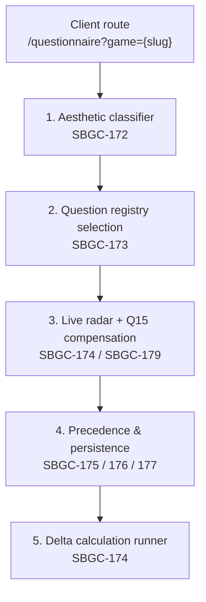

# Epic SBGC-171 — Score Generation by Questionnaire

Architecture blueprint and ticket registry for the questionnaire-driven score
generation epic.  All architectural decisions below are locked in; individual
tickets implement their slice against this document.

Related implementation docs: [`game-model.md`](game-model.md) (the `aesthetic`
field), [`backend-api.md`](backend-api.md) (the resolve endpoint).

## 1. Purpose

Today a Game's Challenge/Reward profile is produced only by editorial
submissions.  SBGC-171 adds a guided questionnaire that lets a player generate
a six-dimensional profile from structured answers, with the same deduplication
and staff-routing guarantees established by SBGC-216.

The client route is:

```text
/questionnaire?game={game_slug}
```

## 2. Lifecycle



### Stage 1 — Aesthetic classifier (SBGC-172)

Q1 (primary reason for fun) and Q2 (secondary reason) resolve to a dominant
aesthetic.  **True aesthetics** (S+S, F+F, N+N, C+C, or a Collaborative/None
collapse) route all of Part 2 to one set; **hybrid aesthetics** (S+F, F+S, …)
split Part 2 50/50.  The canonical primary aesthetic is persisted to
`Game.aesthetic`.

### Stage 2 — Question registry selection (SBGC-173)

The versioned registry is code-owned (`registry/v1/`, tag `v1.0.0`) and mirrored
in Python and TypeScript.  `assemble_questionnaire` returns the concrete graph
for a resolved aesthetic:

- Challenge (Part 1, Q3–Q8): 100% from the dominant set (1A, 1B, 1C, or 1D),
  child branches included.
- Reward (Part 2, Q9–Q14):
  - True aesthetic → 100% from the dominant set (2X).
  - Hybrid aesthetic → Q9–Q11 from the secondary set, Q12–Q14 from the
    dominant set (the 50/50 split), with every child branch kept with its root.

``POST /api/v1/questionnaire/assemble-tree`` resolves the Q1/Q2 answers and
returns this graph for a publicly-listed Game.

### Stage 3 — Live radar engine & Q15 compensation (SBGC-174, SBGC-179)

- Q3–Q8 drive the Challenge radar; the Q9 transition auto-swaps to the Reward
  radar (no manual toggle).
- Q15 is a dual-slider adjuster (Challenge + Reward) bounded by the quality
  range, with proportional compensation:

  ```text
  ΔY = −ΔX · Y / (Y + Z)
  ΔZ = −ΔX · Z / (Y + Z)
  ```

  with an equal-split fallback when `Y + Z = 0`, clamped to `[0, 100]`.
- Q15 shows the desaturated raw polygon behind the active adjusted polygon.

### Stage 4 — Precedence & persistence state machine (SBGC-175, SBGC-176, SBGC-177)

- **Staff / Moderator / Superuser** → route to `EditorialClassification`
  (never `UserGameScoreSubmission`).
- **Community user**:
  - Manual submission age ≥ 10 days → automatic overwrite.
  - Manual submission age < 10 days → interstitial modal (Keep Manual vs
    Overwrite).  "Keep Manual" archives the questionnaire result without
    updating the active calculation pool.
- The complete audit trace is stored in `QuestionnaireResult`.

### Stage 5 — Delta-based calculation runner (SBGC-174)

Admin one-click global trigger runs an async worker that recalculates only
Games with new/modified submissions (`last_calculated_at < MAX(created_at,
updated_at)`) and emails a completion report to the triggering admin.

## 3. Ticket registry

| Ticket   | Scope                                                                                          |
| -------- | ---------------------------------------------------------------------------------------------- |
| SBGC-172 | Domain routing, `Game.aesthetic`, Q1/Q2 combinatoric resolver, question-set dispatch contract. |
| SBGC-173 | Versioned code-based questionnaire registry (`questionnaires/v1/`, tagged `v1.0.0`), Sets A–D, branching graphs, 50/50 split router. |
| SBGC-174 | Versioned scoring engine, ratio normalization to 100-point profiles, Q15 compensator, delta recalculation async task + email report. |
| SBGC-175 | `QuestionnaireResult` / `QuestionnaireClassification` models, precedence resolver, SBGC-216 bridge. |
| SBGC-176 | Authenticated API persistence & retrieval (`GET /api/v1/questionnaire/{slug}`, `POST .../submit`, `POST /api/v1/classifications/recalculate-delta`). |
| SBGC-177 | PostgreSQL schema constraints & migration suite (aesthetic column, questionnaire tables, sum-to-100 / range checks). |
| SBGC-178 | Dynamic questionnaire UX & transition engine (Astro + Tailwind, FLIP step transitions, progress tracker). |
| SBGC-179 | Live dynamic spider chart (canvas/SVG radar, real-time re-render, boundary auto-swap, Q15 review state). |
| SBGC-180 | Resilience & session edge cases (network drops, refresh, back-button, abandoned states, local session draft cache). |

## 4. Locked decisions

- The questionnaire registry is **code-based and immutable** (Python +
  TypeScript mirrors tagged by version), not database rows.
- The backend resolver is authoritative; the frontend taxonomy mirrors it for
  zero-latency set switching and is unit-tested for parity.
- Community questionnaire scores flow through the SBGC-216 ingestion
  boundaries (deduplication, 15-day supersession, staff isolation).
- Q1/Q2 option identifiers (`OPT_*`) are a stable wire contract; aesthetic
  categories use the canonical uppercase values
  (`SENSORY`/`FANTASY`/`NARRATIVE`/`CHALLENGE`, plus `COLLABORATIVE`, `NONE`,
  `SPECIAL_FLOW`).

## 5. SBGC-172 implementation notes

### Backend

- `games.Game.aesthetic` — `CharField(max_length=20, choices=Aesthetic.choices,
  null=True, blank=True, db_index=True)`.  `NULL` means "not yet resolved".
  Migration: `games/0016_game_aesthetic.py`.
- `classifications/questionnaire/domain.py` — ORM-free vocabulary: the Q1/Q2
  option registry, `map_option_to_category`, `available_secondary_options`,
  `AestheticCategory`, `QuestionSetId`, and the dispatch dataclasses.
- `classifications/questionnaire/aesthetic_resolver.py` — pure
  `resolve_aesthetic` / `resolve_from_options` implementing the state-machine
  matrix (true, hybrid, Collaborative collapse, None collapse, special flow).
- `classifications/questionnaire/api.py` — `POST
  /api/v1/questionnaire/resolve-aesthetic`, mounted in `api/v1.py`.
- Tests: `classifications/tests/test_aesthetic_resolver.py` (25 tests).

### Frontend

- `src/lib/questionnaire/types.ts` — enums and pure domain interfaces.
- `src/lib/questionnaire/aesthetic-taxonomy.ts` — option registry and resolver
  mirroring the backend.
- `src/lib/questionnaire/aesthetic-taxonomy.test.ts` — 21 parity tests
  (co-located per the vitest `src/**` include).
- `src/pages/questionnaire/index.astro` — the `/questionnaire?game={slug}` route.

### Deliberate adaptations to this codebase

- **No `Game.is_active`.**  This repository expresses public visibility through
  `Game.objects.publicly_listable()` (`content_type == game AND listing_status
  == published`), so the route and endpoint use that policy instead of the
  blueprint's `is_active=True`.
- **Missing `game` query param** redirects to `/catalogue` (there is no
  `/games` index route).
- **The endpoint is a pure resolver.**  It does not write `Game.aesthetic` or
  any submission; canonical persistence and precedence belong to SBGC-175 /
  SBGC-176.
- **Frontend tests are co-located under `src/`**, matching the repository's
  vitest configuration rather than the blueprint's `tests/unit/` path.

## 6. SBGC-173 implementation notes

### Registry layout

```text
apps/backend/classifications/questionnaire/registry/v1/
├── types.py        # schema, builders (opt/question/build_set), validation
├── set_a.py        # Sensory   — Part 1 Q3–Q8 (15 nodes), Part 2 Q9–Q14 (17 nodes)
├── set_b.py        # Fantasy   — Part 1 (11 nodes), Part 2 (10 nodes)
├── set_c.py        # Narrative — Part 1 (10 nodes), Part 2 (10 nodes)
├── set_d.py        # Challenge — Part 1 (12 nodes), Part 2 (11 nodes)
└── assembler.py    # REGISTRY_MAP + assemble_questionnaire

apps/frontend/src/lib/questionnaire/registry/v1/
├── types.ts        # mirror + buildSet/validateQuestionSet
├── set-a.ts … set-d.ts
├── assembler.ts
└── assembler.test.ts
```

### Encoding rules

- Every root question is Q3–Q8 (Challenge) or Q9–Q14 (Reward); child branch
  nodes (`Q4A`, `Q8F`, `Q13B`, …) derive their `root_id` from the node id and
  carry a `next_question_id` branch pointer.
- Each answer option carries a signed `ScoreModifier` (`micro`/`macro`/
  `mystiko`); branch-only options may be zero-weighted.
- Option ids are derived deterministically as `{question_id}_{slug(label)}` in
  both stacks so the wire ids are stable and identical.
- Sets are validated at import/build time: six roots per part, target
  integrity, unique ids, no dangling branch targets, branch reachability from
  roots, and an acyclic branch graph.  A malformed registry fails fast.

### Endpoint

`POST /api/v1/questionnaire/assemble-tree` (public, publicly-listed Games
only) returns `version`, the game identity, the resolved aesthetics, and
`part1_challenge_nodes` / `part2_reward_nodes` — each node with its options and
modifiers.  Invalid options return `422 VALIDATION_ERROR`; unknown or
non-public Games return `404 NOT_FOUND`.

### Deliberate adaptations

- Collections are immutable tuples/readonly arrays rather than the
  blueprint's mutable `List`/`[]` — the registry is code-owned constant data.
- Tests are co-located under `src/` (vitest) as with SBGC-172; the backend
  suite lives in `classifications/tests/test_questionnaire_registry.py`.
- Dual-stack parity is enforced by identical literal anchors in both suites
  (modifier weights, node texts, root ordering) rather than a generated
  fixture.
