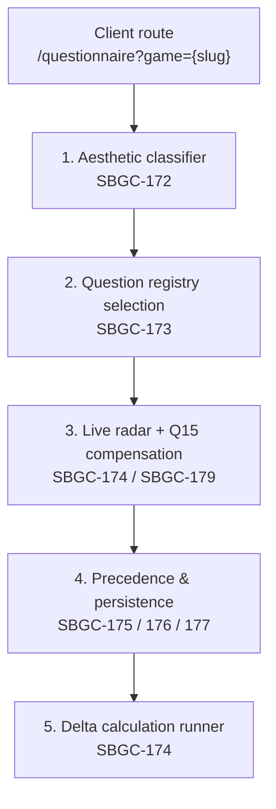

# Epic SBGC-171 — Score Generation by Questionnaire

Architecture blueprint and ticket registry for the questionnaire-driven score
generation epic.  All architectural decisions below are locked in; individual
tickets implement their slice against this document.

Related implementation docs: [`game-model.md`](game-model.md) (the `aesthetic`
field), [`backend-api.md`](backend-api.md) (the resolve endpoint).

## 1. Purpose

Today a Game's Challenge/Reward profile is produced only by editorial
submissions.  SBGC-171 adds a guided questionnaire that lets a player generate
a six-dimensional profile from structured answers, with the same deduplication
and staff-routing guarantees established by SBGC-216.

The client route is:

```text
/questionnaire?game={game_slug}
```

## 2. Lifecycle



### Stage 1 — Aesthetic classifier (SBGC-172)

Q1 (primary reason for fun) and Q2 (secondary reason) resolve to a dominant
aesthetic.  **True aesthetics** (S+S, F+F, N+N, C+C, or a Collaborative/None
collapse) route all of Part 2 to one set; **hybrid aesthetics** (S+F, F+S, …)
split Part 2 50/50.  The canonical primary aesthetic is persisted to
`Game.aesthetic`.

### Stage 2 — Question registry selection (SBGC-173)

The versioned registry is code-owned (`registry/v1/`, tag `v1.0.0`) and mirrored
in Python and TypeScript.  `assemble_questionnaire` returns the concrete graph
for a resolved aesthetic:

- Challenge (Part 1, Q3–Q8): 100% from the dominant set (1A, 1B, 1C, or 1D),
  child branches included.
- Reward (Part 2, Q9–Q14):
  - True aesthetic → 100% from the dominant set (2X).
  - Hybrid aesthetic → Q9–Q11 from the secondary set, Q12–Q14 from the
    dominant set (the 50/50 split), with every child branch kept with its root.

``POST /api/v1/questionnaire/assemble-tree`` resolves the Q1/Q2 answers and
returns this graph for a publicly-listed Game.

### Stage 3 — Live radar engine & Q15 compensation (SBGC-174, SBGC-179)

- Q3–Q8 drive the Challenge radar; the Q9 transition auto-swaps to the Reward
  radar (no manual toggle).
- Q15 is a dual-slider adjuster (Challenge + Reward) bounded by the quality
  range, with proportional compensation:

  ```text
  ΔY = −ΔX · Y / (Y + Z)
  ΔZ = −ΔX · Z / (Y + Z)
  ```

  with an equal-split fallback when `Y + Z = 0`, clamped to `[0, 100]`.
- Q15 shows the desaturated raw polygon behind the active adjusted polygon.

### Stage 4 — Precedence & persistence state machine (SBGC-175, SBGC-176, SBGC-177)

- **Staff / Moderator / Superuser** → route to `EditorialClassification`
  (never `UserGameScoreSubmission`).
- **Community user**:
  - Manual submission age ≥ 10 days → automatic overwrite.
  - Manual submission age < 10 days → interstitial modal (Keep Manual vs
    Overwrite).  "Keep Manual" archives the questionnaire result without
    updating the active calculation pool.
- The complete audit trace is stored in `QuestionnaireResult`.

### Stage 5 — Delta-based calculation runner (SBGC-174)

Admin one-click global trigger runs an async worker that recalculates only
Games with new/modified submissions (`last_calculated_at < MAX(created_at,
updated_at)`) and emails a completion report to the triggering admin.

## 3. Ticket registry

| Ticket   | Scope                                                                                          |
| -------- | ---------------------------------------------------------------------------------------------- |
| SBGC-172 | Domain routing, `Game.aesthetic`, Q1/Q2 combinatoric resolver, question-set dispatch contract. |
| SBGC-173 | Versioned code-based questionnaire registry (`questionnaires/v1/`, tagged `v1.0.0`), Sets A–D, branching graphs, 50/50 split router. |
| SBGC-174 | Versioned scoring engine, ratio normalization to 100-point profiles, Q15 compensator, delta recalculation async task + email report. |
| SBGC-175 | `QuestionnaireResult` / `QuestionnaireClassification` models, precedence resolver, SBGC-216 bridge. |
| SBGC-176 | Authenticated API persistence & retrieval (`GET /api/v1/questionnaire/{slug}`, `POST .../submit`, `POST /api/v1/classifications/recalculate-delta`). |
| SBGC-177 | PostgreSQL schema constraints & migration suite (aesthetic column, questionnaire tables, sum-to-100 / range checks). |
| SBGC-178 | Dynamic questionnaire UX & transition engine (Astro + Tailwind, FLIP step transitions, progress tracker). |
| SBGC-179 | Live dynamic spider chart (canvas/SVG radar, real-time re-render, boundary auto-swap, Q15 review state). |
| SBGC-180 | Resilience & session edge cases (network drops, refresh, back-button, abandoned states, local session draft cache). |

## 4. Locked decisions

- The questionnaire registry is **code-based and immutable** (Python +
  TypeScript mirrors tagged by version), not database rows.
- The backend resolver is authoritative; the frontend taxonomy mirrors it for
  zero-latency set switching and is unit-tested for parity.
- Community questionnaire scores flow through the SBGC-216 ingestion
  boundaries (deduplication, 15-day supersession, staff isolation).
- Q1/Q2 option identifiers (`OPT_*`) are a stable wire contract; aesthetic
  categories use the canonical uppercase values
  (`SENSORY`/`FANTASY`/`NARRATIVE`/`CHALLENGE`, plus `COLLABORATIVE`, `NONE`,
  `SPECIAL_FLOW`).

## 5. SBGC-172 implementation notes

### Backend

- `games.Game.aesthetic` — `CharField(max_length=20, choices=Aesthetic.choices,
  null=True, blank=True, db_index=True)`.  `NULL` means "not yet resolved".
  Migration: `games/0016_game_aesthetic.py`.
- `classifications/questionnaire/domain.py` — ORM-free vocabulary: the Q1/Q2
  option registry, `map_option_to_category`, `available_secondary_options`,
  `AestheticCategory`, `QuestionSetId`, and the dispatch dataclasses.
- `classifications/questionnaire/aesthetic_resolver.py` — pure
  `resolve_aesthetic` / `resolve_from_options` implementing the state-machine
  matrix (true, hybrid, Collaborative collapse, None collapse, special flow).
- `classifications/questionnaire/api.py` — `POST
  /api/v1/questionnaire/resolve-aesthetic`, mounted in `api/v1.py`.
- Tests: `classifications/tests/test_aesthetic_resolver.py` (25 tests).

### Frontend

- `src/lib/questionnaire/types.ts` — enums and pure domain interfaces.
- `src/lib/questionnaire/aesthetic-taxonomy.ts` — option registry and resolver
  mirroring the backend.
- `src/lib/questionnaire/aesthetic-taxonomy.test.ts` — 21 parity tests
  (co-located per the vitest `src/**` include).
- `src/pages/questionnaire/index.astro` — the `/questionnaire?game={slug}` route.

### Deliberate adaptations to this codebase

- **No `Game.is_active`.**  This repository expresses public visibility through
  `Game.objects.publicly_listable()` (`content_type == game AND listing_status
  == published`), so the route and endpoint use that policy instead of the
  blueprint's `is_active=True`.
- **Missing `game` query param** redirects to `/catalogue` (there is no
  `/games` index route).
- **The endpoint is a pure resolver.**  It does not write `Game.aesthetic` or
  any submission; canonical persistence and precedence belong to SBGC-175 /
  SBGC-176.
- **Frontend tests are co-located under `src/`**, matching the repository's
  vitest configuration rather than the blueprint's `tests/unit/` path.

## 6. SBGC-173 implementation notes

### Registry layout

```text
apps/backend/classifications/questionnaire/registry/v1/
├── types.py        # schema, builders (opt/question/build_set), validation
├── set_a.py        # Sensory   — Part 1 Q3–Q8 (15 nodes), Part 2 Q9–Q14 (17 nodes)
├── set_b.py        # Fantasy   — Part 1 (11 nodes), Part 2 (10 nodes)
├── set_c.py        # Narrative — Part 1 (10 nodes), Part 2 (10 nodes)
├── set_d.py        # Challenge — Part 1 (12 nodes), Part 2 (11 nodes)
└── assembler.py    # REGISTRY_MAP + assemble_questionnaire

apps/frontend/src/lib/questionnaire/registry/v1/
├── types.ts        # mirror + buildSet/validateQuestionSet
├── set-a.ts … set-d.ts
├── assembler.ts
└── assembler.test.ts
```

### Encoding rules

- Every root question is Q3–Q8 (Challenge) or Q9–Q14 (Reward); child branch
  nodes (`Q4A`, `Q8F`, `Q13B`, …) derive their `root_id` from the node id and
  carry a `next_question_id` branch pointer.
- Each answer option carries a signed `ScoreModifier` (`micro`/`macro`/
  `mystiko`); branch-only options may be zero-weighted.
- Option ids are derived deterministically as `{question_id}_{slug(label)}` in
  both stacks so the wire ids are stable and identical.
- Sets are validated at import/build time: six roots per part, target
  integrity, unique ids, no dangling branch targets, branch reachability from
  roots, and an acyclic branch graph.  A malformed registry fails fast.

### Endpoint

`POST /api/v1/questionnaire/assemble-tree` (public, publicly-listed Games
only) returns `version`, the game identity, the resolved aesthetics, and
`part1_challenge_nodes` / `part2_reward_nodes` — each node with its options and
modifiers.  Invalid options return `422 VALIDATION_ERROR`; unknown or
non-public Games return `404 NOT_FOUND`.

### Deliberate adaptations

- Collections are immutable tuples/readonly arrays rather than the
  blueprint's mutable `List`/`[]` — the registry is code-owned constant data.
- Tests are co-located under `src/` (vitest) as with SBGC-172; the backend
  suite lives in `classifications/tests/test_questionnaire_registry.py`.
- Dual-stack parity is enforced by identical literal anchors in both suites
  (modifier weights addressed by option index, node texts, root ordering)
  rather than a generated fixture.

### Copy pass & key phrase (SBGC-171 follow-up)

- The question/answer prose in all four sets was rewritten in a plain,
  reviewer-approved voice (descriptive answers, genre terms used only where a
  bare label would be ambiguous, e.g. gacha).  Node ids, parts, targets, every
  `ScoreModifier`, and every branch target are byte-for-byte identical to the
  pre-change registry; four nodes changed option count to match the draft
  exactly (Set A Q5 3→4, Set A Q7 6→5, Set A Q9 2→3, Set D Q7 3→4).  The
  TypeScript and Python registries were diffed field-by-field for exact parity.
- The frontend `QuestionNode` carries an optional `keyPhrase` — the slice of
  the question that stands alone for a skimmer.  `validateQuestionSet` fails
  if the phrase is not inside the question text; `QuestionnaireRoot.astro`
  underlines it via `.q-question-key`.  The Python registry omits it (display
  only), mirroring the aesthetic-option `emphasis` precedent.  Each phrase is
  chosen so the underlined slice still reads on its own if the rest of the
  question is blurred out.
- Because option ids derive from labels, the modifier-fidelity anchors in both
  suites now address options by **index** instead of id suffix, so future copy
  edits no longer break them.
- `pyproject.toml` exempts `classifications/questionnaire/registry/v1/*.py`
  from `E501`: the prose is intentionally long single string literals.

## 7. SBGC-174 implementation notes

### Scoring engine (`classifications/questionnaire/scoring/`)

- `types.py` — `QualityTier`, `DimensionScore` (immutable, rejects negatives),
  `QualitySpec`, `CalculatedProfilePair`, `FullScoringResult`.
- `engine.py` — `compute_raw_profile` (per-step zero-flooring; Challenge and
  Reward profiles isolated by `ProfileTarget`) and `normalize_profile`
  (Largest-Remainder to a 100-point integer profile; zero-total fallback
  `(33, 33, 34)`; tie-break Micro ≻ Macro ≻ Mystiko).
- `compensation.py` — `QUALITY_TIER_MAP` (rating 1–10 → ±90/30/10/5/1),
  `resolve_quality_spec`, and `apply_proportional_compensation` (coupled
  proportional redistribution with boundary containment and integer remainder
  absorption, preserving a strict 100-point total).

The frontend mirrors these in
`src/lib/questionnaire/scoring/{types,engine,compensation}.ts` for zero-latency
live radar/slider feedback.

### Delta recalculation (`classifications/services/delta_recalculation.py`)

- `find_stale_game_ids()` — a published Game is stale when it has **no**
  completed calculation but has submissions, or when its latest editorial or
  community submission `updated_at` is after its latest
  `ClassificationSnapshot.calculated_at`.
- `execute_delta_recalculation(admin_user)` — creates a fresh
  `CalculationEpoch` and runs `run_game_calculation` once per stale Game, then
  emails the triggering admin a completion report.
- `dispatch_delta_recalculation(user)` — daemon-thread dispatch (no Celery
  broker in this deployment), so the HTTP thread never blocks.

### Trigger surfaces

- `POST /api/v1/classifications/recalculate-delta` → `202 {status, message,
  recipient_email}`; 401 unauthenticated, 403 non-Superuser/non-Moderator.
- `CalculationEpochAdmin` gains a changelist button (custom
  `change_list_template` + `trigger_delta_view`) that queues the same worker.

### Deliberate adaptations

- **No `ClassificationRun` model.**  This repository persists a completed
  calculation as `ClassificationSnapshot.calculated_at`; the delta query uses
  that as the "completed_at" anchor.  `execute_game_calculation(game_id=...)`
  does not exist; the engine primitive is `run_game_calculation(game=…,
  epoch=…, attempt_number=1, cutoff_at=…)`, matching the existing admin
  recalculation action.
- **Moderator gate** uses the authoritative `resolve_editorial_role`
  (Superuser/Moderator) rather than a raw `group.name == "Moderator"` match.
- **Email** uses Django's `send_mail` with `fail_silently=True`; no Celery.

## 8. SBGC-175 implementation notes

### Persistence models (`classifications/models.py`)

- `QuestionnaireResult` — immutable audit trail (aesthetic snapshot, answer
  tree, Q15 rating, raw/normalized/adjusted profiles) with four database
  `CheckConstraint`s enforcing each normalized/adjusted profile sums to 100.
- `QuestionnaireClassification` — the `(user, game)` precedence ledger with
  `PrecedenceStatus` (`ACTIVE_IN_CALCULATION`, `SUPERSEDED_BY_MANUAL`,
  `ARCHIVED_KEPT_MANUAL`, `STAFF_EDITORIAL_ROUTED`).
- `UserGameScoreSubmission` gains `source` (`MANUAL`/`QUESTIONNAIRE`) and a
  nullable `questionnaire_result` FK (`SET_NULL`).

### Precedence engine (`classifications/services/questionnaire_precedence.py`)

`ingest_questionnaire_submission` runs the state machine in one transaction:

- Always persist `QuestionnaireResult`.
- Staff (Superuser / Moderator / Community Leader) → route into
  `EditorialClassification` (via `create_submission`/`update_submission`),
  zero `UserGameScoreSubmission` rows, ledger status `STAFF_EDITORIAL_ROUTED`.
- Community with no manual row → direct promotion.
- Manual age >= 10 days → in-place overwrite (`created_at` preserved).
- Manual age < 10 days → requires an explicit `OVERWRITE`/`KEEP_MANUAL`;
  `KEEP_MANUAL` archives the result without touching the manual row.

### Deliberate adaptations

- **Moderator/staff gate** reuses `is_editorial_submitter`
  (`resolve_editorial_role != COMMUNITY`), not the spec's
  `resolve_editorial_role(...) is not None`.
- **Editorial routing** uses the real `create_submission`/`update_submission`
  services (`submitted_by`/`ScoreDistribution`) rather than the spec's
  `author=`/`payload=` pseudocode (the editorial model is not flat here).
- **Missing resolution guard** — a recent-manual submission without an
  explicit `conflict_resolution` raises `ValueError` instead of silently
  overwriting (SBGC-176's POST flow always supplies the resolution).
- **Migration** is auto-named
  `0010_usergamescoresubmission_source_questionnaireresult_and_more.py`.
- **Manual supersession (SBGC-225)** — the precedence state machine here is
  questionnaire→manual only.  A manual score that replaces a
  `QUESTIONNAIRE`-source community row now flips that row to `MANUAL` (clearing
  its `questionnaire_result` FK) and transitions an `ACTIVE_IN_CALCULATION`
  ledger entry to `SUPERSEDED_BY_MANUAL`; the ≥15-day branch path supersedes the
  ledger too.  This closes the one-directional gap where a manual overwrite left
  the questionnaire ledger active.

## 9. SBGC-176 implementation notes

### Endpoints

- `GET /api/v1/questionnaire/{slug}/session` (authenticated) — returns the
  publicly-listed Game identity, its canonical `aesthetic`, the manual-conflict
  `precedence` metadata (`PrecedenceEvaluation`), and the viewer's
  `previous_result` when one exists.
- `POST /api/v1/questionnaire/{slug}/submit` (authenticated) — validates and
  persists a completed traversal.

### Server-side validation pipeline (`questionnaire/api.py`)

1. Publicly-listed Game guard → `404 NOT_FOUND`.
2. Aesthetic resolution + tree assembly → `422 VALIDATION_ERROR` (domain and
   registry errors share this status).
3. Traversal integrity — every answer must belong to the assembled tree with a
   valid option id; client raw/normalized values are never trusted.
4. Authoritative re-computation via `compute_raw_profile` + `normalize_profile`
   for both profiles.
5. Q15 quality-tier delta bounds — each adjusted dimension must be within
   ±`permitted_delta` of the recomputed normalized value.
6. Precedence conflict gate — `requires_user_choice` with no
   `conflict_resolution` returns `409` with `ConflictRequiredOut` **before**
   any record is written.
7. Persistence through `ingest_questionnaire_submission` (SBGC-175); response
   is `200` for `OVERWRITE`, otherwise `201`.

### Schemas (`questionnaire/schemas.py`)

`DimensionScoreSchema` enforces `0..100` per dimension **and** a strict
sum-to-100 via a pydantic `model_validator`, so adjusted profiles are rejected
at the validation layer (`422`) before the endpoint runs.

### Frontend client (`src/lib/server/api/questionnaire.ts`)

`getQuestionnaireSession` and `submitQuestionnaire` (returning a
success/conflict discriminated union) forward the viewer `sessionid` cookie.

### Deliberate adaptations

- The 409 response declares its concrete sibling error statuses explicitly
  (`400/401/403/404/422 → ApiErrorResponse`) instead of `STANDARD_ERROR_RESPONSES`,
  because `codes_4xx` contains 409 and would shadow `ConflictRequiredOut`.
- Error codes use the repository's uppercase `ErrorCode` vocabulary, not the
  spec's lowercase strings.
- The client forwards `sessionId` (repo BFF convention, cf.
  `lib/server/api/users.ts`) rather than a raw cookie header, and uses raw
  `fetch` because the shared `ApiResult` transport cannot surface the custom
  409 body.
- The submit request type is the snake_case wire contract
  (`QuestionnaireSubmitRequest`), since the backend field names are the
  authoritative wire format.

## 10. SBGC-177 implementation notes

### Database-level hardening (migration `0011_questionnaire_db_constraints`)

Application validators run only on `full_clean()` / API parsing, so raw ORM
writes (`bulk_create`, `.update()`) could otherwise persist invalid rows.
SBGC-177 pushes the invariants into the database:

- `QuestionnaireResult` — `q15_rating` 1–10 range check; `<= 100` upper-bound
  checks on all twelve normalized/adjusted dimension columns; the four
  sum-to-100 checks (seeded by SBGC-175); and
  `idx_qresult_user_game_created`.
- `QuestionnaireClassification` — named `uniq_qclass_user_game` unique
  constraint (replacing `unique_together`) and `idx_qclass_status_updated`.
- `UserGameScoreSubmission` — `idx_usergamescoresub_source` on
  `(source, game_id)`; the `questionnaire_result` FK remains `SET_NULL`.
- Lower bounds (`>= 0`) are provided by the backend for every
  `PositiveSmallIntegerField`, so no extra negative checks are needed.

See `docs/database-constraints.md` for the full inventory.

### Verification tests

- `test_database_constraints.py` — inserts through the raw ORM (no
  `full_clean()`) and asserts `IntegrityError` for q15 out-of-range,
  `> 100` dimensions, negative scores (sum-preserving), sum != 100, and the
  `(user, game)` uniqueness; plus `SET_NULL` and `CASCADE` foreign-key actions.
- `test_migration_verification.py` — uses `MigrationExecutor` to roll
  `classifications` back to `0009_usergamescoresubmission` and forward to the
  latest revision, proving the SBGC-175/177 migrations are fully reversible
  (with a `tearDown` safety re-migration).

### Deliberate adaptations

- The migration is named `0011_questionnaire_db_constraints.py` (renamed from
  Django's auto-generated name for a stable reference in the reversibility
  test).
- The four sum-to-100 expressions retain the SBGC-175 form
  (`micro = 100 - macro - mystiko`), which is equivalent to the spec's
  `micro + macro + mystiko == 100` and avoids churn on already-applied
  constraints.

## 11. SBGC-178 implementation notes

### Dynamic progression (`src/components/questionnaire/QuestionnaireRoot.astro`)

- The page route (`src/pages/questionnaire/index.astro`) already enforces the
  SSR auth wall; it renders `QuestionnaireRoot` only once
  `getQuestionnaireSession` returns, so guests get a 302 before any script or
  question markup.
- `QuestionnaireRoot` drives the DOM-free `QuestionnaireStateMachine` through
  the five phases and renders one question at a time.  The active step is the
  first unanswered node in the assembled sequence, so answering a branching
  root naturally reveals its child as the next step; changing the root prunes
  the branch (handled by `recordAnswer`).
- `removeAnswer` was added to the state machine so Backspace/back can undo the
  most recent answer without leaving orphaned branch answers.

### BFF submission (`src/pages/api/questionnaire/[slug]/submit.ts`)

- The browser posts only to `/api/questionnaire/${slug}/submit`; the Astro
  route forwards the `sessionid` cookie to Django via the existing
  `submitQuestionnaire` server client and returns the 200/201 body or the raw
  409 conflict contract unchanged.

### Security handrails

- Auth gating, backend-host concealment, and DOM text-safety are all preserved:
  option labels are injected with `textContent` (no `innerHTML`/`set:html`).
- Console silence is enforced by authoring no `console.*` in client code; no
  `drop_console` Vite override was added because the Vite 8 `esbuild.drop`
  option is not a first-class `astro.config.mjs` surface and forcing it risks
  `astro check`.

### Deliberate adaptations

- The spec's flow implies both an inline accordion and a step transition.  The
  implementation uses a single-card, step-by-step model (one question at a
  time) because it maps cleanly onto `getActiveSequence()`, the
  "Question X of 14" counter, and the Enter/Backspace hotkeys; branches are
  rendered as their own steps via `BranchContainer`.
- Dynamic option buttons are styled with an `is:global` `<style>` block
  (`q-option*` / `q-fade`) rather than Astro scoped styles, since
  `document.createElement`d nodes do not receive Astro's scope attributes.

## 12. SBGC-179 implementation notes

### Component & live bridge

- `src/components/questionnaire/QuestionnaireRadar.astro` renders the static SVG
  shell once: grid rings, the six canonical spokes, both profile polygons, the
  raw benchmark path, the six vertex nodes, and the six dimension axis labels —
  plus the Phase-4 segmented Challenge/Reward toggle.
- `src/lib/questionnaire/radar-live-bridge.ts` (`RadarLiveBridge`) subscribes to
  `questionnaire:challenge-update` / `reward-update` / `boundary-swap` /
  `phase-change` and mutates the shell in place (path `d`, vertex `cx`/`cy`,
  opacity, toggle state, axis-label emphasis), so answering a question never
  triggers an Astro re-render.  Geometry and label anchoring are delegated to
  the shared `radar-geometry` helpers, so the questionnaire chart reuses the
  exact spokes and axis labels of the game-detail and rankings radars.
- `QuestionnaireRoot` dispatches the richer score detail
  (`{ profile, raw, normalized, adjusted }`), a targeted `boundary-swap`, and a
  `phase-change` event on every machine phase transition.  The Q15 rating and
  reset handlers re-emit snapshots so slider resets redraw the chart too.

### Layout

- Desktop (≥1024px): asymmetric `grid-cols-[minmax(420px,46%)_1fr]`; the radar
  rail is `sticky top-8 self-start` while question cards paginate in the fluid
  right column.
- Mobile/tablet: one column with the radar above the card, capped at
  `max-w-[340px]`.

### Phase visibility matrix

- AESTHETICS → neutral empty grid (nothing plotted); axis labels stay visible.
- CHALLENGE → challenge polygon only; challenge labels emphasised.
- REWARD → reward polygon only; reward labels emphasised.
- REVIEW_Q15 / SUBMITTING → dual overlay: the active layer at full opacity, the
  other dimmed to `0.2`, with the pinned normalized benchmark drawn desaturated
  behind the live adjusted polygon; the segmented toggle switches the active
  layer and its axis-label emphasis.

### Live preview normalization

- The accurate ratio normalizer is exact but reads as extreme on partial data
  (a single +20-micro answer normalizes to 100/0/0).  For the live preview only,
  `scoring/soft-normalize.ts` blends the accurate normalized vector toward the
  neutral centre (`33/33/34`) by progress (`answeredRoots / 6`), so the shape
  starts near the middle and converges on the accurate profile by the end of the
  part.  Q15 always plots the accurate normalized/adjusted vectors; the softened
  vector is display-only and never enters state or the submission payload.

### Barycentric fill & shared toggle

- The questionnaire polygon reuses the slug radar's SBGC-210 vertex-anchored
  barycentric fill: three per-vertex `<linearGradient>`s (each perpendicular to
  its opposite edge, fading to transparent) additively blended with
  `plus-lighter` inside a `radar-polygon-fill` group clipped to the spline.
  `radar-render` now exports the geometry (`VERTEX_COLOR`,
  `polygonIsDegenerate`, `vertexGradientAxis`) so the live bridge and the static
  generator share one implementation, and the bridge re-anchors the gradient
  axes on every answer.
- The slug pages' Challenge/Reward switch was replaced by the questionnaire's
  segmented two-button control so both share one style: `.radar-toggle-group`
  now lays out horizontally as a pill and `.radar-profile-btn` styles each
  button; `radar-controller.setActive` drives `aria-pressed`/`is-active` per
  profile button instead of a single `role=switch`.

### Deliberate adaptations

- The questionnaire toggle's container keeps the `.radar-toggle-group` name
  (so the rankings `radar-toggle-hidden` rule and the bridge's inline
  show/hide keep working); only the inner control changed from a switch to two
  buttons.
- Axis labels reuse the global `.radar-axis-label` / `--active` classes; their
  emphasis is driven by the bridge rather than the initial-profile class baked
  into the SSR markup.
- Tests are co-located under `src/lib/questionnaire/__tests__/` (jsdom per
  file), matching the repository's vitest config rather than a `tests/unit/`
  path.

## 13. SBGC-180 implementation notes

### Draft persistence

- `lib/questionnaire/draft-storage.ts` owns the key schema
  (`mygamedna_q_draft_{slug}_{userHash}`), the 7-day sliding TTL, and all
  validation.  `saveDraft` refuses blank snapshots and the `completed` phase;
  `loadDraft` purges and returns `null` on expiry, registry-version drift, slug
  mismatch, malformed JSON, or an invalid score shape.

### State machine hydration

- `QuestionnaireStateMachine` gains `isDirty()`, `toDraft(slug)`,
  `hydrateFromDraft(draft)`, and `reset()`.  Hydration rebuilds the assembled
  tree from the persisted Q1/Q2 options, prunes answers that are no longer on
  the active traversal, restores the adjusted score vectors, and re-emits
  `phase-change` / `challenge-update` / `reward-update` so the radar and views
  resync.  Unknown answer ids are dropped rather than rejecting the whole draft.

### Root wiring

- `QuestionnaireRoot` persists on every machine event, guards `beforeunload`
  while dirty, intercepts browser Back (`popstate`) into `goBack()`, gates
  submission on `navigator.onLine`, and on a submit-time 401 saves the draft and
  redirects to `/login?next=…&resume=true`.  On mount it loads a draft and either
  auto-hydrates (`resume=true`) or prompts via `ResumeDraftModal`.
- `NetworkNotice` shows an offline banner driven by `online`/`offline` events.

### Deliberate adaptations

- The spec's `MachineState` shape (`navigationStack`, `currentNodeId`,
  `rawScores`, …) does not exist in this codebase; the draft stores the real
  machine fields (Q1/Q2 options, answers, Q15 rating, adjusted Challenge/Reward,
  phase) and the traversal is always rebuilt from the registry, so a stored
  navigation stack is unnecessary.
- The draft key uses the `anon` user hash: `getQuestionnaireSession` exposes no
  user identifier, so a per-user hash is not available client-side.  The key is
  still slug-scoped, and "Start over" clears a foreign draft on a shared browser.
- The default Q15 rating is the real `7`, not the spec's `10`.
